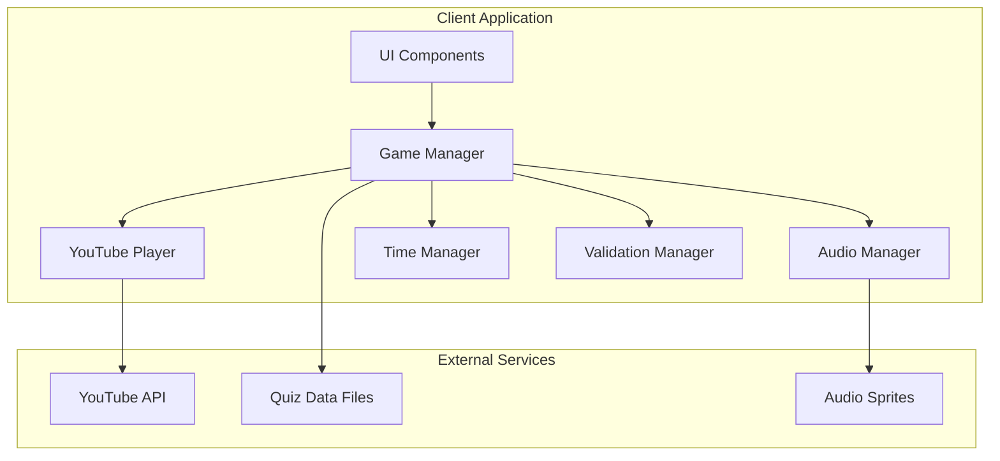
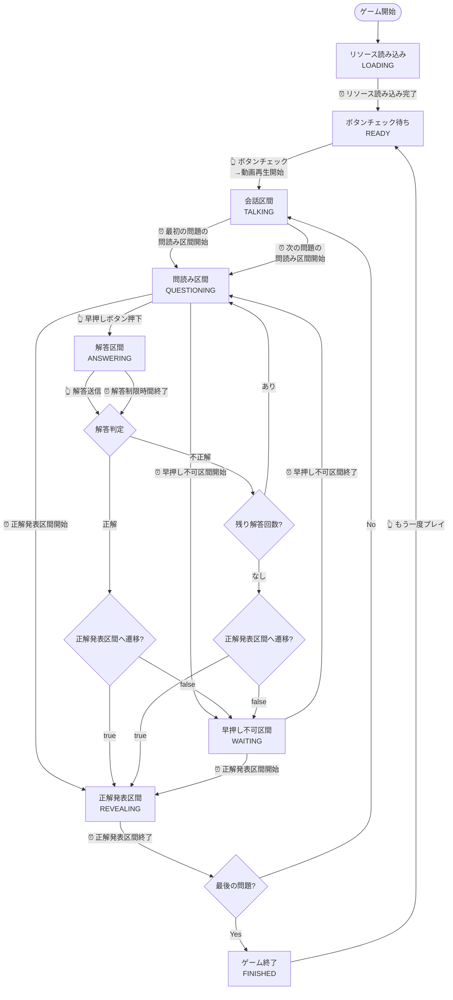
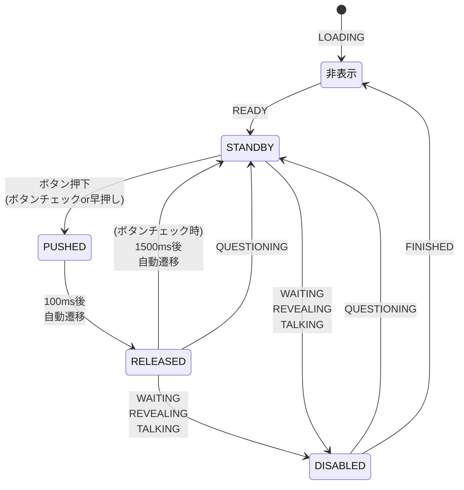
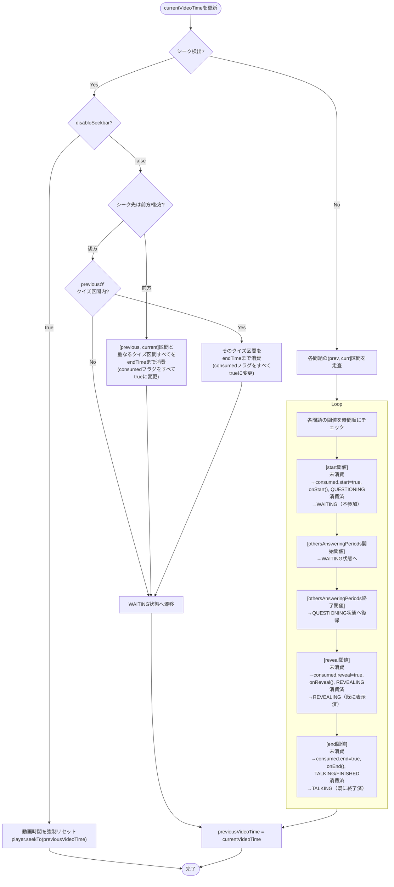
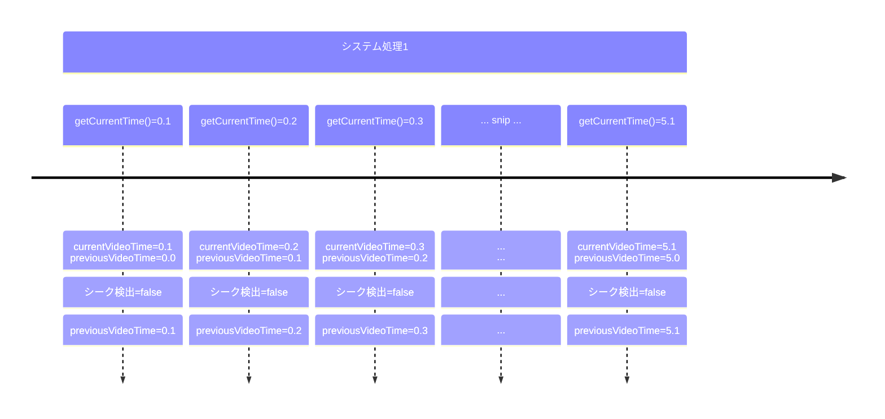
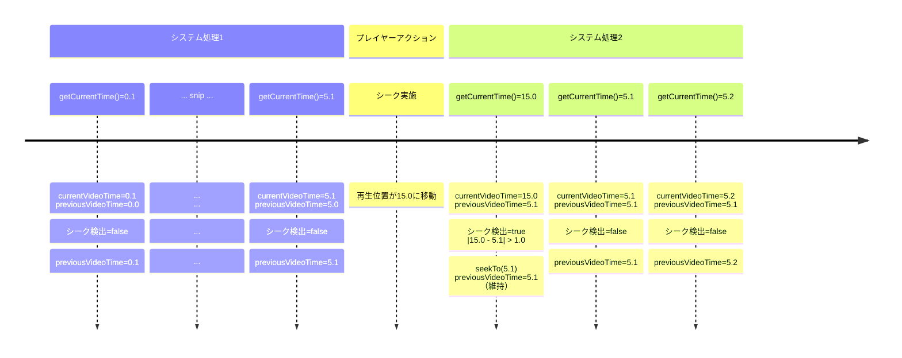
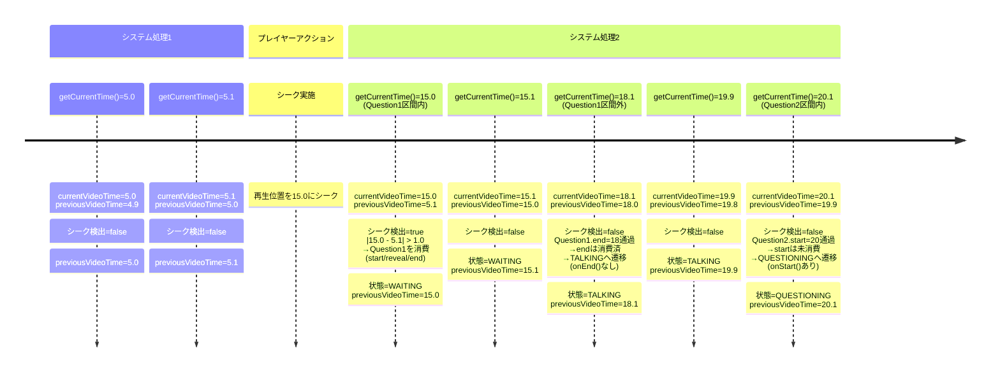

# Design Document

## Overview

YouTube上のクイズ動画を使った「早押しクイズ」ができるWebアプリケーション。視聴者もプレイヤーとなり、動画出演者との疑似的な早押しクイズ対決を楽しむことを可能にする。

### Core Concept

```
YouTubeクイズ動画 + 動画視聴中のリアルタイム早押し = インタラクティブな動画視聴体験
```

**基本体験**: プレイヤーはYouTubeに投稿されたクイズ動画を視聴しながら、画面上の早押しボタンをタップすることで解答権を取得し、動画内で出題されたクイズに解答する

**プレイ可能人数**: 1人

**対象環境**

- プライマリ: スマートフォンブラウザ（縦画面専用）
- セカンダリ: PCブラウザ（開発・デバッグ機能も用意する）

### Technical Stack

**推奨スタック**

- **Frontend**: Vue 3 (Composition API) + TypeScript + Vite
- **State Management**: Pinia
- **Styling**: Tailwind CSS
- **Target Platform**: スマートフォンブラウザ（縦画面専用）、PCブラウザ（開発・デバッグ用）

### Framework Selection

このプロジェクトではVue.js 3を採用します。主な理由：

1. **複雑な状態管理**: ゲーム状態、ボタン状態、時間管理の複雑な相互作用をPiniaで直感的に管理
2. **リアルタイム性**: 150ms間隔（`TIME_UPDATE_INTERVAL_MS`、目安 100〜200ms）の動画時間更新、即座のUI状態反映にリアクティブシステムが最適
3. **状態遷移の可視性**: テンプレート内での条件分岐が複雑な状態遷移を理解しやすくする
4. **TypeScript統合**: Composition APIとTypeScriptの組み合わせが優秀
5. **学習・保守性**: 単一ファイルコンポーネントで構造が理解しやすい

## User Experience

### User Flow

**導入フェーズ**:

1. **Webページの読み込み** → ローディング画面を表示
2. **読み込み完了** → 動画プレイヤーや早押しボタンなどが画面に表示される
3. **早押しボタンをタップ** → ボタンチェック演出 → クイズ動画の再生開始

**ゲームプレイ**:

1. **動画が進行** → 問題が出題される → 早押しボタンが押せる状態になる
2. **早押しボタンをタップ** → 動画を一時停止・効果音を再生(ボタン音) → 解答入力フォームが有効になり、問題に解答できる
3. **解答を入力・送信** → 正誤判定の結果を表示・効果音を再生(正解音・不正解音) → 動画を再開
4. **次の問題まで動画が進行** → すべての問題が終わるまで繰り返し

### Control Methods

- **スマートフォン**: タッチ操作
- **PC**: モニターが対応していればタッチ操作可能、加えてスペースキー押下でも早押しが可能（その他は通常のマウス操作に対応）

#### キーボード操作（PC）

- 入力中の誤操作防止: フォーカスが`input/textarea/contentEditable`上にある場合はスペースキーを無視
- 既定スクロール抑止: スペースキー早押し時は`preventDefault()`を行う

```typescript
document.addEventListener('keydown', (e) => {
  const target = e.target as HTMLElement | null
  const typing = !!target && (
    target.tagName === 'INPUT' ||
    target.tagName === 'TEXTAREA' ||
    (target as any).isContentEditable
  )
  if (typing) return
  if (e.code === 'Space' && (state === 'READY' || state === 'QUESTIONING')) {
    e.preventDefault()
    handleButtonPress()
  }
})
```

#### ボタンチェック演出

早押しクイズ文化における「ボタンチェック」を踏襲し、画面上の早押しボタンを押すこと（タッチまたはスペースキー押下）を動画の再生開始（＝クイズ対戦の開始）のトリガーとする。
これによって、クイズが好きな視聴者にとって馴染みのあるインタラクションでゲームに導入する。

## System Architecture



## Game State Management

### Game State Definitions

| ゲーム状態 | 説明 | 早押しボタン操作 |
|------|------|-----------|
| LOADING | リソースのロード中 | ボタン非表示 |
| READY | ゲームの開始準備完了（ボタンチェック待ち） | 有効（ボタンチェック） |
| TALKING | 問題前後の会話区間 | 無効 |
| QUESTIONING | 問読み区間（早押し可能区間） | 有効（早押し） |
| ANSWERING | プレイヤーの解答区間 | 無効 |
| WAITING | 早押し不可区間（動画内プレイヤーの解答区間など） | 無効 |
| REVEALING | 正解発表区間 | 無効 |
| FINISHED | ゲーム終了（結果表示） | ボタン非表示 |

### State Transition Patterns

#### 状態遷移の起点

- **⏰ 時間経過起点**: 動画時間や制限時間の到達により自動発生する状態遷移
- **👆 アクション起点**: プレイヤーの操作によって即座に発生する状態遷移

#### ゲーム導入時の状態遷移

```
LOADING → [⏰ リソース読み込み完了] → READY → [👆 ボタンチェック] → TALKING（動画再生開始） → [⏰ 最初の問読み区間開始] → QUESTIONING
```

#### クイズ出題中の状態遷移

**（１）QUESTIONING状態からの分岐**

```
QUESTIONING
├── [👆 早押しボタン押下　] → ANSWERING（動画一時停止）
├── [⏰ 早押し不可区間開始] → WAITING
└── [⏰ 正解発表区間開始　] → REVEALING
```

**（２）ANSWERING状態からの分岐**

```
ANSWERING（動画一時停止）
├── [👆 解答送信] → 正誤判定
│   ├── [正解の場合]
│   │   ├── [正解発表区間への遷移設定 = true ] → REVEALING (時間をジャンプして動画再開)
│   │   └── [正解発表区間への遷移設定 = false] → WAITING (そのまま動画再開)
│   │
│   ├── [不正解 & 残り解答回数あり] → QUESTIONING (そのまま動画再開)
│   │
│   └── [不正解 & 残り解答回数なし]
│       ├── [正解発表区間への遷移設定 = true ] → REVEALING (時間をジャンプして動画再開)
│       └── [正解発表区間への遷移設定 = false] → WAITING (そのまま動画再開)
│
└── [⏰ 解答制限時間終了] → 強制正誤判定
    └── （上記と同じ分岐処理）
```

**（３）WAITING状態からの分岐**

```
WAITING
├── [⏰ 早押し不可区間終了] → QUESTIONING
└── [⏰ 正解発表区間開始　] → REVEALING
```

**（４）その他の時間経過起点遷移**

```
REVEALING → [⏰ 正解発表区間終了] →
            ├── [最後の問題の場合] → FINISHED
            └── [続きの問題がある場合] → TALKING

TALKING → [⏰ 問読み区間開始] → QUESTIONING

FINISHED → [👆 シークバー操作等] → FINISHED（状態固定、時間ベース遷移なし）
        └── [👆 もう一度プレイ押下] → READY（リセット後、動画を0秒にシーク。自動再生はしない）
```

### State Transition Flow



## Button State Management

### Button State Definitions

| ボタン状態 | 名称 | 説明 | 押下可否 |
|------|------|------|---------|
| STANDBY | 待機状態 | ボタンのデフォルト状態 | 可能 |
| PUSHED | 押下状態 | ボタンが押された状態 | 不可 |
| RELEASED | 点灯状態 | ボタンのLEDが点灯した状態（解答権取得） | 不可 |
| DISABLED | 無効状態 | ボタン押下が無効の状態 | 不可 |

### Button State Transitions



### Button State Transition Timing Details

| 遷移パターン | トリガー | 遷移時間 | 詳細 |
|------------|---------|---------|------|
| 非表示 → STANDBY | ゲーム状態変化（READY） | 即座 | ゲーム開始準備完了時 |
| STANDBY → PUSHED | ボタン押下 | 即座 | ボタン押下音再生 |
| PUSHED → RELEASED | 自動遷移 | 100ms後 | 視覚的フィードバック |
| RELEASED → STANDBY | 自動遷移（ボタンチェック時） | 1500ms後 | 正解音再生 |
| RELEASED → STANDBY | ゲーム状態変化（QUESTIONING） | 即座 | 早押し成功時 |
| RELEASED → DISABLED | ゲーム状態変化 | 即座 | WAITING/REVEALING/TALKING状態時 |
| STANDBY → DISABLED | ゲーム状態変化 | 即座 | WAITING/REVEALING/TALKING状態時 |
| DISABLED → STANDBY | ゲーム状態変化（QUESTIONING） | 即座 | 問題開始時 |
| DISABLED → 非表示 | ゲーム状態変化（FINISHED） | 即座 | ゲーム終了時 |

### Button Interaction Rules

**ボタンチェック時**（ゲーム状態: READY状態）

1. ボタン押下 → PUSHED状態（ボタン押下音再生開始）
2. 100ms後 → RELEASED状態
3. 1500ms後 → STANDBY状態（正解音再生開始）
4. 1500ms後 → ゲーム状態がTALKING状態に遷移（動画再生開始）

**早押し時**（ゲーム状態: QUESTIONING状態）

1. ボタン押下 → PUSHED状態（ボタン押下音再生開始、動画一時停止）
2. 100ms後 → RELEASED状態
3. ゲーム状態がANSWERING状態に遷移 → RELEASED状態を維持

**状態連動**

- ゲーム状態がWAITING/REVEALING/TALKING状態 → DISABLED状態
- ゲーム状態がQUESTIONING状態 → STANDBY状態（押下可能）

## Time Management

### Video Time Structure

- **QUIZ区間**: 問読み区間から正解発表区間までをまとめた1問の問題の区間
- **TALK区間**: QUIZ区間以外の区間

動画内で複数の問題が出題される場合、複数のQUIZ区間を持つ。動画内のQUIZ区間以外の区間はすべてTALK区間とする。

### Static Time Variables

#### QUIZ区間に関する時間変数（閾値）

```typescript
interface QuizQuestion {
  index: number // 配列インデックス（0-indexed、JSONのquestionNumber（1-indexed）から変換）
  startTime: number // 問読み区間の開始時間（秒）
  revealTime: number // 正解発表区間の開始時間（秒）
  endTime: number // 正解発表区間の終了時間（秒）
  answers: string[] // 正解パターンのリスト
  othersAnsweringPeriods?: OthersAnsweringPeriod[] // 動画内プレイヤーの解答区間
}

interface OthersAnsweringPeriod {
  startTime: number // 解答開始時間（秒）
  endTime: number // 解答終了時間（秒）
}
```

#### 時間閾値による状態遷移制御

**状態遷移の流れ:**

各問題について、以下の閾値を時間順に処理：

1. `startTime`:
   - consumed.start=false → onStart()実行 + QUESTIONING状態へ
   - consumed.start=true → WAITING状態へ（不参加）
2. `othersAnsweringPeriods[i].start`: WAITING状態へ
3. `othersAnsweringPeriods[i].end`: QUESTIONING状態へ復帰
4. `revealTime`:
   - consumed.reveal=false → onReveal()実行 + REVEALING状態へ
   - consumed.reveal=true → REVEALING状態へ（既に表示済み）
5. `endTime`:
   - consumed.end=false → onEnd()実行 + TALKING/FINISHED状態へ
   - consumed.end=true → TALKING状態へ（既に終了済み）

**consumedフラグによる一回性保証（start/reveal/endのみ）:**
- start/reveal/end閾値は副作用のある処理を実行する
  - `onStart()`: currentQuestionIndex設定、残り回数初期化、UIリセット（重複実行で解答状態がリセットされる）
  - `onReveal()`: 正解表示、ジャンプ処理（重複実行で再ジャンプが発生）
  - `onEnd()`: スコア集計、結果保存（重複実行でスコアが二重カウントされる）
- よって、再生時間の巻き戻しなどによって同じ処理が重複して実行されないようにするために、consumedフラグを用いた一回性保証の制御が必要（Single‑Shot Guard）

**othersAnsweringPeriodsには一回性保証は不要:**
- othersAnsweringPeriodsの区間では副作用のある処理を伴わず、UI上の状態切り替えのみを行う
- consumedフラグを消費済みの問題では問題自体に参加できないため（WAITING状態）、othersAnsweringPeriodsの処理は実質的に意味を持たない

**消費済み区間の扱い:**
- 消費済み区間では、上記の通り副作用のある処理（onStart/onReveal/onEnd）は実行されないようにする
- 不参加として適切な状態への遷移のみを実行する

**各区間の排他・包含関係（検証）:**

1. **単一問題内の閾値順序**:
   - 各問題について: `startTime < revealTime < endTime`
   - 各閾値は厳密に昇順である必要がある

2. **問題間の非重複性**:
   - 問題配列を時間順に整列した場合: `questions[i].endTime <= questions[i+1].startTime`
   - 前の問題の終了時刻は、次の問題の開始時刻以前である必要がある

3. **othersAnsweringPeriods の検証**:
   - 各期間について: `period.start < period.end`（開始時刻 < 終了時刻）
   - 複数期間がある場合: `periods[i].end <= periods[i+1].start`（昇順・非重複）
   - すべての期間が QUESTIONING 区間内に完全に収まる:
     ```
     startTime <= period.start < period.end <= revealTime
     ```

4. **データ検証**:
   - 上記の条件に違反するデータは読み込み時にエラーとする
   - エラーメッセージには、具体的な違反箇所（問題番号、閾値名、実際の値）を含める

#### TALK区間に関する時間変数:

なし。QUIZ区間の範囲外の動画時間を自動的にTALK区間として扱い、その間のゲーム状態をTALKING状態と判定する。

### Dynamic System Time Variables

動画の再生時間に関する以下のシステム変数を常に管理・更新することで、現在の動画時間を把握する。
currentVideoTimeは、YouTube PlayerのAPIによって取得する動画の現在再生時間である。

| 変数名 | 型 | 初期値 | 説明 | 更新タイミング |
|--------|------|------|------|-------------|
| currentVideoTime | number | 0 | 現在の動画再生時間 | `TIME_UPDATE_INTERVAL_MS`（150ms）間隔 |
| previousVideoTime | number | 0 | 直前の再生位置（シーク検出用） | currentVideoTime更新後 |
| hasPassedRewindThreshold | boolean | false | YouTube Player巻き戻り閾値（5.5秒）を通過したか | updateVideoTime()で5.5秒通過時にtrue設定、resetGame()でfalseにリセット |

### Seek Detection via previousVideoTime

**前提**: 本ゲームでは公正な進行のために、シークバーの使用を原則で禁止とする。

previousVideoTimeは、直前の再生位置を記録する変数である。
currentVideoTimeの値を更新したあとで、"更新後のcurrentVideoTimeの値"と"更新前のpreviousVideoTimeの値"の比較を行うことで、プレイヤーによるシークバーの使用（による、動画再生時間のジャンプ）を検出する。

- **シーク判定方法**: `|currentVideoTime - previousVideoTime| > SEEK_TOLERANCE_SEC` を満たすとき
- **監視頻度**: currentVideoTimeの更新ごと

シーク検出の許容幅の設定:

```typescript
// 時間更新間隔（ミリ秒）
export const TIME_UPDATE_INTERVAL_MS = 150

/**
 * シーク検出の許容誤差時間（秒）
 * タブ切り替え時のsetInterval遅延（通常0.3〜0.5秒）を許容しつつ、
 * 実際のシーク操作（UIで10秒単位のジャンプ）を確実に検出できる値。
 * 1秒に設定することで、タブ切り替え時の誤検出を防ぎつつ、意図的なシーク操作は確実に検出できる。
 */
export const SEEK_TOLERANCE_SEC = 1.0
```

**設計根拠:**
- **タブ切り替え時の遅延許容**: バックグラウンドタブではsetIntervalが遅延し、0.3〜0.5秒程度のギャップが発生する可能性がある
- **意図的なシーク操作の確実な検出**: YouTubeプレイヤーのシークは通常10秒単位でジャンプするため、1秒の許容幅では確実に検出できる
- **固定値を採用**: 更新間隔に基づく計算式ではなく、実運用での経験値として固定値1.0秒を採用

### Seek Detection Behavior

プレイヤーによるシークバーの利用が検出された場合の挙動として、以下の2パターンを設定変数の値によって選択できるようにする。

| disableSeekbar設定 | シーク検出時の動作 |
|---------------|------------------|
| true | 動画の再生時間をpreviousVideoTimeまで強制リセットする |
| false | 以下に記すようにクイズ区間を消費することで、対象となった問題を途中参加あるいは途中離脱扱いにする<br><br>**前方ジャンプ（current > previous）の場合:**<br>- `[previousVideoTime, currentVideoTime]`区間と重なるすべてのクイズ区間を消費（consumed = {start: true, reveal: true, end: true}）<br>- 区間の重なり判定: `q.startTime < currentVideoTime && q.endTime > previousVideoTime`<br>- シーク後の状態遷移（3分岐）:<br>　• すべてのクイズ区間を消費済みかつ最後のクイズ区間のendTimeを通過した場合 → FINISHEDへ遷移<br>　• シーク先が未消費の問題区間内の場合 → WAITINGへ遷移<br>　• それ以外（問題区間外） → TALKINGへ遷移<br>- 消費されていないクイズ区間に到達したら、状態遷移を再開<br><br>**後方ジャンプ（current < previous）の場合:**<br>- previousVideoTimeがクイズ区間内の場合、そのクイズ区間全体を消費（途中離脱として扱う）<br>- シーク後の状態遷移は前方ジャンプと同じルールで3分岐 |

### Single‑Shot Guard（一回性トリガ）

consumedフラグを用いて問題単位で「start/reveal/end」を各1回だけ処理するフラグ管理を行う（巻き戻しや任意シークがあっても安全）。
副作用のある処理（onStart/onReveal/onEnd）は未消費時のみ実行し、消費済み時は状態遷移のみ行う。比較時には微小な許容値 `EPS`（目安: `1e-3` 秒）を加えて量子化ズレを吸収する。

```typescript
// 問題ごとの一回性フラグ（start/reveal/end を各1回だけ処理）
const consumed: Record<number, { start: boolean; reveal: boolean; end: boolean }> = {}
const EPS = 1e-3

function applyThresholds(prev: number, curr: number, q: QuizQuestion) {
  const c = consumed[q.index] ?? (consumed[q.index] = { start: false, reveal: false, end: false })

  // start閾値
  if (prev + EPS < q.startTime && curr + EPS >= q.startTime) {
    // currentQuestionIndexは常に更新（動画再生位置ベースの表示用）
    currentQuestionIndex = q.index

    if (!c.start) {
      c.start = true
      onStart(q)  // 副作用あり：初期化、QUESTIONING状態へ
    } else {
      // 消費済み：不参加、スキップとして記録
      recordSkippedQuestion(q.index)
      transitionTo(GAME_STATE.WAITING)
    }
  }

  // reveal閾値
  if (prev + EPS < q.revealTime && curr + EPS >= q.revealTime) {
    if (!c.reveal) {
      c.reveal = true
      onReveal(q)  // 副作用あり：正解表示、REVEALING状態へ
    } else {
      transitionTo(GAME_STATE.REVEALING)  // 消費済み：既に表示済み
    }
  }

  // end閾値
  if (prev + EPS < q.endTime && curr + EPS >= q.endTime) {
    if (!c.end) {
      c.end = true
      onEnd(q)  // 副作用あり：スコア集計、TALKING/FINISHED状態へ
    } else {
      // 消費済み：既に終了済み
      transitionTo(GAME_STATE.TALKING)

      // すべての問題が消費済みかチェック
      const allConsumed = questions.every(q =>
        consumed[q.index]?.start && consumed[q.index]?.reveal && consumed[q.index]?.end
      )

      // 最後の問題のendTimeを通過したかチェック
      const lastQuestion = questions[questions.length - 1]
      if (allConsumed && q.index === lastQuestion.index) {
        transitionTo(GAME_STATE.FINISHED)
      }
    }
  }
}
```

`jumpToRevealPeriod=true` でシークするコードパスでは、時間ハンドラより先に `consumed[q.index].reveal = true` を設定し、二重発火が起きないよう順序を固定する。

#### スキップされた問題の扱い

シーク操作によって途中参加・途中離脱扱いとなり問題への参加をスキップした場合（consumed.start=trueで start閾値を通過）、以下の内容で結果を記録する

**記録内容:**
- **スコア**: 0点として記録
- **結果表**: 「-」表示（○×ではなく）
- **あなたの解答**: 空欄
- **正解数の分母**: カウントに含める（例: 2/5問正解）

**実装:**
```typescript
function recordSkippedQuestion(questionIndex: number, isSkip: boolean) {
  // gameStore.recordResult() 経由で記録
  // 重複ガードにより同一問題の二重記録は防止される
  gameStore.recordResult(
    questionIndex + 1,  // questionNumber（1-indexed）
    false,              // isCorrect
    questions[questionIndex].answers[0],  // correctAnswer
    [],                 // userAnswers（スキップなので空）
    isSkip              // skipped
  )
}
```

**参考: 時間経過起点のハンドラと GameManager の対応付け**

```typescript
function onStart(q: QuizQuestion) {
  // 状態とカウンタを問題開始用に初期化
  currentQuestionIndex = q.index
  gameStore.initializeForQuestion()  // remainingAttempts, answerTimeRemaining, answerInput, answerResult, pendingUserAnswers をリセット

  // QUESTIONING でボタンを押下可能に
  transitionToState(GAME_STATE.QUESTIONING)
}

function onReveal(q: QuizQuestion) {
  // 時間経過で正解発表区間へ遷移（入力は不可、結果表示）
  transitionToState(GAME_STATE.REVEALING)
  // 備考: アクション起点（解答送信）で jumpToRevealPeriod=true の場合は
  // 先に player.seekTo(q.revealTime) を行うコードパスが別に存在する
}

function onEnd(q: QuizQuestion) {
  // 正解発表区間の終了。最後かどうかで分岐
  const isLast = q.index >= questions.length
  transitionToState(isLast ? GAME_STATE.FINISHED : GAME_STATE.TALKING)
  // 後処理（例）: スコア集計・結果保存・入力クリアなど
}
```

#### 1ティック内の複数閾値走査

`setInterval`の遅延等で複数の閾値をまとめて飛び越える可能性に備えて、毎回のチェック時に`(prev, curr]`の窓内を走査して全閾値を順に処理する。

```typescript
private processTimeWindow(prev: number, curr: number): void {
  // すべての問題の閾値を走査して処理
  for (const question of this.quizData.questions) {
    this.applyThresholds(prev, curr, question)
  }
}
```

### VideoTime Update Logic

#### VideoTime更新処理のフローチャート

以下の流れでcurrentVideoTimeの更新、シーク検出、consumedフラグの消費、状態遷移、previousVideoTimeの更新処理を行う。




#### 動画時間の定期更新処理

動画時間の定期更新処理（TimeUpdate）では、再生直後の誤検出を避けるウォームアップ猶予と、壁時計との差分による停滞チェックの枠組みを持たせる。

状態遷移停止中も `processTimeWindow` は継続し、未消費の `reveal/end` 閾値があれば消化する。すべての問題で `start` が消費済みかつ未消費の `end` が残っていない場合は、強制的に `FINISHED` へ遷移させてソフトロックを防ぐ。

```typescript
const STALL_WALL_MS = 1200
const STALL_VIDEO_DELTA_SEC = 0.05
const STARTUP_GRACE_MS = 1000

let startedAt = performance.now()
let lastWallMs = startedAt
let lastVideoTime = player.getCurrentTime()

function timeUpdateTick() {
  const now = performance.now()
  const current = player.getCurrentTime()

  // 再生開始直後の誤検出回避
  if (now - startedAt < STARTUP_GRACE_MS) {
    lastWallMs = now
    lastVideoTime = current
    return
  }

  // 必要に応じて停滞（スタール）検出をここで行う
  const ps = player.getPlayerState()
  const wallDelta = now - lastWallMs
  const videoDelta = current - lastVideoTime
  const playbackIntended = ps === YouTubePlayerState.PLAYING || ps === YouTubePlayerState.BUFFERING
  if (
    !gm.externalPaused &&
    playbackIntended &&
    wallDelta >= STALL_WALL_MS &&
    videoDelta < STALL_VIDEO_DELTA_SEC
  ) {
    gm.pauseExternal('stall')
  }
  if (
    gm.externalPaused &&
    gm.externalPausedReason === 'stall' &&
    videoDelta >= STALL_VIDEO_DELTA_SEC
  ) {
    gm.resumeExternal()
  }

  // 通常の時間更新・シーク検出・状態判定を実施
  gm.updateVideoTime(current)

  lastWallMs = now
  lastVideoTime = current
}

// 推奨起動間隔の目安: 100〜200ms
setInterval(timeUpdateTick, 150)
```

### External Pause Handling（外部一時停止対応）

ページ可視性・プレイヤー状態・再生停滞を検出し、ゲームの時間遷移・シーク検出・UIを一時停止/再開する。

**実装方針（Task 18 完了で仕様確定済み）:**

- 外部一時停止検知時に `player.pauseVideo()` を明示的に呼び出す
- 動画停止中は `getCurrentTime()` が進まないため、TimeManagerへの影響はない
- GameManager側で状態管理とUI表示を実施
- TimeManagerから外部一時停止関連のコードは削除済み

**検出ポイント:**

- 可視性: `document.hidden` による検出（`visibilitychange`/`pagehide`/`pageshow`）
- プレイヤー状態: `onStateChange(PAUSED/PLAYING)`（内部操作は `gm.internalAction` で除外）
- 再生停滞: TimeUpdate内で `wallDelta` と `videoDelta` を比較
- 広告再生: YouTube広告中は `getCurrentTime()` が進まないため特別な処理不要

**一時停止時の動作:**

- `player.pauseVideo()` で動画を明示的に停止
- ANSWERING のカウントダウン停止
- UI に「一時停止中」オーバーレイを表示（ただし ANSWERING 中は表示しない）

**再開時の動作:**

- `player.playVideo()` で動画を再開
- 同じ時間から再開されるため、シーク誤検出は起きない想定

**将来の検討事項:**

- タブ切り替え時の `setInterval` 遅延による誤検出が発生する場合、猶予期間（`RESUME_GRACE_MS ≈ 300ms`）の追加を検討
- 動作確認で問題が確認されてから実装する

#### External Pause中の時間更新スキップ

External Pause中は、時間更新処理を完全にスキップする。

```typescript
updateVideoTime(current: number): void {
  // External Pause中は時間更新をスキップ
  if (this.externalPaused) {
    return
  }
  // ... 以下、通常の時間更新処理
}
```

これにより、タブ切り替えやユーザー操作による一時停止中は、シーク検出や状態遷移処理が実行されない。

**可視性・プレイヤー状態のイベント例:**

```typescript
setupVisibilityHandlers(): void {
  document.addEventListener('visibilitychange', () => {
    if (document.hidden) {
      // タブが非表示になった時：動画が再生中の場合のみpause
      const playerState = this.playerManager.getPlayerState()
      if (playerState === 1) { // PLAYING
        this.pauseExternal('visibility')
      }
    } else {
      // タブが表示された時：visibility pauseの場合のみresume
      if (this.externalPausedReason === 'visibility') {
        this.resumeExternal()
      }
    }
  })

  window.addEventListener('pagehide', () => {
    const playerState = this.playerManager.getPlayerState()
    if (playerState === 1) {
      this.pauseExternal('visibility')
    }
  })

  window.addEventListener('pageshow', () => {
    if (this.externalPausedReason === 'visibility') {
      this.resumeExternal()
    }
  })
}

// プレイヤー状態
player.onStateChange((s) => {
  if (s === YouTubePlayerState.PAUSED && !gm.internalAction) {
    gm.pauseExternal('user')
  }
  if (s === YouTubePlayerState.PLAYING && gm.externalPaused) {
    gm.resumeExternal()
  }
})
```

### YouTube Player Rewind Handling（動画プレイヤーによる巻き戻し仕様対応）

YouTube Playerの特殊な巻き戻し挙動に対応するための仕組みを用意する。

#### 問題の背景

YouTube Playerには、動画再生開始直後の特殊な巻き戻し挙動が存在する：

- **現象**: 5秒未満の位置から動画の再生を開始し、5秒を超える前にタブを移動・戻って動画を再開すると、タブ移動前の再生開始位置まで動画が自動的に巻き戻る
- **発生条件**:
  1. 冒頭0秒からの再生開始時
  2. 5秒未満の位置にシークバーで移動したあとの再生開始時
- **回避方法**: タブに戻って動画の再開をする前にシークバーを操作すると、タブ移動前の再生開始位置ではなくシークバー操作後の位置から動画が再生される

#### 対応方針

この挙動に対応するため、以下の仕組みを実装：

1. **閾値の定義**: `YOUTUBE_REWIND_THRESHOLD_SEC = 5.5`秒
   - この閾値を通過したかどうかで、初回再生とユーザーシーク後を区別

2. **通過フラグの管理**: `hasPassedRewindThreshold: boolean`
   - 初期値: `false`
   - 動画が5.5秒を通過した時点で`true`に設定
   - ゲームリセット時に`false`に戻す

3. **巻き戻し検出**（resumeExternal()内）:
   ```typescript
   if (previousVideoTime < YOUTUBE_REWIND_THRESHOLD_SEC &&
       currentVideoTime < YOUTUBE_REWIND_THRESHOLD_SEC &&
       currentVideoTime < previousVideoTime) {
     // YouTube Playerによる巻き戻りを検出
   }
   ```

4. **consumedフラグの条件付きリセット**:
   - `!hasPassedRewindThreshold`: 初回再生開始直後 → consumedフラグをリセット（問題を再プレイ可能に）
   - `hasPassedRewindThreshold`: ユーザーがシークで戻った → consumedフラグは維持（スキップ扱い継続）

5. **previousVideoTimeの同期**:
   - 巻き戻りを検出した場合、シーク検出を回避するため`previousVideoTime`を`currentVideoTime`に更新

#### Task 18での改善予定

現在は暫定対応として、初回再生時はすべての問題のconsumedフラグをリセットしているが、Task 18で解答記録システムが実装された後は、以下のように改善：

```typescript
// 解答記録がない（またはskippedフラグが立っている）問題のみリセット
if (!results[question.index] || results[question.index].skipped) {
  this.consumed[question.index] = { start: false, reveal: false, end: false }
}
```

これにより、すでに解答した問題はconsumedのままとし、未解答・スキップした問題のみリセットする。

### Timeline Examples

**正常な連続視聴時**



**シーク操作による非連続な動画視聴時**（disableSeekbar = true）



**シーク操作による非連続な動画視聴時**（disableSeekbar = false）

前提: Question1 (start=12, reveal=16, end=18)、Question2 (start=20, reveal=24, end=26)



## Core Components

### Game Manager

```typescript
interface GameManager {
  // ゲーム制御
  resetGame(): void
  handleReplay(): void
  handleButtonPress(): void
  handleAnswerSubmit(answer: string): void
  submitAnswer(questionIndex: number, isCorrect: boolean): void // jumpToRevealPeriod 時のシーク処理
  updateVideoTime(time: number): void

  // 外部要因による一時停止（External Pause）のハンドリング
  pauseExternal(reason: 'visibility' | 'user' | 'stall'): void
  resumeExternal(): void
  isExternalPaused(): boolean
  checkStall(currentWallMs: number, currentVideoTime: number): void
  initializeExternalPauseHandling(): void
}
```

状態（`currentState` / `buttonState`）は GameManager のプロパティとしては保持しない。**状態は gameStore が単一の真実の源**として保持し、GameManager はストアのアクション経由でそれを操作する。`handleAnswerSubmit()` の戻り値は `void`（正誤・最終判定は `gameStore.handleAnswerSubmit()` が `{ isCorrect, isFinal }` を返す）。

**不正解かつ残り回数ありの場合の挙動:**

不正解だが解答回数が残っている場合、ANSWERING → QUESTIONING に戻し、動画を再開して再早押しを可能にする。
`gameStore.handleAnswerSubmit()` が `{ isCorrect: false, isFinal: false }` を返した場合にこの分岐に入る。

#### ゲームのリセット機能

「もう一度プレイ」ボタンが押下された際に、ゲーム状態をリセットして同じ動画を最初から再プレイできるようにする機能。

**設計方針:**
consumedフラグと状態変数をリセットすることで、ユーザーエクスペリエンスを損なわず（ページのリロードなしで）に高速なリセットを実現する。

**GameManager.resetGame() の実装:**

```typescript
/**
 * ゲームをリセットして最初から開始できるようにする
 * 「もう一度プレイ」ボタン押下時に呼び出される
 */
resetGame(): void {
  // YouTube Player巻き戻しフラグをリセット
  this.hasPassedRewindThreshold = false

  // 問題の消費フラグをリセット
  this.consumed = {}

  // ゲームストアの状態をリセット
  this.gameStore.resetGame()

  // 時間管理システムの時間変数をリセット（currentVideoTime, previousVideoTimeを0に）
  this.timeManager.resetTimeValues()

  console.log('[GameManager] Game reset')
}
```

リセット内容:
- `hasPassedRewindThreshold`: `false` に戻す（YouTube Player巻き戻り検出の初期化）
- `consumed`: 空オブジェクト `{}` に戻す（すべての問題を未消費状態に）
- `gameStore.resetGame()`: ゲームストアの状態をすべてリセット（currentState, currentQuestionIndex, スコア等）
- `currentVideoTime`, `previousVideoTime`: `0` に戻す（TimeManager.resetTimeValues() 経由）

このリセットにより、FINISHED状態の固定が解除され、再度ゲームをプレイ可能になる。

**GameStore.resetGame() の実装:**

```typescript
/**
 * ゲームをリセット
 */
function resetGame() {
  currentState.value = GameState.LOADING
  buttonState.value = ButtonState.STANDBY
  currentQuestionIndex.value = -1
  correctCount.value = 0
  incorrectCount.value = 0
  answerInput.value = ''
  answerResult.value = null
  pendingUserAnswers.value = []
  results.value = []
}
```

リセット内容:
- `currentState`: `LOADING` 状態に戻す
- `buttonState`: `STANDBY` 状態に戻す
- `currentQuestionIndex`: `-1` に戻す
- `correctCount`, `incorrectCount`: `0` に戻す
- `answerInput`: 空文字列に戻す
- `answerResult`: `null` に戻す
- `pendingUserAnswers`: 空配列に戻す
- `results`: 空配列に戻す

**`removeResult(questionNumber)` について:**

YouTube巻き戻り補正でskipped結果をクリアする用途で、`gameStore.removeResult(questionNumber)` が提供されている。skipped結果はスコアに影響しないため、スコア巻き戻しは不要。巻き戻り補正セクション（YouTube Player Rewind Handling）を参照。

**呼び出しフロー:**

1. ユーザーがリザルト画面で「もう一度プレイ」ボタンを押下
2. `ResultActions` コンポーネントが `replay` イベントを emit
3. `App.vue` が `replay` イベントをハンドル → `gameManager.handleReplay()` を呼び出し
4. `handleReplay()` 内で以下を実行:
   - External Pause状態をクリア
   - `resetGame()` でストア・内部状態をリセット
   - 動画を先頭（0秒）にシーク
   - `READY` 状態へ遷移（自動再生はしない。ユーザーがボタンチェックで開始）

**注意点:**
- **自動再生なし**: リプレイ後は `READY` 状態で待機し、ユーザーのボタンチェック操作で動画再生を開始する
- **External Pause状態**: `handleReplay()` 内でクリアされる
- **タイマー**: TimeManagerの各種タイマー（解答時間カウントダウンなど）は、次の問題開始時に自動的に初期化される

### YouTube Player Manager

```typescript
interface YouTubePlayerManager {
  // プレイヤー制御
  loadVideo(videoId: string): Promise<void>
  playVideo(): void
  pauseVideo(): void
  seekTo(time: number): void

  // 状態取得
  getCurrentTime(): number
  getDuration(): number
  getPlayerState(): YouTubePlayerState

  // イベント処理
  onTimeUpdate(callback: (time: number) => void): void
  onStateChange(callback: (state: number) => void): void
}

// YouTube IFrame API states (YT.PlayerState)
export enum YouTubePlayerState {
  UNSTARTED = -1, // 再生前
  ENDED = 0, // 再生終了
  PLAYING = 1, // 再生中
  PAUSED = 2, // 一時停止
  BUFFERING = 3, // バッファリング
  CUED = 5, // ロード済み（再生待ち）
}
```

#### YouTube Player Vars（推奨設定）

本プロジェクトでの推奨 `playerVars` 構成（初期化時のみ設定。実行中の切替なし）:

```typescript
type PlayerVars = Record<string, string | number | boolean>

function buildPlayerVars(settings: QuizSettings): PlayerVars {
  return {
    playsinline: 1,
    controls: settings.disableSeekbar ? 0 : 1, // 公平性に合わせて決定
    disablekb: 1, // 常にキーボード操作無効
    fs: 0, // 常にフルスクリーン禁止
    rel: 0,
    autoplay: 0,
    cc_load_policy: 0,
    hl: 'ja',
    origin: window.location.origin, // ページオリジンを明示
  }
}

// プライバシー配慮が必要なら host に nocookie を指定
const player = new YT.Player(el, {
  videoId,
  host: 'https://www.youtube-nocookie.com',
  playerVars: buildPlayerVars(quizSettings),
  events: { onReady, onStateChange },
})
```

#### YouTube Player Vars Profiles（運用ガイド）

開発運用上のプロファイルとして、Strict（本番）と Debug（検証用）を用意できる。切り替えは初期化時のみで、実行中の変更は行わない。

```typescript
// Strict（本番既定）: 公平性を重視
const strictPlayerVars = {
  playsinline: 1,
  controls: 0, // シークUIを隠す
  disablekb: 1, // キーボード制御無効
  fs: 0, // フルスクリーン不可
  rel: 0,
  autoplay: 0,
  cc_load_policy: 0,
  hl: 'ja',
}

// Debug（検証用）: 操作性を一時的に優先（本番では使用しない）
const debugPlayerVars = {
  playsinline: 1,
  controls: 1, // UIを出して手動検証しやすく
  disablekb: 1, // それでもキーボードは無効化
  fs: 0, // フルスクリーン不可のまま
  rel: 0,
  autoplay: 0,
  cc_load_policy: 0,
  hl: 'ja',
}
```

注意:

- 本番は Strict を既定とし、`controls` は `disableSeekbar` 設定に基づく単一仕様で十分（実運用ではDebugに切り替えない）
- `origin: window.location.origin` は buildPlayerVars で明示し、オリジン検証の安定性を高める
- `modestbranding` は 2023年8月に YouTube 側で廃止済み（指定しても無視される）のため指定しない。実装側の削除は R-2 で行う

### Time Manager

TimeManagerは時間管理のプリミティブなメソッドを提供する。動画時間に基づくシーク検出時の処理（player.seekTo()や状態遷移停止）はGameManager側で実施する。

```typescript
interface TimeManager {
  // 時間管理
  getCurrentVideoTime(): number
  getPreviousVideoTime(): number
  updateCurrentVideoTime(time: number): void
  updatePreviousVideoTime(time: number): void
  resetTimeValues(): void  // currentVideoTime, previousVideoTimeを0にリセット

  // シーク検出
  isSeekDetected(time: number): boolean

  // 状態判定
  getCurrentGameState(questionIndex: number): GAME_STATE
  isInQuestionPeriod(time: number, question: QuizQuestion): boolean
  isInRevealPeriod(time: number, question: QuizQuestion): boolean
  isInOthersAnsweringPeriod(time: number, question: QuizQuestion): boolean
  hasOthersAnsweringPeriodInRange(
    startTime: number,
    endTime: number,
    question: QuizQuestion,
  ): boolean
}
```

### Audio Manager

```typescript
interface AudioManager {
  // 音声制御
  playSound(soundType: SOUND_TYPE): Promise<void>
  stopSound(soundType?: SOUND_TYPE): void
  setVolume(volume: number): void // 0-1の範囲で設定

  // 設定管理
  setSoundEnabled(enabled: boolean): void
  isSoundSupported(): boolean

  // 音量制御
  getVolume(): number // 現在の音量を取得
  setMute(muted: boolean): void // ミュート制御
}
```

### Audio Mangement System Details

#### 音声の種類

- **ゲーム効果音**: ボタン押下音、正解音、不正解音
- **YouTube動画音**: 動画プレイヤー側で制御される動画音声

#### 制御手法

- 推奨: Web Audio API
- フォールバック: HTML Audio
- 役割分担: AudioManagerは再生制御のみ、GameConfigで設定管理を実施

#### 制御ルール

_ボタンチェック時_

- ボタン押下音 → 早押しボタン押下時
- 正解音 → ボタン状態がSTANDBY状態へ遷移時

_クイズ開始後_

- ボタン押下音 → 早押しボタン押下時 または ANSWERING状態への遷移時
- 正解音 → 正誤判定を実施して正解時
- 不正解音 → 正誤判定を実施して不正解時

_制御ルール_

- 新たな効果音再生時は、再生中の効果音を停止してから新しい効果音を再生
- ゲーム状態遷移は音声再生終了を待たないが、ゲーム状態が遷移した後も効果音の再生は継続する

#### 音声スプライトの構成

```typescript
enum SOUND_TYPE {
  BUTTON = 'button', // ボタン押下音
  CORRECT = 'correct', // 正解音
  INCORRECT = 'incorrect', // 不正解音
}

const DEFAULT_AUDIO_SPRITE = {
  src: '/assets/sounds/quiz-sounds.mp3',
  sprite: {
    button: { start: 0, duration: 2.0 },
    correct: { start: 3.0, duration: 2.0 },
    incorrect: { start: 6.0, duration: 2.0 },
  },
}
```

> **素材注記**: 実ファイル（8.125s / mono 48kHz、2026-07-03 ユーザー用意）のスプライト位置に合わせて定義済み。新規再生時に前の効果音を停止するため、各区間の末尾無音は問題にならない。

### Answer Validator

```typescript
interface AnswerValidator {
  // 正誤判定
  validate(userInput: string, correctAnswers: string[]): boolean

  // 正規化処理
  normalizeAnswer(input: string, config: AnswerValidationConfig): string
  detectTextType(input: string): TextType
}
```

### Answer Validation System Details

#### 基本方針と段階導入

- クライアント側で処理: 正解データをクライアントで保持し、入力と比較して同期判定
- Phase 2（MVP）: 正規化なし＋完全一致のみ（必要なら内部で`trim+NFKC`を用意し既定OFF）
- Phase 3: 安全な統一パイプラインをグローバル適用（下記）。可変オプションは使用しない
- Requirement 4 の受け入れ条件（全角半角・大小文字・仮名揺れなど）を満たすのは Phase 3 完了時点。Phase 2 では未達成であることをタスク計画に明記し、進捗管理時は Phase 3 を要件達成ポイントとする。

#### Phase 3 デフォルト正規化パイプライン

1. Unicode 正規化（NFKC）
2. 英字の大文字小文字統一（casefold）
3. 前後空白の trim（内部空白は保持）
4. 日本語が含まれる場合のみ（文字種検出でON）
   - 半角カナ→全角カナ
   - ひらがな/カタカナのどちらかへ統一（既定: カタカナ）
   - 小書きかなの標準化
   - 長音記号の同形異体統一（「ー/ｰ/―/－」→「ー」）
5. 数字の幅統一（全角→半角）。桁区切り・先頭ゼロ・ローマ/漢数字変換は行わない

注: 句読点・記号の統一/除去は Phase 3 では実施しない（誤陽性リスク回避）。

#### 日本語含有の存在検出（ON/OFF判定）

```typescript
// Unicode Property 対応環境（Node 20+ / 主要ブラウザ）
const RE_JP =
  /[\p{Script=Hiragana}\p{Script=Katakana}\p{Script=Han}\uFF66-\uFF9F\u3005\u303B\u309D-\u309E\u30FD-\u30FE]/u

function containsJapanese(s: string): boolean {
  const t = s.normalize('NFKC')
  return RE_JP.test(t)
}

// フォールバック（Property未対応）
const RE_JP_FALLBACK =
  /[\u3040-\u309F\u30A0-\u30FF\u3400-\u4DBF\u4E00-\u9FFF\uF900-\uFAFF\uFF66-\uFF9F\u3005\u303B\u309D-\u309E\u30FD-\u30FE]/
```

## UI Architecture

### Component Design Approach

**Vue.js Single File Components**

- テンプレート、スクリプト、スタイルを分離した構造
- Composition APIによる状態管理
- リアクティブな状態変更の自動反映

### UI Component Hierarchy

```
App
├── AppHeader (common/)
│   ├── Title
│   └── SettingsButton (歯車アイコン)
├── VideoPlayer (common/)
│   └── YouTubePlayer
├── GamePanel (game/) - ゲーム中の統合パネル
│   ├── GameInfo
│   │   ├── ProgressDisplay
│   │   └── ScoreDisplay
│   └── AnswerArea (内部でmode切り替え)
│       ├── GuideText (LOADING/READY/TALKING状態)
│       └── AnswerContent (QUESTIONING/ANSWERING/WAITING/REVEALING状態)
│           ├── AnswerMeta
│           │   ├── AttemptsCounter
│           │   ├── AnswerTimer
│           │   └── AnswerResult
│           └── AnswerInput
│               ├── TextInput
│               └── SubmitButton
├── QuizButton (game/)
├── FinalScore (result/) - FINISHED状態で直接配置
├── ResultTable (result/) - FINISHED状態で直接配置
├── ResultActions (result/) - FINISHED状態で直接配置
├── SettingsModal (dialogs/)
│   ├── VolumeControl
│   │   ├── VolumeIcon (音量0-4に応じて表示変化)
│   │   └── VolumeSlider (0-4の5段階)
│   ├── PrivacyInfo
│   └── CloseButton
└── DialogSystem (dialogs/)
    ├── LoadingDialog
    ├── OrientationDialog
    └── ErrorDialog
```

**ディレクトリ構造:**

```
src/components/
├── common/      - 共通コンポーネント
├── game/        - ゲーム中のコンポーネント
├── result/      - リザルト表示コンポーネント
└── dialogs/     - モーダル/ダイアログ
```

**コンポーネント設計の特徴:**

- **GamePanel**: GameInfoとAnswerAreaを一つのパネルとして統合
  - 視覚的な一つの単位（白いパネル）とコンポーネント構造を一致
  - GameInfo/AnswerArea間のgap管理を担当
  - 内部でmode切り替えによりGuideText/AnswerContentを表示制御

- **Result領域**: 統合役コンポーネントなし
  - FinalScore、ResultTable、ResultActionsを個別コンポーネント化
  - App.vueで直接配置し、`.result-ui`でpadding/gap管理

- **レイアウト責任分担**:
  - App.vue: `.game-ui`/`.result-ui`でpadding管理
  - GamePanel: GameInfo/AnswerArea間のgap管理（背景色が見える隙間）
  - 各コンポーネント: 内部スタイリングのみ担当

### Screen Layout

- **Screen Size**: スマートフォン画面に合わせたレスポンシブ設計（縦画面専用）
- **Layout**: 上から順に配置される垂直レイアウト
- **Video Player**: 16:9アスペクト比を維持（画面幅に応じて自動調整）

### UI Elements

**Header**

- 固定表示「YouTube Quiz Battle」
- 青色背景 (#2563eb)
- 右上に歯車アイコンボタン（設定画面表示用）

**Video Player**

- 16:9アスペクト比維持
- 状態による表示制御あり
- 画面幅に応じてサイズ調整

**Game Info Area**

- 進行状況表示（例：「第3問」）
- スコア表示（例：「○: 2 ×: 1」）

**Answer Area**（解答エリアは状態によって異なるコンテンツを表示）

_Guide Text（LOADING/READY/TALKING状態用）_

- LOADING状態：「読み込み中...」
- READY状態：「ボタンを押してゲームを開始」
- TALKING状態：
  - 1問目開始前：「問題の開始をお待ちください」
  - 1問目終了後以降：「次の問題をお待ちください」

_Answer Content（QUESTIONING/ANSWERING/WAITING/REVEALING状態用）_

1. **Answer Meta Information Area**
   - 残り解答回数表示（例：「残り 2回」）
   - 解答制限時間タイマー（例：「残り 10秒」）
   - 解答結果表示（「正解！」または「不正解」）

2. **Answer Input Field**
   - テキスト入力（最大100文字）
   - プレースホルダー：「解答を入力」
   - 状態により有効/無効が切り替わる

3. **Answer Submit Button**
   - ラベル：「送信」
   - 状態により有効/無効が切り替わる

**Quiz Button**

- **Size**: レスポンシブ設計
  - 解答エリア下の余剰スペースを最大限活用
  - 縦横比固定（縦:横 = 4:3の比率を維持）
  - 画面サイズに応じて可能な限り大きなサイズで表示
- **Placement**: 解答エリア下の残りスペースを占有
- **Implementation**:
  - **Phase1**: Rectangle描画での実装（CSSスタイルによる状態表現）
  - **Future**: 横並び画像スプライト、SVG採用も検討
- **4つの状態**: STANDBY/PUSHED/RELEASED/DISABLED

**Result Area**（FINISHED状態でのみ表示）

_Final Score_

- 最終スコア表示（例：「🎉 ゲーム終了！ 正解数: 3/5問 (60%)」）

_Result Table_

- 個別結果表（基本構成）:
  | 問題 | 結果 | 正答 | あなたの解答 |
  |------|------|------|-------------|
  | 第1問 | ○ | 東京 | 東京 |
  | 第2問 | × | 織田信長 | 豊臣秀吉 |
  | 第3問 | ○ | 富士山 | ふじさん |

- 簡略版（横幅不足時）:
  | 問題 | 結果 | 正答 |
  |------|------|------|
  | 第1問 | ○ | 東京 |
  | 第2問 | × | 織田信長 |
  | 第3問 | ○ | 富士山 |

_Action Buttons_

- **もう一度プレイ**: 同じ動画で再プレイ（`resetGame()`を呼び出してゲーム状態をリセット後、動画を先頭から再生）
- **別の動画**: 動画選択画面への遷移（将来実装）

**Settings Modal**（歯車ボタン押下で表示）

- オーバーレイでゲーム画面の上に表示
- モーダルウィンドウイメージ:
  ```
  ┌──────────────────────┐
  │       Settings     × │
  ├──────────────────────┤
  │ 🔊音声設定           │
  │ [✓] 効果音を再生     │
  │ 音量: 🔇 ●●○○○ 🔊   │
  │          01234       │
  │                      │
  │ 📊データ収集について  │
  │ ゲーム改善のため匿名の │
  │ 利用データを収集して   │
  │ います。入力した解答内 │
  │ 容も統計処理の対象です │
  │ が、個人を直接識別でき │
  │ る形では保存しません。 │
  │ • プレイ統計          │
  │ • エラー情報          │
  │ • デバイス情報        │
  │ • 入力した解答内容    │
  │   (匿名統計目的)       │
  │                      │
  │      [ 閉じる ]      │
  └──────────────────────┘
  ```

_Audio Settings_

- **Sound Toggle**: 効果音の有効/無効切り替え
- **Volume Slider**: 5段階音量調整（0: Mute, 1-4: 音量レベル）
- **UI表現**: クリック可能なドット表示

_Privacy Info_

- データ収集に関するコンパクトな説明
- 収集するデータと収集しないデータの明記

**Dialogs**

- ローディングダイアログ
- 横画面警告ダイアログ
- エラーダイアログ

### UI State Management by Game State

**LOADING State**

- **Loading Dialog**: 表示（「読み込み中...」）
- **Quiz Button**: 非表示
- **Answer Area**: ガイドテキスト「読み込み中...」

**READY State**

- **Loading Dialog**: 非表示
- **Video Player**: 表示
- **Game Info Area**: 表示
- **Answer Area**: ガイドテキスト「ボタンを押してゲームを開始」
- **Quiz Button**: STANDBY状態、操作可能

**TALKING State**

- **Video Player**: 表示
- **Game Info Area**: 表示
- **Answer Area**: ガイドテキスト
- **Quiz Button**: DISABLED状態、操作不可

**QUESTIONING State**

- **Video Player**: 表示
- **Game Info Area**: 表示
- **Answer Area**: 解答コンテンツ表示
  - 残り回数表示、タイマー表示なし
  - 解答入力フィールド: 無効（空の状態）
  - 送信ボタン: 無効、結果表示: 非表示
- **Quiz Button**: STANDBY状態、操作可能

**ANSWERING State**

- **Video Player**: 表示（設定により非表示可能。**設定 `hideVideoPlayerDuringAnswer` の表示制御は未実装 — Task 20-4 で実装予定**）
- **Game Info Area**: 表示
- **Answer Area**: 解答コンテンツ表示
  - 残り回数表示、カウントダウンタイマー表示
  - 解答入力フィールド: 有効、自動フォーカス
  - 送信ボタン: 有効、結果表示: 非表示
- **Quiz Button**: PUSHED状態 → RELEASED状態に自動遷移、操作不可

**WAITING/REVEALING State**

- **Video Player**: 表示
- **Game Info Area**: 表示
- **Answer Area**: 解答コンテンツ表示
  - 残り回数表示、タイマー表示なし
  - 解答入力フィールド: 無効（前回解答内容を保持）
  - 送信ボタン: 無効、結果表示: 表示
- **Quiz Button**: DISABLED状態、操作不可

**FINISHED State**

- **Video Player**: 表示（動画は最後まで再生完了）
- **Game Info Area**: 「ゲーム終了」表示
- **Answer Area**: 非表示
- **Quiz Button**: 非表示
- **Result Area**: 表示（最終スコア + 個別結果表）

### Input Field Specifications

**Answer Input Field**

- **HTML Element**: `<input type="text">`（1行入力）
- **Character Limit**: 最大100文字
- **Input Characters**: 全角・半角文字、数字、記号、絵文字
- **Mobile Optimization**:
  - フォントサイズ16px以上（ズーム防止）
  - 入力エリア44px以上（タッチしやすさ）
  - キーボード表示時の画面調整対応

**Answer Submit Button**

- **HTML Element**: `<button type="button">`
- **Label**: 「送信」（固定）
- **Size**: 最小44px×44px（タッチしやすいサイズ）
- **Duplicate Prevention**: クリック瞬間にdisabled属性設定

### Responsive Design

- **Basic Layout**: 垂直配置（ヘッダー → 動画プレイヤー → ゲーム情報エリア → 解答エリア → 早押しボタン）
- **Quiz Button Size Calculation**:
  - 画面高さから上部要素の高さを除いた残りスペースを計算
  - そのスペース内で縦横比4:3を維持して最大サイズを算出
  - 最小サイズの制約も設定（タッチしやすさを確保）

### Screen Orientation Control

- **Portrait Only**: モバイルで横画面時は警告表示
- **Loading**: ダイアログ形式
- **Error**: ダイアログ表示 → ページ再読み込み誘導

### Visual Reference

初期検討時のワイヤーフレーム: [wireframe.html](./assets/wireframe.html)  
※ 参考用プロトタイプ。実装時は本コードで調整予定。

## Data Models

### Quiz Data Structure

JSONファイル（生データ）とプログラム内部型は `quizDataLoader` によって変換される。

**JSONファイルの構造（RawQuizData）:**

```typescript
// 実際のJSONファイルの構造
interface RawQuizData {
  videoId: string
  quizTitle?: string
  settings: {
    maxAttempts: number
    answerTimeLimit: number
    disableSeekbar?: boolean
    jumpToRevealPeriod?: boolean
    hideVideoPlayerDuringAnswer?: boolean
  }
  questions: Array<{
    questionNumber?: number // 問題番号（1-indexed）
    questionText?: string // 将来のUI拡張用（現状は未使用）
    answers: string[]
    startTime: number
    revealTime: number
    endTime: number
    othersAnsweringPeriods?: Array<{
      startTime: number
      endTime: number
    }>
  }>
}
```

**プログラム内部型（QuizData）:**

```typescript
interface QuizData {
  videoId: string // YouTubeの動画ID
  questions: QuizQuestion[]
  settings: QuizSettings
}

interface QuizQuestion {
  index: number // 配列インデックス（0-indexed、JSONのquestionNumber（1-indexed）から変換）
  answers: string[]
  startTime: number
  revealTime: number
  endTime: number
  othersAnsweringPeriods?: OthersAnsweringPeriod[]
}

interface QuizSettings {
  answerTimeLimit: number
  maxAttempts: number
  disableSeekbar: boolean
  jumpToRevealPeriod: boolean
  hideVideoPlayerDuringAnswer: boolean
}
```

**変換時の注意:**
- JSONの `questionNumber`（1-indexed）→ 内部型の `index`（0-indexed）、`questionNumber !== arrayIndex + 1` の場合はエラー
- JSONの `questionText` は現状の内部型に含まれない（将来のUI拡張用）
- `disableSeekbar`, `jumpToRevealPeriod`, `hideVideoPlayerDuringAnswer` はデフォルト値あり（それぞれ `true`, `false`, `false`）

### Application State

アプリケーションの状態は Pinia ストア（`gameStore`）のリアクティブ変数群で管理される。以下は概念的な状態モデルである。

```typescript
// gameStore のリアクティブ変数（概念モデル）
// 実装では ref() で定義され、Composition API 経由でアクセスする

// ゲーム状態
currentState: GameState          // 現在のゲーム状態
buttonState: ButtonState         // ボタン状態

// クイズデータ
quizData: QuizData | null        // ロードされたクイズデータ

// 進行状況
currentQuestionIndex: number     // -1: 問題開始前, 0~: 配列インデックス
correctCount: number             // 正解数
incorrectCount: number           // 不正解数

// 解答状態
remainingAttempts: number        // 残り解答回数
answerTimeRemaining: number      // 解答制限時間の残り（秒）
answerInput: string              // 現在の解答入力
answerResult: 'correct' | 'incorrect' | null  // 解答結果表示
pendingUserAnswers: string[]     // 問題単位の解答履歴

// 結果
results: QuestionResult[]        // 全問題の解答結果
```

### QuestionResult

```typescript
interface QuestionResult {
  questionNumber: number  // 問題番号（1-indexed）
  isCorrect: boolean
  correctAnswer: string   // 正解の最初の要素
  userAnswers: string[]   // ユーザーの解答履歴（複数回解答の場合は複数要素）
  skipped: boolean        // スキップされた問題かどうか
}
```

## Configuration Management

### Quiz Settings (QuizSettings)

**answerTimeLimit（解答の制限時間）**

- **Type**: number（秒）
- **Measurement Range**: 早押しボタン押下時点から解答送信まで
- **Timeout Processing**: その時点でのフォームへの入力内容で強制的に正誤判定を実施
- **UI Display**: カウントダウンタイマーで残り時間を表示
- **Note**: 問題ごとの個別上書き（`QuizQuestion.answerTimeLimit`）は将来検討事項。現在は全問共通の設定値のみ使用

**maxAttempts（解答可能な回数）**

- **Type**: number
- **Management Unit**: 問題ごと
- **Initial Value**: 各問題開始時に設定値をセット
- **Decrement Timing**: 解答送信時（正誤問わず）
- **Reset Timing**: 次の問題開始時
- **UI Display**: 「残り○回」形式で表示

**disableSeekbar（シークバーの操作を無効にする設定）**

- **Type**: boolean
- **When true**: シーク検出で`previousVideoTime`まで強制リセット
- **When false**: シーク検出で問題を消費し、シーク先に応じた状態へ遷移（TALKING/WAITING/FINISHED）
- **Detection Method**: `|currentVideoTime - previousVideoTime| > SEEK_TOLERANCE_SEC`でシーク判定
- **Purpose**: 順次視聴の担保

**jumpToRevealPeriod（正解発表区間への遷移設定）**

- **Type**: boolean
- **When true**:
  - 正解時: `currentVideoTime < revealTime` の場合のみ `seekTo(revealTime)` して動画再開
  - 不正解かつ解答回数終了時: 同様に `currentVideoTime < revealTime` の場合のみ `seekTo(revealTime)`
  - 備考: `disableSeekbar = true` でも、このプログラム起因のシークは許可する
- **When false**: 通常の動画再生を継続
- **Audio Playback**: 動画の時間をジャンプする際も効果音の再生は継続する

**hideVideoPlayerDuringAnswer（解答中の動画表示制御設定）**

- **Type**: boolean
- **When true**: ANSWERING状態への遷移と同時にYouTube動画プレイヤーを即時に非表示（演出待ちなし）
- **When false**: 動画プレイヤーは常時表示
- **Purpose**: 解答中に問題文を見られないルールの再現
- **実装状況**: **未実装**。型・ローダー・JSON には存在するが、表示制御コードは Task 20-4 で実装予定

```typescript
interface QuizSettings {
  answerTimeLimit: number // 解答の時間制限（秒）
  maxAttempts: number // 解答可能な回数
  disableSeekbar: boolean // シークバーの操作を無効にする設定
  jumpToRevealPeriod: boolean // 解答終了後に正解発表区間へ遷移する設定
  hideVideoPlayerDuringAnswer: boolean // 解答中に動画プレイヤーを隠す設定
}
```

### Game Configuration (GameConfig)

**System Information（読み取り専用）**

```typescript
interface SystemCapabilities {
  readonly soundSupported: boolean // 音声サポート状況
  readonly webAudioSupported: boolean // Web Audio API対応
  readonly isMobileDevice: boolean // モバイルデバイス判定
  readonly hasLocalStorage: boolean // LocalStorage利用可能
}
```

**User Settings（変更可能）**

```typescript
interface UserSettings {
  soundEnabled: boolean // ゲーム効果音有効/無効
  soundVolume: number // 音量（0, 0.25, 0.5, 0.75, 1.0）
  autoSaveProgress: boolean // 進行状況自動保存（将来実装）
}

// 音量レベル定数
const VOLUME_LEVELS = [0, 0.25, 0.5, 0.75, 1.0]
```

**Developer Settings（デバッグ用）**

```typescript
interface DeveloperSettings {
  enableDebugMode: boolean // デバッグモード
  showPerformanceInfo: boolean // パフォーマンス情報表示
  enableVerboseLogging: boolean // 詳細ログ
  bypassErrorDialogs: boolean // エラーダイアログスキップ
}
```

### Configuration Management

#### 設定項目の分類

**システム情報（読み取り専用）**

- soundSupported: 音声サポート状況
- webAudioSupported: Web Audio API対応状況
- isMobileDevice: モバイルデバイス判定
- hasLocalStorage: ローカルストレージ利用可能性

**ユーザー設定（変更可能）**

- soundEnabled: ゲーム効果音有効/無効
- soundVolume: 音量レベル（0-100）
- autoSaveProgress: 進行状況自動保存

**開発者設定（デバッグ用）**

- enableDebugMode: デバッグモード
- showPerformanceInfo: パフォーマンス情報表示
- enableVerboseLogging: 詳細ログ出力

## Data Structure and Management

### Data Acquisition Strategy

#### URL設計

- **Query Parameter**: `?v={videoId}` または `?video={videoId}`
- **Example**: `https://example.com/quiz?v=dQw4w9WgXcQ`

#### ディレクトリ構造

```
public/
├── data/
│   ├── {videoId}/
│   │   ├── data.json         # クイズデータ
│   │   └── metadata.json     # メタデータ（将来拡張用）
└── assets/
    └── sounds/
        └── quiz-sounds.mp3
```

#### データ取得フロー

1. URLからvideoIdを抽出
2. `/data/{videoId}/data.json` からクイズデータを取得
3. データ検証の実行
4. エラー時は適切なエラーメッセージを表示

### Data Validation

#### 検証項目

- **必須フィールド**: videoId, questions, settings
  - settings 内の必須: answerTimeLimit（>0）, maxAttempts（>0）
  - 各 question の必須: answers（非空配列）, startTime, revealTime, endTime
- **動画ID整合性**: URLとデータファイルのvideoId一致
- **時間データ妥当性**: startTime < revealTime < endTime, 各QUIZ区間の被りなし
- **解答データ**: 空でない文字列配列
- **問題番号の整合性**: questionNumber が指定されている場合、配列インデックス + 1 と一致する必要がある（1-indexed）

## Error Handling

### Error Classification

#### リソース読み込みエラー

- YouTube動画読み込み失敗
- 音声ファイル読み込み失敗
- クイズデータ読み込み失敗

#### 実行時エラー

- データ検証失敗
- YouTube Player APIエラー
- Web Audio APIエラー

### Error Recovery Strategy

#### 基本方針

1. エラー分類による適切なメッセージ表示
2. 復旧可能なエラーは自動リトライ
3. 復旧不可能なエラーはページ再読み込み誘導
4. エラーダイアログによるユーザー操作待ち

#### エラーメッセージ

```typescript
const ERROR_MESSAGES = {
  YOUTUBE_LOAD_FAILED: 'YouTube動画の読み込みに失敗しました。ページを再読み込みしてください。',
  AUDIO_LOAD_FAILED: '音声ファイルの読み込みに失敗しました。ページを再読み込みしてください。',
  IMAGE_LOAD_FAILED: '画像ファイルの読み込みに失敗しました。ページを再読み込みしてください。',
  QUIZ_DATA_LOAD_FAILED: 'クイズデータの読み込みに失敗しました。ページを再読み込みしてください。',
  QUIZ_DATA_NOT_FOUND: 'クイズデータが見つかりません。URLを確認してください。',
  QUIZ_DATA_INVALID: 'クイズデータの形式が正しくありません。ページを再読み込みしてください。',
  NETWORK_ERROR: 'ネットワークエラーが発生しました。接続を確認してページを再読み込みしてください。',
  GENERIC_ERROR: 'エラーが発生しました。ページを再読み込みしてください。',
}
```

> **現状注記**: 現在はエラーコード（`QUIZ_DATA_NOT_FOUND` 等）を ErrorDialog にそのまま表示する暫定実装。コード→上記メッセージへの変換は Task 20（errorHandler）で実装する。

#### エラーダイアログイメージ

```
┌─────────────────────┐
│        Error      × │
├─────────────────────┤
│ YouTube動画の読み込み│
│ に失敗しました。      │
│ ページを再読み込みして│
│ ください。           │
│                     │
│    [ 再読み込み ]    │
└─────────────────────┘
```

## Testing Strategy

### Unit Testing

- **Game State Logic**: 状態遷移ロジックの単体テスト（遷移境界の包含規則、単発ガードの確認、窓走査）
- **Answer Validation**: 正規化処理と正誤判定のテスト
- **Time Management**: シーク検出と時間管理のテスト（`SEEK_TOLERANCE_SEC` 前後の検出可否）
- **Utility Functions**: ヘルパー関数のテスト

追加観点:

- othersAnsweringPeriods が QUESTIONING より優先されること
- jumpToRevealPeriod のシーク挙動（disableSeekbar の有無を含む）

### Integration Testing

- **YouTube Player Integration**: YouTube API連携のテスト
- **Audio System Integration**: 音声再生システムのテスト
- **State Management Integration**: 状態管理システムの統合テスト

### End-to-End Testing

- **Complete Game Flow**: ゲーム開始から終了までの完全フロー
- **Error Scenarios**: エラー発生時の復旧フロー
- **Mobile Device Testing**: スマートフォンでの動作確認

### Testing Tools

- **Unit Tests**: Vitest
- **Component Tests**: 未導入。導入是非は Task 26（E2E 整備）時に判断する。それまでは services/stores のユニットテストと Playwright E2E でカバーする
- **E2E Tests**: Playwright
- **Mobile Testing**: BrowserStack または実機テスト

## Performance Considerations

### 基本方針

個人プロジェクトのため、パフォーマンス要件は特に設定せず、ベストエフォートで対応する。
実際の使用で体験に支障がある場合は都度改善を検討する。

### 最低限の考慮事項

- **モバイル対応**: スマートフォンでの基本動作を確保
- **リアルタイム性**: `TIME_UPDATE_INTERVAL_MS`（150ms）間隔の動画時間更新による状態遷移
- **音声再生**: 効果音の適切な再生タイミング

## Security Considerations

### 基本方針

個人プロジェクトのため、セキュリティ要件は最低限とし、重大なリスクがない範囲で運用する。

### 最低限の対策

- **入力処理**: ユーザー入力はローカル処理のみ（サーバー送信なし）
- **クイズデータ**: 自作データのため信頼できるソース
- **YouTube API**: 公式APIの適切な使用
- **URL Parameter**: videoIdの基本的な検証

### 想定リスク

現在の仕様では重大なセキュリティリスクは想定されない。

## Accessibility

### 基本方針

個人プロジェクトのため、アクセシビリティ要件は特に設定せず、基本的な配慮のみ行う。

### 最低限の配慮

- **タッチターゲット**: 44px以上のボタンサイズ
- **フォントサイズ**: 16px以上（モバイルズーム防止）
- **コントラスト**: 基本的な視認性の確保
- **キーボード操作**: PCでのスペースキー早押し対応

## Deployment Strategy

### Build Configuration

- **Environment Variables**: 環境別設定の管理
- **Asset Optimization**: 画像・音声ファイルの最適化
- **Code Splitting**: 必要に応じたコード分割

### Hosting Requirements

- **Static Hosting**: SPA対応の静的ホスティング
- **HTTPS**: セキュア接続の必須化
- **CDN**: 静的アセットの配信最適化

### Monitoring

- **Firebase Analytics**: 利用状況とゲームプレイの分析

## Analytics and Monitoring

### 基本方針

個人プロジェクトのため、最低限の利用分析のみ実施する。

### Firebase Analytics

#### 基本利用分析

- **利用状況分析**: ページビュー、セッション時間
- **ゲーム進行分析**: ゲーム開始率、完了率
- **エラー追跡**: 基本的なエラー発生状況
- **デバイス分析**: モバイル/PC利用比率

#### 問題正解率分析

**個人セッション単位**

- イベント: `quiz_session_completed`
- パラメータ:
  - `play_session_id`: プレイセッションID（UUID）
  - `video_id`: 動画ID
  - `total_questions`: 総問題数
  - `correct_answers`: 正解数
  - `accuracy_rate`: 正解率（%）
  - `completion_time`: プレイ時間

**問題単位**

- イベント: `question_answered`
- パラメータ:
  - `play_session_id`: プレイセッションID（UUID）
  - `video_id`: 動画ID
  - `question_index`: 問題番号
  - `is_correct`: 正誤結果（boolean）
  - `input_answer`: プレイヤーの入力内容
  - `correct_answer`: 正解（配列の最初の要素）
  - `answer_time`: 解答時間（秒）
  - `attempt_count`: 解答回数

#### プレイセッションID管理

- **生成タイミング**: アプリケーション初期化時（ページロード時）
- **使用タイミング**: ゲーム開始時（ボタンチェック完了時）から
- **形式**: UUID v4
- **スコープ**: 1回のクイズプレイ（動画1本分）
- **リセット**: ページリロードまたは別動画への遷移時

#### 収集データの活用

- **個別プレイ分析**: 1プレイ内での問題ごとの解答パターン
- **動画別難易度分析**: 各動画の平均正解率
- **問題別難易度分析**: 各問題の正解率ランキング
- **解答パターン分析**: よくある間違いや表記揺れの特定
- **ユーザー体験改善**: 離脱率の高い問題の特定
- **正規化処理改善**: 不正解になった解答の分析による正規化ルール改善

## Technical Implementation Details

### Project Structure

#### ディレクトリ構成

```
src/
├── components/          # UIコンポーネント
│   ├── common/          # 共通コンポーネント (AppHeader, VideoPlayer)
│   ├── game/            # ゲームコンポーネント (GamePanel, GameInfo, GuideText, AnswerContent, QuizButton)
│   ├── result/          # リザルトコンポーネント (FinalScore, ResultTable, ResultActions)
│   └── dialogs/         # モーダル/ダイアログ (SettingsModal, LoadingDialog, OrientationDialog, ErrorDialog)
├── composables/         # Composition API関数
├── stores/              # Pinia状態管理
├── services/            # 外部サービス連携
├── types/               # 型定義
├── utils/               # ユーティリティ関数
└── data/                # 静的データ
```

### YouTube IFrame Player API Integration

#### API統合方針

**初期化プロセス**

1. YouTube IFrame APIスクリプトの動的読み込み
2. プレイヤーインスタンスの作成
3. イベントハンドラーの設定
4. 時間追跡の開始（`TIME_UPDATE_INTERVAL_MS` = 150ms 間隔）

**プレイヤー設定**

- autoplay: 無効（ボタンチェック後に手動開始）
- controls: 有効（基本的な操作を許可）
- playsinline: 有効（モバイル対応）

**イベント処理**

- onReady: プレイヤー準備完了時の初期化
- onStateChange: 再生状態変更の検出
- onError: エラー発生時の処理

**時間管理**

- `TIME_UPDATE_INTERVAL_MS`（150ms）間隔での現在時間取得
- シーク検出とゲーム状態への反映
- 状態遷移判定の実行

### Implementation Patterns

#### Component Lifecycle Management

**Vue.js Approach**

- onMounted: プレイヤー初期化とリソース読み込み
- onUnmounted: タイマーやイベントリスナーのクリーンアップ
- watch: videoId変更時の動的プレイヤー更新

#### Audio System Implementation

**Web Audio API使用**

- AudioContext: 音声コンテキストの管理
- AudioBuffer: 音声スプライトのデコード・保持
- BufferSource: 音声の再生制御

**音声スプライト構成**

- 単一ファイル内に複数音声を配置
- 開始時間と再生時間による区間指定
- 重複再生の制御とクリーンアップ

#### State Management Architecture

**Vue.js + Pinia**

- defineStore: 型安全なストア定義
- getters: 計算プロパティによる派生状態
- actions: 状態変更とビジネスロジック

### Development Configuration

#### 技術スタック設定

**ビルドツール**

- Vite: 高速な開発サーバーとビルド
- TypeScript: 型安全性の確保
- ESLint/Prettier: コード品質の維持

**スタイリング**

- Tailwind CSS: ユーティリティファーストCSS
- レスポンシブデザイン: モバイルファースト
- カスタムアニメーション: ボタン状態遷移

**開発環境**

- Hot Module Replacement: 開発効率の向上
- TypeScript strict mode: 厳密な型チェック
- Path alias: インポートパスの簡略化

## Implementation Details

### 開発フェーズ

#### Phase 1: UI基盤とコンポーネント実装 ✓ 完了

- **プロジェクト基盤**: Vue 3 + TypeScript + Vite + Tailwind CSS v4環境構築
- **基本UI構造**: 全コンポーネントの静的実装とレスポンシブレイアウト
- **コンポーネント作成**:
  - common/: AppHeader, VideoPlayer
  - game/: GamePanel, GameInfo, GuideText, AnswerContent, QuizButton
  - result/: FinalScore, ResultTable, ResultActions
  - dialogs/: SettingsModal, LoadingDialog, OrientationDialog, ErrorDialog
- **コンポーネント設計**:
  - GamePanelによるGameInfo/AnswerAreaの統合管理
  - GuideText/AnswerContentの分割とmode切り替え
  - Result系コンポーネントの個別化（統合役なし）
- **レイアウト設計**:
  - 縦画面専用の垂直配置レイアウト
  - App.vueでpadding管理、GamePanelでgap管理
  - 視覚的な単位とコンポーネント構造の一致
- **音量設定UI**: スライダー式（0-4の5段階）、音量レベル別アイコン表示

#### Phase 2: 状態管理とゲームロジック

- **状態管理システム**: Pinia導入とゲーム状態・ボタン状態の管理
- **YouTube Player統合**: 動画再生、時間管理、シーク検出
- **ゲーム状態遷移**: 時間経過・アクション起点の状態遷移ロジック
- **解答システム**: 入力処理、正誤判定、解答検証
- **UI状態制御**: ゲーム状態に応じた動的表示切り替え
- **クイズデータ処理**: データ取得、検証、エラーハンドリング

#### Phase 3: 高度な機能と最適化

- **音声システム**: 効果音の再生制御とWeb Audio API統合
- **エラーハンドリング**: 各種エラー対応とダイアログ表示
- **表記揺れ対応**: 解答の正規化処理拡張
- **早押しボタン画像スプライト**: CSSから画像スプライトへの移行
- **テストと最適化**: 単体・統合・E2Eテストとパフォーマンス最適化

### 技術的考慮事項

#### モバイル最適化

- タッチ操作の応答性向上
- バッテリー使用量の最適化
- ネットワーク使用量の最小化
- メモリ使用量の監視

#### パフォーマンス

- 初期読み込み時間の短縮
- リアルタイム処理の最適化
- 音声再生の低遅延化
- UI応答性の確保

## Sample Quiz Data

### データファイル例

`/public/data/E5200yjbvj8/data.json`

**注記**:
- JSONファイルの `questionNumber` フィールドは1-indexed（第1問=1, 第2問=2, ...）で人間が管理しやすい形式
- プログラム内部では `index` フィールドに変換され、0-indexed（第1問=0, 第2問=1, ...）の配列インデックスとして扱われる
- 変換時にquestionNumber検証が行われ、`questionNumber !== arrayIndex + 1` の場合はエラー

```json
{
  "videoId": "E5200yjbvj8",
  "quizTitle": "QuizBattleDemo",
  "settings": {
    "maxAttempts": 3,
    "answerTimeLimit": 10,
    "disableSeekbar": true,
    "jumpToRevealPeriod": false,
    "hideVideoPlayerDuringAnswer": false
  },
  "questions": [
    {
      "questionNumber": 1,
      "questionText": "「あかい」「まるい」「おおきい」「うまい」の頭文字をとって名付けられた、福岡の特産であるイチゴの品種は何でしょう？",
      "answers": ["あまおう"],
      "startTime": 4.01,
      "revealTime": 18.78,
      "endTime": 20.3
    },
    {
      "questionNumber": 2,
      "questionText": "特に粒の大きいものは「大納言」と呼ばれる、マメ科の植物は何でしょう？",
      "answers": ["小豆"],
      "startTime": 21.8,
      "revealTime": 33.93,
      "endTime": 35.45
    },
    {
      "questionNumber": 3,
      "questionText": "英語で「花びら」を表す言葉が由来となっている、炭酸飲料のペットボトルの底にデザインされている加工を何というでしょう？",
      "answers": ["ペタロイド"],
      "startTime": 36.95,
      "revealTime": 52.61,
      "endTime": 54.13
    },
    {
      "questionNumber": 4,
      "questionText": "ボウリングで「パーフェクトゲーム」を達成したとき、スコアは何点でしょう？",
      "answers": ["300"],
      "startTime": 55.63,
      "revealTime": 67.5,
      "endTime": 69.01
    },
    {
      "questionNumber": 5,
      "questionText": "「どっどど　どどうど　どどうど　どどう」という書き出しで始まる、宮沢賢治の童話は何でしょう？",
      "answers": ["風の又三郎"],
      "startTime": 70.51,
      "revealTime": 84.39,
      "endTime": 86.0
    }
  ]
}
```

### データ作成ガイドライン

- **videoId**: YouTube動画のID（URLの`v=`パラメータ）
- **quizTitle**: クイズのタイトル（任意）
- **questionNumber**: 問題番号（任意、1-indexed）。指定する場合は配列順と一致させる（第1問=1、第2問=2、...）。検証時に不一致だとエラーになる
- **startTime/revealTime/endTime**: 秒単位で指定
- **answers**: 正解の配列（複数の表記を許可する場合）
- **questionText**: 問題文（任意、動画内で読み上げられる場合は省略可）

## Future Work

### LocalStorage Integration

- **設定の永続化**: 音声設定の保存
- **ゲーム進行状況**: プレイ履歴の保存
- **ユーザー設定**: 個人設定の永続化

### 実装予定

- Phase 1: セッション中の設定保持（メモリ内）
- Phase 2: LocalStorageによる永続化
- Phase 3: 設定のインポート/エクスポート機能
