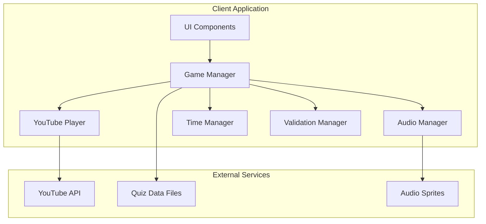
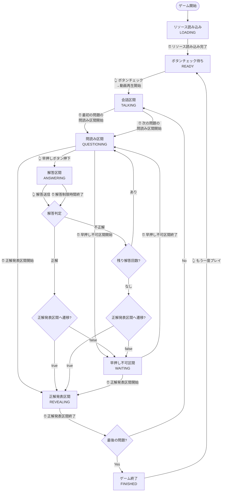
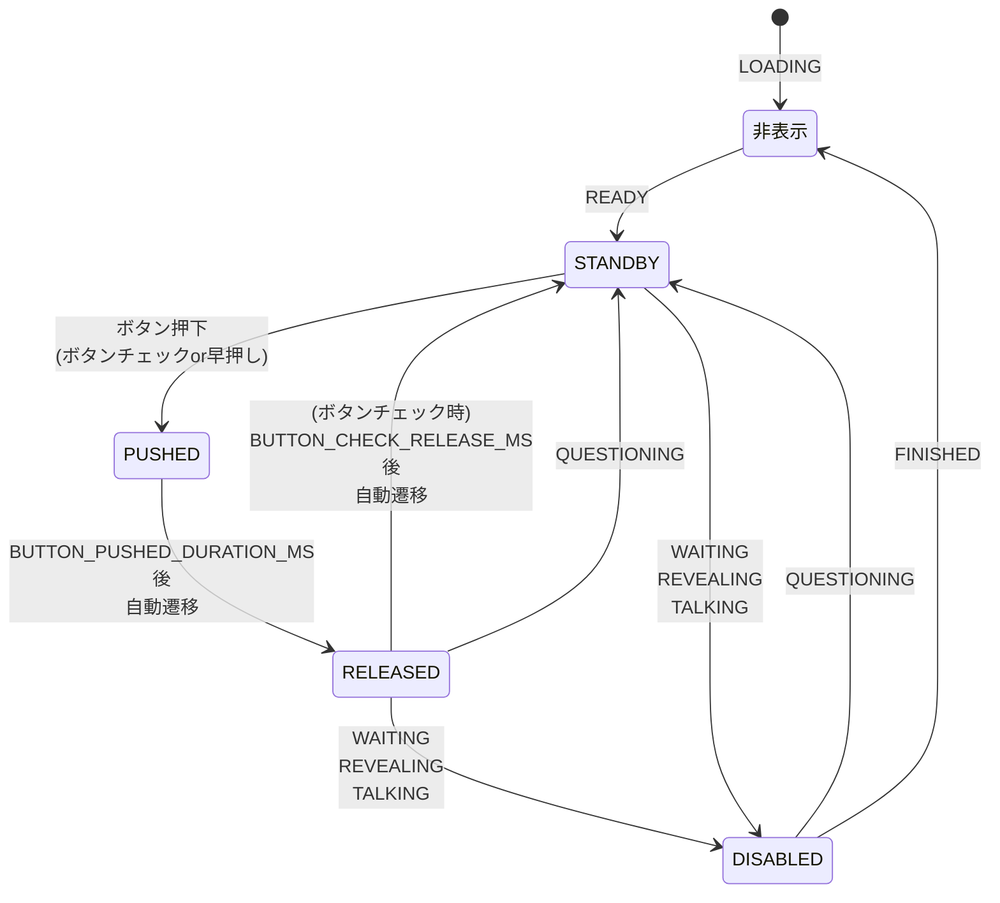
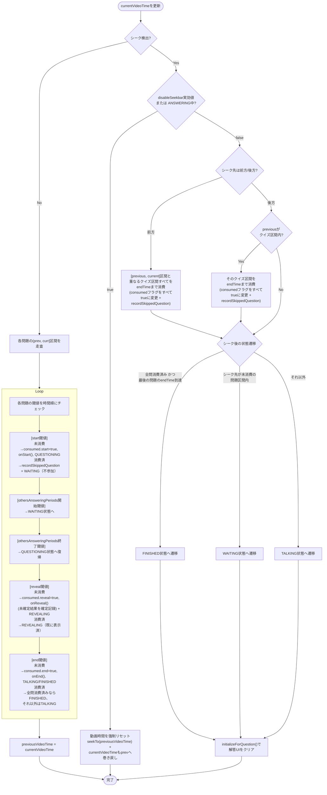
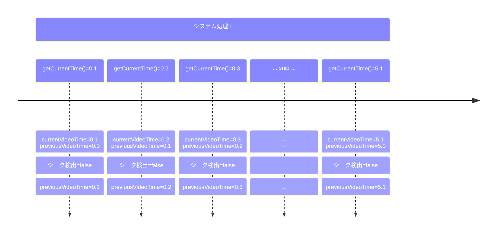
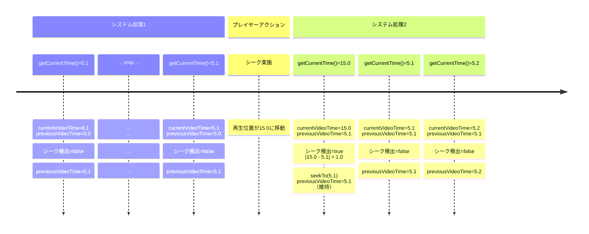
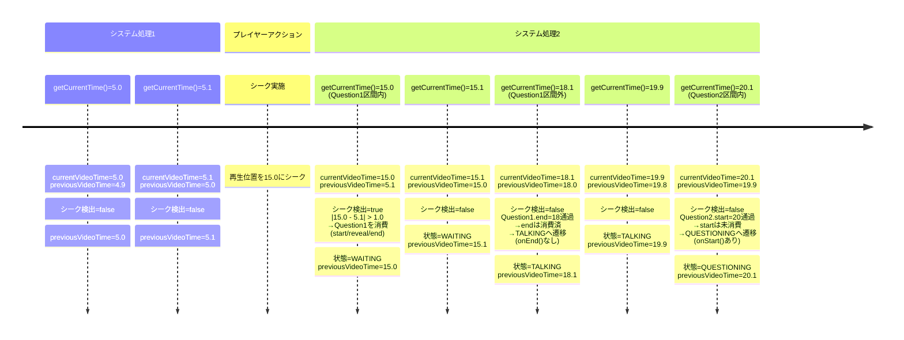
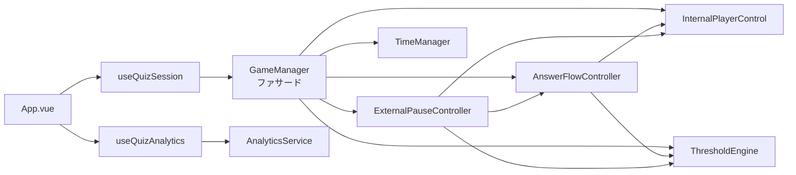

# Design Document

## Overview

YouTube上のクイズ動画を使った「早押しクイズ」ができるWebアプリケーション。視聴者もプレイヤーとなり、動画出演者との疑似的な早押しクイズ対決を楽しむことを可能にする。

### Core Concept

```
YouTubeクイズ動画 + 動画視聴中のリアルタイム早押し = インタラクティブな動画視聴体験
```

**基本体験**: プレイヤーはYouTubeに投稿されたクイズ動画を視聴しながら、画面上の早押しボタンをタップすることで解答権を取得し、動画内で出題されたクイズに解答する

**プレイ可能人数**: 1人

**対象環境**

- プライマリ: スマートフォンブラウザ（縦画面専用）
- セカンダリ: PCブラウザ（開発・デバッグ機能も用意する）

### Technical Stack

**推奨スタック**

- **Frontend**: Vue 3 (Composition API) + TypeScript + Vite
- **State Management**: Pinia
- **Styling**: Tailwind CSS
- **Target Platform**: スマートフォンブラウザ（縦画面専用）、PCブラウザ（開発・デバッグ用）

### Framework Selection

このプロジェクトではVue.js 3を採用します。主な理由：

1. **複雑な状態管理**: ゲーム状態、ボタン状態、時間管理の複雑な相互作用をPiniaで直感的に管理
2. **リアルタイム性**: 150ms間隔（`TIME_UPDATE_INTERVAL_MS`、目安 100〜200ms）の動画時間更新、即座のUI状態反映にリアクティブシステムが最適
3. **状態遷移の可視性**: テンプレート内での条件分岐が複雑な状態遷移を理解しやすくする
4. **TypeScript統合**: Composition APIとTypeScriptの組み合わせが優秀
5. **学習・保守性**: 単一ファイルコンポーネントで構造が理解しやすい

## User Experience

### User Flow

**導入フェーズ**:

1. **Webページの読み込み** → ローディング画面を表示
2. **読み込み完了** → 動画プレイヤーや早押しボタンなどが画面に表示される
3. **早押しボタンをタップ** → ボタンチェック演出 → クイズ動画の再生開始

**ゲームプレイ**:

1. **動画が進行** → 問題が出題される → 早押しボタンが押せる状態になる
2. **早押しボタンをタップ** → 動画を一時停止・効果音を再生(ボタン音) → 解答入力フォームが有効になり、問題に解答できる
3. **解答を入力・送信** → 正誤判定の結果を表示・効果音を再生(正解音・不正解音) → 動画を再開
4. **次の問題まで動画が進行** → すべての問題が終わるまで繰り返し

### Control Methods

- **スマートフォン**: タッチ操作
- **PC**: モニターが対応していればタッチ操作可能、加えてスペースキー押下でも早押しが可能（その他は通常のマウス操作に対応）

#### キーボード操作（PC）

- 入力中の誤操作防止: フォーカスが`input`/`textarea`/`contentEditable`上にある場合はスペースキーを無視
- フォーカスが`button`/`a`/`select`上にある場合も無視（各要素本来のSpace→click動作を妨げないため）
- 修飾キー（Alt/Ctrl/Meta）付き、またはキーリピート中のイベントは無視（OS/ブラウザショートカットとの衝突・連続発火防止）
- 既定スクロール抑止: スペースキー早押し時は`preventDefault()`を行う
- 押下可否の判定自体はハンドラ内で行わず、`gameManager.handleButtonPress()`（`gameStore.isButtonEnabled`を内部で参照）に委譲する

```typescript
// src/utils/keyboardHandler.ts
export function shouldHandleSpaceKey(e: KeyboardEvent): boolean {
  if (e.code !== 'Space') return false
  if (e.repeat) return false
  if (e.altKey || e.ctrlKey || e.metaKey) return false

  const target = e.target as HTMLElement
  if (
    target instanceof HTMLInputElement ||
    target instanceof HTMLTextAreaElement ||
    target.isContentEditable ||
    target instanceof HTMLButtonElement ||
    target instanceof HTMLAnchorElement ||
    target instanceof HTMLSelectElement
  ) {
    return false
  }
  return true
}

// App.vue
function handleKeyDown(e: KeyboardEvent) {
  if (!shouldHandleSpaceKey(e)) return
  e.preventDefault()
  handleButtonPress() // gameManager.handleButtonPress() へ委譲
}
```

#### ボタンチェック演出

早押しクイズ文化における「ボタンチェック」を踏襲し、画面上の早押しボタンを押すこと（タッチまたはスペースキー押下）を動画の再生開始（＝クイズ対戦の開始）のトリガーとする。
これによって、クイズが好きな視聴者にとって馴染みのあるインタラクションでゲームに導入する。

## System Architecture


```mermaid
graph TB
    subgraph "Client Application"
        UI[UI Components]
        GM[Game Manager]
        YT[YouTube Player]
        AM[Audio Manager]
        TM[Time Manager]
        VM[Validation Manager]
    end

    subgraph "External Services"
        YTA[YouTube API]
        QD[Quiz Data Files]
        AS[Audio Sprites]
    end

    UI --> GM
    GM --> YT
    GM --> AM
    GM --> TM
    GM --> VM
    YT --> YTA
    GM --> QD
    AM --> AS
```

## Game State Management

### Game State Definitions

| ゲーム状態 | 説明 | 早押しボタン操作 |
|------|------|-----------|
| LOADING | リソースのロード中 | ボタン非表示 |
| READY | ゲームの開始準備完了（ボタンチェック待ち） | 有効（ボタンチェック） |
| TALKING | 問題前後の会話区間 | 無効 |
| QUESTIONING | 問読み区間（早押し可能区間） | 有効（早押し） |
| ANSWERING | プレイヤーの解答区間 | 無効 |
| WAITING | 早押し不可区間（動画内プレイヤーの解答区間など） | 無効 |
| REVEALING | 正解発表区間 | 無効 |
| FINISHED | ゲーム終了（結果表示） | ボタン非表示 |

### State Transition Patterns

#### 状態遷移の起点

- **⏰ 時間経過起点**: 動画時間や制限時間の到達により自動発生する状態遷移
- **👆 アクション起点**: プレイヤーの操作によって即座に発生する状態遷移

#### ゲーム導入時の状態遷移

```
LOADING → [⏰ リソース読み込み完了] → READY
  → [👆 開始ゲートをタップ]
  → [👆 ボタンチェック ON: 演出 → TALKING（動画再生開始）]
    / [👆 ボタンチェック OFF: 即座に TALKING（動画再生開始）]
  → [⏰ 最初の問読み区間開始] → QUESTIONING
```

**操作遮断**: ゲート・設定・テーマ・横画面・エラー表示中は、Appの共通判定で早押しと手動解答送信（Spaceを含む）を受け付けない。AnswerContentはcompositionイベント・`KeyboardEvent.isComposing`・IME互換のkeyCode 229を確認し、変換確定Enterでは送信しない。通常Enterでは1回送信する。

**開始ゲート**: LOADING中から画面全体に表示されるオーバーレイ（`start-gate`）。READY到達後のみタップを受け付ける。タップ内で以下を同期実行する:

- `GameManager.warmupVideoPlayback()`: `GATE_WARMUP_PLAY_MS` だけ動画を実再生してから停止し先頭へ戻す（iOSにユーザー操作由来の再生実績を作り、以後の遅延`playVideo()`を許可させる）
- `AudioManager.unlock()`: AudioContextの解錠（iOS音声再生対策。詳細はAudio Manager節を参照）
- `AnalyticsService.init()`: Analytics初期化（外部リクエストはゲート通過後に限定する）

**ボタンチェック演出の有無**: `gameStore.isButtonCheckEnabled`（設定オーバーライドがクイズデータの`buttonCheckEnabled`より優先。詳細はConfiguration Management参照）で決まる。OFFの場合、READYでのボタン押下は演出なしの単純な再生ボタンとして動作し、動画を先頭へシーク＆時間変数リセットした上で即座にTALKINGへ遷移して再生を開始する。

#### クイズ出題中の状態遷移

**（１）QUESTIONING状態からの分岐**

```
QUESTIONING
├── [👆 早押しボタン押下　] → ANSWERING（動画一時停止）
├── [⏰ 早押し不可区間開始] → WAITING
└── [⏰ 正解発表区間開始　] → REVEALING
```

**（２）ANSWERING状態からの分岐**

```
ANSWERING（動画一時停止）
├── [👆 解答送信] → 正誤判定
│   ├── [正解の場合]
│   │   ├── [正解発表区間への遷移設定 = true ] → REVEALING (時間をジャンプして動画再開)
│   │   └── [正解発表区間への遷移設定 = false] → WAITING (そのまま動画再開)
│   │
│   ├── [不正解 & 残り解答回数あり] → QUESTIONING (そのまま動画再開)
│   │
│   └── [不正解 & 残り解答回数なし]
│       ├── [正解発表区間への遷移設定 = true ] → REVEALING (時間をジャンプして動画再開)
│       └── [正解発表区間への遷移設定 = false] → WAITING (そのまま動画再開)
│
└── [⏰ 解答制限時間終了] → その時点の入力内容で強制正誤判定（`submissionType='timeout'`として送信。未入力なら空文字＝不正解）
    └── （上記と同じ分岐処理）
```

**（３）WAITING状態からの分岐**

```
WAITING
├── [⏰ 早押し不可区間終了] → QUESTIONING
└── [⏰ 正解発表区間開始　] → REVEALING
```

**（４）その他の時間経過起点遷移**

```
REVEALING → [⏰ 正解発表区間終了] →
            ├── [最後の問題の場合] → FINISHED
            └── [続きの問題がある場合] → TALKING

TALKING → [⏰ 問読み区間開始] → QUESTIONING

FINISHED → [👆 シークバー操作等] → FINISHED（状態固定、時間ベース遷移なし）
        └── [👆 もう一度プレイ押下] → resetGame()でLOADINGへ一旦戻し、動画を0秒にシーク
             → READY（リセット後。自動再生はしない）
             ※ READY復帰後は正常な開始操作まで、seekTo(0)起因のspurious PLAYING
                イベント（YouTube側の遅延通知）を無視する
```

### State Transition Flow


```mermaid
flowchart TD
  START([ゲーム開始]) --> LOADING[リソース読み込み<br>LOADING]
  LOADING --> |⏰ リソース読み込み完了| READY[ボタンチェック待ち<br>READY]
  READY --> |👆 ボタンチェック<br>→動画再生開始| TALKING[会話区間<br>TALKING]
  TALKING --> |⏰ 最初の問題の<br>問読み区間開始| QUESTIONING[問読み区間<br>QUESTIONING]

  QUESTIONING --> |👆 早押しボタン押下| ANSWERING[解答区間<br>ANSWERING]
  QUESTIONING --> |⏰ 早押し不可区間開始| WAITING[早押し不可区間<br>WAITING]
  QUESTIONING --> |⏰ 正解発表区間開始| REVEALING[正解発表区間<br>REVEALING]

  ANSWERING --> |👆 解答送信| JUDGE{解答判定}
  ANSWERING --> |⏰ 解答制限時間終了| JUDGE

  JUDGE --> |正解| CORRECT_JUMP{正解発表区間へ遷移?}
  JUDGE --> |不正解| INCORRECT_CHECK{残り解答回数?}

  CORRECT_JUMP --> |true| REVEALING
  CORRECT_JUMP --> |false| WAITING

  INCORRECT_CHECK --> |あり| QUESTIONING
  INCORRECT_CHECK --> |なし| INCORRECT_JUMP{正解発表区間へ遷移?}
  INCORRECT_JUMP --> |true| REVEALING
  INCORRECT_JUMP --> |false| WAITING

  WAITING --> |⏰ 早押し不可区間終了| QUESTIONING
  WAITING --> |⏰ 正解発表区間開始| REVEALING

  REVEALING --> |⏰ 正解発表区間終了| LAST_CHECK{最後の問題?}

  LAST_CHECK --> |No| TALKING[会話区間<br>TALKING]
  LAST_CHECK --> |Yes| FINISHED[ゲーム終了<br>FINISHED]

  TALKING --> |⏰ 次の問題の<br>問読み区間開始| QUESTIONING

  FINISHED --> |👆 もう一度プレイ| READY
```

## Button State Management

### Button State Definitions

| ボタン状態 | 名称 | 説明 | 押下可否 |
|------|------|------|---------|
| STANDBY | 待機状態 | ボタンのデフォルト状態 | 可能 |
| PUSHED | 押下状態 | ボタンが押された状態 | 不可 |
| RELEASED | 点灯状態 | ボタンのLEDが点灯した状態（解答権取得） | 不可 |
| DISABLED | 無効状態 | ボタン押下が無効の状態 | 不可 |

### Button State Transitions


```mermaid
stateDiagram-v2
  [*] --> 非表示 : LOADING
  非表示 --> STANDBY : READY

  %% ユーザー操作起因の遷移（ボタンチェック＆早押し。ボタンチェックOFF時のREADYはこの遷移列を経由せず即TALKING）
  STANDBY --> PUSHED : ボタン押下<br>(ボタンチェックor早押し)
  PUSHED --> RELEASED : BUTTON_PUSHED_DURATION_MS後<br>自動遷移
  RELEASED --> STANDBY : (ボタンチェック時)<br>BUTTON_CHECK_RELEASE_MS後<br>自動遷移

  %% 解答結果・状態変化による遷移
  RELEASED --> STANDBY : QUESTIONING
  RELEASED --> DISABLED : WAITING<br>REVEALING<br>TALKING

  STANDBY --> DISABLED : WAITING<br>REVEALING<br>TALKING

  DISABLED --> STANDBY : QUESTIONING
  DISABLED --> 非表示 : FINISHED
```

### Button State Transition Timing Details

数値は `src/constants/timing.ts` の定数を正とする（値は2026-07-07時点）。

| 遷移パターン | トリガー | 遷移時間 | 詳細 |
|------------|---------|---------|------|
| 非表示 → STANDBY | ゲーム状態変化（READY） | 即座 | ゲーム開始準備完了時 |
| STANDBY → PUSHED | ボタン押下 | 即座 | QUESTIONING時は同期処理内で「動画停止→押下タイミング記録→押下音再生」の順 |
| PUSHED → RELEASED | 自動遷移 | `BUTTON_PUSHED_DURATION_MS`後（100ms） | 視覚的フィードバック |
| RELEASED → STANDBY | 自動遷移（ボタンチェック時） | `BUTTON_CHECK_RELEASE_MS`後（1800ms） | 正解音再生 → 同時にTALKING状態へ遷移 |
| TALKING遷移 → 動画再生開始 | 自動遷移 | 上記STANDBY遷移からさらに`VIDEO_START_DELAY_MS`後（1200ms） | 正解音と動画音声の重なり回避。遅延中にExternal Pauseなら再生要求を保留し、最後の解除後に開始。TALKING状態を離れた場合は再生しない |
| RELEASED → STANDBY | ゲーム状態変化（QUESTIONING） | 即座 | 早押し成功時 |
| RELEASED → DISABLED | ゲーム状態変化 | 即座 | WAITING/REVEALING/TALKING状態時 |
| STANDBY → DISABLED | ゲーム状態変化 | 即座 | WAITING/REVEALING/TALKING状態時 |
| DISABLED → STANDBY | ゲーム状態変化（READY/QUESTIONING） | 即座 | 問題開始時・ゲーム開始準備完了時 |
| DISABLED → 非表示 | ゲーム状態変化（FINISHED） | 即座 | ゲーム終了時 |

早押し受理後はQUESTIONINGのまま点灯演出を見せ、押下から`ANSWER_START_DELAY_MS`（500ms）後にANSWERINGへ移る（iOS／iPadOSは追加待ちなしで100ms）。待ち時間中は再押下・解答入力を受け付けず、動画の再生要求を停止する。解答期限はANSWERING開始時から数え、リセット・破棄・問題変更で保留遷移を取り消す。

表示ラベルはボタン状態へ即時追従し、DISABLEDへ変わった時点で必ず「WAIT」へ切り替える。

### Button Interaction Rules

**ボタンチェック時**（ゲーム状態: READY状態、`gameStore.isButtonCheckEnabled`がtrueの場合のみ）

1. ボタン押下 → PUSHED状態（ボタン押下音再生開始）
2. `BUTTON_PUSHED_DURATION_MS`後 → RELEASED状態
3. `BUTTON_CHECK_RELEASE_MS`後 → STANDBY状態（正解音再生開始）+ ゲーム状態がTALKING状態に遷移
4. さらに`VIDEO_START_DELAY_MS`後 → 動画再生開始

`isButtonCheckEnabled`がfalseの場合、READYでのボタン押下は上記の演出をすべてスキップする。動画を先頭へシーク・時間変数をリセットした上で即座にTALKING状態へ遷移し、動画再生を開始する（単純な再生ボタンとして動作）。

**早押し時**（ゲーム状態: QUESTIONING状態）

1. ボタン押下 → 同期処理内で「動画停止 → 押下タイミング記録（Analytics用。問題開始からの経過秒） → 押下音再生」の順に実行 → PUSHED状態
2. `BUTTON_PUSHED_DURATION_MS`後 → RELEASED状態。同時に前回の不正解表示・入力内容をクリアし、ゲーム状態がANSWERING状態に遷移（RELEASED状態を維持したまま解答カウントダウン開始）

**状態連動**

- ゲーム状態がWAITING/REVEALING/TALKING状態 → DISABLED状態（DISABLED/RELEASEDからのみ降格）
- ゲーム状態がREADY/QUESTIONING状態 → STANDBY状態（DISABLED/RELEASEDからのみ昇格。PUSHED中はゲーム状態変化の影響を受けない）

## Time Management

### Video Time Structure

- **QUIZ区間**: 問読み区間から正解発表区間までをまとめた1問の問題の区間
- **TALK区間**: QUIZ区間以外の区間

動画内で複数の問題が出題される場合、複数のQUIZ区間を持つ。動画内のQUIZ区間以外の区間はすべてTALK区間とする。

### Static Time Variables

#### QUIZ区間に関する時間変数（閾値）

```typescript
interface QuizQuestion {
  index: number // 配列インデックス（0-indexed、JSONのquestionNumber（1-indexed）から変換）
  startTime: number // 問読み区間の開始時間（秒）
  revealTime: number // 正解発表区間の開始時間（秒）
  endTime: number // 正解発表区間の終了時間（秒）
  answers: string[] // 正解パターンのリスト
  othersAnsweringPeriods?: OthersAnsweringPeriod[] // 動画内プレイヤーの解答区間
  questionText?: string // 問題文（Analytics送信用。データが持つ場合のみ）
}

interface OthersAnsweringPeriod {
  startTime: number // 解答開始時間（秒）
  endTime: number // 解答終了時間（秒）
}
```

#### 時間閾値による状態遷移制御

**状態遷移の流れ:**

各問題について、以下の閾値を時間順に処理：

1. `startTime`:
   - consumed.start=false → onStart()実行 + QUESTIONING状態へ
   - consumed.start=true → WAITING状態へ（不参加）
2. `othersAnsweringPeriods[i].start`: WAITING状態へ
3. `othersAnsweringPeriods[i].end`: QUESTIONING状態へ復帰
4. `revealTime`:
   - consumed.reveal=false → onReveal()実行 + REVEALING状態へ
   - consumed.reveal=true → REVEALING状態へ（既に表示済み）
5. `endTime`:
   - consumed.end=false → onEnd()実行 + TALKING/FINISHED状態へ
   - consumed.end=true → TALKING状態へ（既に終了済み）

**未確定結果の確定記録:**

解答権を残したまま不正解・無解答で正解発表区間に入った場合（＝結果が未確定のまま）、`onReveal()`実行時に`recordSkippedQuestion(index, false)`を呼び、この時点で結果を確定記録する（0点、`skipped=false`）。`onEnd()`でも同じ呼び出しを保険として行う（reveal閾値を跨がずendに到達する稀なケースの対応。既に記録済みなら重複ガードで無視される）。

**consumedフラグによる一回性保証（start/reveal/endのみ）:**
- start/reveal/end閾値は副作用のある処理を実行する
  - `onStart()`: currentQuestionIndex設定、残り回数初期化、UIリセット（重複実行で解答状態がリセットされる）
  - `onReveal()`: 正解表示、ジャンプ処理（重複実行で再ジャンプが発生）
  - `onEnd()`: スコア集計、結果保存（重複実行でスコアが二重カウントされる）
- よって、再生時間の巻き戻しなどによって同じ処理が重複して実行されないようにするために、consumedフラグを用いた一回性保証の制御が必要（Single‑Shot Guard）

**othersAnsweringPeriodsには一回性保証は不要:**
- othersAnsweringPeriodsの区間では副作用のある処理を伴わず、UI上の状態切り替えのみを行う
- consumedフラグを消費済みの問題では問題自体に参加できないため（WAITING状態）、othersAnsweringPeriodsの処理は実質的に意味を持たない

**消費済み区間の扱い:**
- 消費済み区間では、上記の通り副作用のある処理（onStart/onReveal/onEnd）は実行されないようにする
- 不参加として適切な状態への遷移のみを実行する

**各区間の排他・包含関係（検証）:**

1. **単一問題内の閾値順序**:
   - 各問題について: `startTime < revealTime < endTime`
   - 各閾値は厳密に昇順である必要がある

2. **問題間の非重複性**:
   - 問題配列を時間順に整列した場合: `questions[i].endTime <= questions[i+1].startTime`
   - 前の問題の終了時刻は、次の問題の開始時刻以前である必要がある

3. **othersAnsweringPeriods の検証**:
   - 各期間について: `period.start < period.end`（開始時刻 < 終了時刻）
   - 複数期間がある場合: `periods[i].end <= periods[i+1].start`（昇順・非重複）
   - すべての期間が QUESTIONING 区間内に完全に収まる:
     ```
     startTime <= period.start < period.end <= revealTime
     ```

4. **データ検証**:
   - 上記の条件に違反するデータは読み込み時にエラーとする
   - エラーメッセージには、具体的な違反箇所（問題番号、閾値名、実際の値）を含める

#### TALK区間に関する時間変数:

なし。QUIZ区間の範囲外の動画時間を自動的にTALK区間として扱い、その間のゲーム状態をTALKING状態と判定する。

### Dynamic System Time Variables

動画の再生時間に関する以下のシステム変数を常に管理・更新することで、現在の動画時間を把握する。
currentVideoTimeは、YouTube PlayerのAPIによって取得する動画の現在再生時間である。

| 変数名 | 型 | 初期値 | 説明 | 更新タイミング |
|--------|------|------|------|-------------|
| currentVideoTime | number | 0 | 現在の動画再生時間 | `TIME_UPDATE_INTERVAL_MS`（150ms）間隔 |
| previousVideoTime | number | 0 | 直前の再生位置（シーク検出用） | currentVideoTime更新後 |
| hasPassedRewindThreshold | boolean | false | YouTube Player巻き戻り閾値（5.5秒）を通過したか | updateVideoTime()で5.5秒通過時にtrue設定、resetGame()でfalseにリセット |

保持クラスは変数ごとに分かれる: `currentVideoTime`/`previousVideoTime`は`TimeManager`、`hasPassedRewindThreshold`は`ExternalPauseController`が保持する。

### Seek Detection via previousVideoTime

**前提**: 本ゲームでは公正な進行のために、シークバーの使用を原則で禁止とする。

previousVideoTimeは、直前の再生位置を記録する変数である。
currentVideoTimeの値を更新したあとで、"更新後のcurrentVideoTimeの値"と"更新前のpreviousVideoTimeの値"の比較を行うことで、プレイヤーによるシークバーの使用（による、動画再生時間のジャンプ）を検出する。

- **シーク判定方法**: `|currentVideoTime - previousVideoTime| > SEEK_TOLERANCE_SEC` を満たすとき
- **監視頻度**: currentVideoTimeの更新ごと

**内部シーク**: 正解発表へのシークは`TimeManager.beginInternalSeek()`で目標を登録してから発行する。目標±`SEEK_TOLERANCE_SEC`へ到達するまで古い時刻通知を保留し、到達時にpreviousVideoTimeを目標へ同期するため、ユーザーシークとして処理しない。`INTERNAL_SEEK_TIMEOUT_MS`（10秒）で待機を打ち切り、通常監視へ戻す。コマンド失敗・reset/destroyでも待機を解除する。

シーク検出の許容幅の設定:

```typescript
// 時間更新間隔（ミリ秒）
export const TIME_UPDATE_INTERVAL_MS = 150

/**
 * シーク検出の許容誤差時間（秒）
 * タブ切り替え時のsetInterval遅延（通常0.3〜0.5秒）を許容しつつ、
 * 実際のシーク操作（UIで10秒単位のジャンプ）を確実に検出できる値。
 * 1秒に設定することで、タブ切り替え時の誤検出を防ぎつつ、意図的なシーク操作は確実に検出できる。
 */
export const SEEK_TOLERANCE_SEC = 1.0
```

**設計根拠:**
- **タブ切り替え時の遅延許容**: バックグラウンドタブではsetIntervalが遅延し、0.3〜0.5秒程度のギャップが発生する可能性がある
- **意図的なシーク操作の確実な検出**: YouTubeプレイヤーのシークは通常10秒単位でジャンプするため、1秒の許容幅では確実に検出できる
- **固定値を採用**: 更新間隔に基づく計算式ではなく、実運用での経験値として固定値1.0秒を採用

### Seek Detection Behavior

プレイヤーによるシークバーの利用が検出された場合の挙動として、以下の2パターンを設定変数の値によって選択できるようにする。

> **実効値の優先順位**: 設定画面のユーザー上書き（`settingsStore.disableSeekbarOverride`、LocalStorage 永続化、null = 未設定）がクイズデータの `settings.disableSeekbar` より優先される。実効値の解決は GameManager が行う。

| disableSeekbar実効値 | シーク検出時の動作 |
|---------------|------------------|
| true、または**ゲーム状態がANSWERING中**（disableSeekbarの値に関わらず強制） | 動画の再生時間をpreviousVideoTimeまで強制リセットする（`seekTo(previousVideoTime)`に加えて`currentVideoTime`自体もpreviousVideoTimeまで巻き戻す。`submitAnswer`内のrevealTime比較に影響するため）。previousVideoTimeは更新しない |
| false（かつANSWERING以外） | 以下に記すようにクイズ区間を消費することで、対象となった問題を途中参加あるいは途中離脱扱いにする<br><br>**前方ジャンプ（current > previous）の場合:**<br>- `[previousVideoTime, currentVideoTime]`区間と重なるすべてのクイズ区間を消費（consumed = {start: true, reveal: true, end: true}）<br>- 区間の重なり判定: `q.startTime < currentVideoTime && q.endTime > previousVideoTime`<br>- シーク後の状態遷移（3分岐）:<br>　• すべてのクイズ区間を消費済みかつ最後のクイズ区間のendTimeを通過した場合 → FINISHEDへ遷移<br>　• シーク先が未消費の問題区間内の場合 → WAITINGへ遷移<br>　• それ以外（問題区間外） → TALKINGへ遷移<br>- 消費されていないクイズ区間に到達したら、状態遷移を再開<br><br>**後方ジャンプ（current < previous）の場合:**<br>- previousVideoTimeがクイズ区間内の場合、そのクイズ区間全体を消費（途中離脱として扱う）<br>- シーク後の状態遷移は前方ジャンプと同じルールで3分岐<br><br>**消費に伴う付随処理:**<br>- 消費した各問題は`recordSkippedQuestion(index, true)`で結果を記録（0点・スキップ扱い）<br>- 消費処理の最後に`gameStore.initializeForQuestion()`を呼び、解答UI（不正解表示・入力内容・解答履歴）をクリアする（前問のUIが遷移先に残らないようにするため） |

`InternalPlayerControl`は最後に指示した再生意図（PLAYING/PAUSED）を保持する。YouTube側から非同期で届く状態通知と再生意図を比較し、アプリ内コマンドへの応答とPlayer UIなどの外部操作を区別する。

### Single‑Shot Guard（一回性トリガ）

consumedフラグを用いて問題単位で「start/reveal/end」を各1回だけ処理するフラグ管理を行う（巻き戻しや任意シークがあっても安全）。この管理は`ThresholdEngine`が一元的に所有する。
副作用のある処理（onStart/onReveal/onEnd）は未消費時のみ実行し、消費済み時は状態遷移のみ行う。比較時には微小な許容値 `TIME_EPSILON_SEC`（`src/constants/timing.ts`、2026-07-07時点`1e-3`秒）を加えて量子化ズレを吸収する。

```typescript
// 問題ごとの一回性フラグ（start/reveal/end を各1回だけ処理）
const consumed: Record<number, { start: boolean; reveal: boolean; end: boolean }> = {}

function applyThresholds(prev: number, curr: number, q: QuizQuestion) {
  const c = consumed[q.index] ?? (consumed[q.index] = { start: false, reveal: false, end: false })

  // start閾値
  if ((prev + TIME_EPSILON_SEC < q.startTime || (q.startTime === 0 && prev === 0 && !c.start))
      && curr + TIME_EPSILON_SEC >= q.startTime) {
    // currentQuestionIndexは常に更新（動画再生位置ベースの表示用）
    gameStore.setCurrentQuestionIndex(q.index)

    if (!c.start) {
      c.start = true
      onStart(q)  // 副作用あり：初期化、QUESTIONING状態へ
    } else {
      // 消費済み：不参加、スキップとして記録
      recordSkippedQuestion(q.index, true)
      transitionTo(GAME_STATE.WAITING)
    }
  }

  // othersAnsweringPeriods閾値（省略。区間開始でWAITING、終了でQUESTIONING復帰）

  // reveal閾値
  if (prev + TIME_EPSILON_SEC < q.revealTime && curr + TIME_EPSILON_SEC >= q.revealTime) {
    if (!c.reveal) {
      c.reveal = true
      onReveal(q)  // 副作用あり：未確定結果の確定記録 + REVEALING状態へ
    } else {
      transitionTo(GAME_STATE.REVEALING)  // 消費済み：既に表示済み
    }
  }

  // end閾値
  if (prev + TIME_EPSILON_SEC < q.endTime && curr + TIME_EPSILON_SEC >= q.endTime) {
    if (!c.end) {
      c.end = true
      onEnd(q)  // 副作用あり：未確定結果の確定記録（保険）、TALKING/FINISHED状態へ
    } else {
      // 消費済み：既に終了済み

      // すべての問題が消費済みかチェック
      const allConsumed = questions.every(q =>
        consumed[q.index]?.start && consumed[q.index]?.reveal && consumed[q.index]?.end
      )

      // 最後の問題のendTimeを通過したかチェック（index一致で判定。lastQuestion.indexとの比較）
      const lastQuestion = questions[questions.length - 1]
      if (allConsumed && q.index === lastQuestion.index) {
        transitionTo(GAME_STATE.FINISHED)
      } else {
        transitionTo(GAME_STATE.TALKING)
      }
    }
  }
}
```

`jumpToRevealPeriod=true` でシークするコードパスでは、時間ハンドラより先に `consumed[q.index].reveal = true` を設定し、二重発火が起きないよう順序を固定する。

#### スキップされた問題の扱い

シーク操作によって途中参加・途中離脱扱いとなり問題への参加をスキップした場合（consumed.start=trueで start閾値を通過）、以下の内容で結果を記録する

**記録内容:**
- **スコア**: 0点として記録
- **結果表**: 「-」表示（○×ではなく）
- **あなたの解答**: 空欄
- **正解数の分母**: カウントに含める（例: 2/5問正解）

**実装:**

`isSkip`は「消費済みstart閾値経由（true）」か「REVEALING/END到達時の未確定結果確定（false）」かを表す。現在解答中の問題であれば、解答権を残していた分の解答履歴（`pendingUserAnswers`）を引き継いで記録する（解答試行があった場合は「不参加」ではなく「未解答」寄りの扱いになる）。

```typescript
function recordSkippedQuestion(questionIndex: number, isSkip: boolean) {
  const question = questions[questionIndex]

  // pendingUserAnswersは現在解答中の問題にのみ紐付ける（他問題の消費時は空扱い）
  const isCurrentQuestion = questionIndex === gameStore.currentQuestionIndex
  const userAnswers = isCurrentQuestion ? [...gameStore.pendingUserAnswers] : []
  const hasAttempted = isCurrentQuestion && gameStore.pendingUserAnswers.length > 0

  // gameStore.recordResult() 経由で記録
  // 重複ガードにより同一問題の二重記録は防止される
  gameStore.recordResult(
    questionIndex + 1,        // questionNumber（1-indexed）
    false,                    // isCorrect
    question.answers[0],      // correctAnswer
    userAnswers,               // userAnswers（解答権を残していた場合は履歴を引き継ぐ）
    isSkip && !hasAttempted,   // skipped
    {
      timesUntilPress: isCurrentQuestion ? [...gameStore.pendingTimesUntilPress] : [],
      submissionTypes: isCurrentQuestion ? [...gameStore.pendingSubmissionTypes] : [],
    },
  )
}
```

**参考: 時間経過起点のハンドラと GameManager の対応付け**

```typescript
function onStart(q: QuizQuestion) {
  // 状態とカウンタを問題開始用に初期化
  gameStore.setCurrentQuestionIndex(q.index)
  gameStore.initializeForQuestion()  // remainingAttempts, answerTimeRemaining, answerInput, answerResult,
                                      // pendingUserAnswers, pendingTimesUntilPress, pendingSubmissionTypes をリセット

  // QUESTIONING でボタンを押下可能に
  transitionToState(GAME_STATE.QUESTIONING)
}

function onReveal(q: QuizQuestion) {
  // 解答権を残したまま正解発表に入った場合、この時点で結果を確定記録する
  // （記録済みなら重複ガードで無視される）
  recordSkippedQuestion(q.index, false)

  // 時間経過で正解発表区間へ遷移（入力は不可、結果表示）
  transitionToState(GAME_STATE.REVEALING)
  // 備考: アクション起点（解答送信）で jumpToRevealPeriod=true の場合は
  // 先に player.seekTo(q.revealTime) を行うコードパスが別に存在する
}

function onEnd(q: QuizQuestion) {
  // 通常はonRevealで記録済み。reveal閾値を跨がずendに到達した稀なケースの保険
  recordSkippedQuestion(q.index, false)

  // 正解発表区間の終了。最後の問題かどうかはindexの一致で判定
  const lastQuestion = questions[questions.length - 1]
  transitionToState(q.index === lastQuestion.index ? GAME_STATE.FINISHED : GAME_STATE.TALKING)
}
```

#### 1ティック内の複数閾値走査

`setInterval`の遅延等で複数の閾値をまとめて飛び越える可能性に備えて、毎回のチェック時に`(prev, curr]`の窓内を走査して全閾値を順に処理する。

```typescript
private processTimeWindow(prev: number, curr: number): void {
  // すべての問題の閾値を走査して処理
  for (const question of this.quizData.questions) {
    this.applyThresholds(prev, curr, question)
  }
}
```

### VideoTime Update Logic

READY中は時間更新を処理しない。0秒開始の問題も開始操作後に一度だけ開始する（reset後は再度開始できる）。

#### VideoTime更新処理のフローチャート

破棄済み・READY・FINISHED・外部一時停止（user以外）・内部シークの到達待機中は先にreturnする。内部シーク到達時の時刻同期後、以下の流れでcurrentVideoTimeの更新、シーク検出、consumedフラグの消費、状態遷移、previousVideoTimeの更新処理を行う。



```mermaid
flowchart TD
    Start(["currentVideoTimeを更新"]) --> Check{シーク検出?}

    Check -->|No| Loop["各問題の(prev, curr]区間を走査"]

    Check -->|Yes| Setting1{disableSeekbar実効値<br>または ANSWERING中?}

    Setting1 -->|true| Reset["動画時間を強制リセット<br>seekTo(previousVideoTime) +<br>currentVideoTimeもprevへ巻き戻し"]
    Setting1 -->|false| Direction{シーク先は前方/後方?}

    Direction -->|前方| Forward["[previous, current]区間と<br>重なるクイズ区間すべてを<br>endTimeまで消費<br>(consumedフラグをすべてtrueに変更 +<br>recordSkippedQuestion)"]
    Direction -->|後方| Backward{previousが<br>クイズ区間内?}

    Backward -->|Yes| BackwardConsume["そのクイズ区間を<br>endTimeまで消費<br>(consumedフラグをすべてtrueに変更 +<br>recordSkippedQuestion)"]
    Backward -->|No| SeekTransition

    Forward --> SeekTransition
    BackwardConsume --> SeekTransition

    SeekTransition{シーク後の状態遷移}
    SeekTransition -->|全問消費済み かつ<br>最後の問題のendTime到達| ToFinished["FINISHED状態へ遷移"]
    SeekTransition -->|シーク先が未消費の<br>問題区間内| ToWaiting["WAITING状態へ遷移"]
    SeekTransition -->|それ以外| ToTalking["TALKING状態へ遷移"]

    ToFinished --> ClearUI["initializeForQuestion()で<br>解答UIをクリア"]
    ToWaiting --> ClearUI
    ToTalking --> ClearUI

    Loop --> WindowScope

    subgraph WindowScope["Loop"]
        direction TB
        ThresholdCheck["各問題の閾値を時間順にチェック"]
        ThresholdCheck --> StartCheck["[start閾値]<br>未消費<br>→consumed.start=true, onStart(), QUESTIONING<br>消費済<br>→recordSkippedQuestion + WAITING（不参加）"]
        StartCheck --> OthersStart["[othersAnsweringPeriods開始閾値]<br>→WAITING状態へ"]
        OthersStart --> OthersEnd["[othersAnsweringPeriods終了閾値]<br>→QUESTIONING状態へ復帰"]
        OthersEnd --> RevealCheck["[reveal閾値]<br>未消費<br>→consumed.reveal=true, onReveal()<br>(未確定結果を確定記録) + REVEALING<br>消費済<br>→REVEALING（既に表示済）"]
        RevealCheck --> EndCheck["[end閾値]<br>未消費<br>→consumed.end=true, onEnd(), TALKING/FINISHED<br>消費済<br>→全問消費済みならFINISHED、<br>それ以外はTALKING"]
    end

    WindowScope --> UpdatePrev["previousVideoTime = currentVideoTime"]

    Reset --> End(["完了"])
    ClearUI --> End

    UpdatePrev --> End
```

#### 動画時間の定期更新処理

動画時間の定期更新処理（TimeUpdate）では、再生直後の誤検出を避けるウォームアップ猶予と、壁時計との差分による停滞チェックの枠組みを持たせる。役割は2箇所に分かれる: ポーリングと猶予判定は`useGameLoop`（composable）、停滞検出とExternal Pauseの発火/解除は`ExternalPauseController.checkStall()`が担う。

`STARTUP_GRACE_MS`猶予中は`checkStall()`/`updateVideoTime()`のどちらも呼ばれずtickが即returnする（停滞検出の基準値`lastWallMs`/`lastVideoTime`もこの間は更新されない）。FINISHED状態への到達は、endTime消費（`onEnd()`）・シーク消費（`consumeQuestionsBySeek()`）・動画終端到達時の確定処理（`finalizeAtVideoEnd()`。後述）のいずれかを経由する。

```typescript
// STALL_WALL_MS / STALL_VIDEO_DELTA_SEC / STARTUP_GRACE_MS / TIME_UPDATE_INTERVAL_MS は
// src/constants/timing.ts で定義（2026-07-07時点: 1200ms / 0.05秒 / 1000ms / 150ms）

// --- useGameLoop（composable）: ポーリングと猶予判定 ---
const startedAt = performance.now()

function tick(): void {
  const now = performance.now()
  const current = playerManager.getCurrentTime()

  // 再生開始直後の誤検出回避（stall検出・updateVideoTimeの両方をスキップ）
  if (now - startedAt < STARTUP_GRACE_MS) {
    return
  }

  gameManager.checkStall(now, current)
  gameManager.updateVideoTime(current)
}

setInterval(tick, TIME_UPDATE_INTERVAL_MS)


```

停滞の基準は毎tickで更新せず、最後に0.05秒以上の進行を観測した時刻から積算する。再生対象のゲーム状態かつPLAYING/BUFFERINGで1200ms以上進まない場合、ゲームの時刻処理を保留する。stallでは`pauseVideo()`を呼ばず、時刻の進行またはPLAYING通知で復帰できるようにする。動画の逆行・非再生状態では比較基準を更新する。stall中のvisibility/orientation/user停止を優先し、それ以降の時刻進行だけでは解除しない。

### External Pause Handling（外部一時停止対応）

`ExternalPauseController`は動画の停止理由を集合で保持する。解答カウントダウンとは独立しており、設定・横画面警告・タブ非表示でも解答期限は延長しない。

| 停止理由 | 検出・解除 | 動画の扱い |
|---|---|---|
| `settings` | Appの設定またはテーマ選択の表示状態 | 表示中は停止。設定→テーマ選択の切替でも継続して停止 |
| `orientation` | タッチ端末の横画面・縦画面への復帰 | 横画面警告中は停止 |
| `visibility` | visibilitychange/pagehide/pageshow | 非表示中は停止。すでに別の理由で停止中でも理由を追加 |
| `user` | Player UIのPAUSED/PLAYING | 手動停止は設定等を閉じても解除しない |
| `stall` | 再生意図がある状態の時刻停滞・進行の復帰 | 動画自体は止めず時刻処理を保留。能動的な停止が重なったらその理由へ引き継ぐ |

`resumeExternalIfReason(reason)`は指定した理由だけを解除し、すべてなくなってから復帰する。最初の停止時に再生中だった動画、または停止中にアプリから再生要求があった動画だけが再開対象となる。READY/LOADING/FINISHED、手動停止中の動画を画面の開閉だけで再開しない。復帰時のYouTube巻き戻り補正は維持する。

`InternalPlayerControl`の再生ガードにより、解答の時間切れや開始演出の完了が`playVideo()`を呼んでも、停止理由がある間は再生を保留する。Playerから予期しないPLAYING通知が届いた場合も停止を維持する。解答期限後は結果処理・効果音が発生するが、動画再開は最後の停止理由の解除を待つ。

`useQuizSession`は設定・画面向きの表示状態を保持し、Player初期化後にも反映する。Appは設定とテーマ選択の表示を論理和で同期監視し、テーマを開いてから設定を閉じる順序で一時的な再開を防ぐ。

#### 解答期限

`AnswerFlowController`は解答開始時に`performance.now()`を基準とする期限を記録する。1秒ごとのタイマーは期限との差から残り秒数を計算し、遅延した通知の分も差し引く。外部停止でタイマーを停止・再生成しない。期限後の送信もtimeoutとして確定する。実行自体がブラウザにより停止された間は表示更新できないが、次のタイマー通知または送信時に期限を確認する。

設定・テーマ選択・横画面警告の間は解答操作できず、そのまま時間切れになる場合がある。エラー時・解答確定時・reset/destroyでは従来どおり解答タイマーを破棄する。

#### 動画終了とシーク禁止

終了イベントの確定可否は`GameManager.acceptVideoEnd()`で判定する。READY/LOADING/FINISHEDの通知は確定しない。シーク禁止（設定の上書きを優先）または解答中は、直前の正常位置と現在位置の両方が動画終端付近かを確認する。自然終了以外は直前位置へ戻す。内部シーク中の終了通知は無視するだけにせず、保持している内部シークの目標位置への復帰を開始する。判定の許容差は通常監視と同じ`SEEK_TOLERANCE_SEC`（1秒）を用いる。

終了通知に対する時刻更新の遅れや、復帰指示が反映されない場合に備え、`endRecovery`に復帰先と元の再生意図を保持する。再生/停止を指示してからseekを行い、既存の時刻監視で「目標位置付近かつENDED以外」を確認する。未到達なら500ms間隔で再試行し、10秒で専用の到達待機を打ち切って通常監視へ戻す。追加のタイマーは作らない。外部停止中も位置確認を行い、到達時に再生停滞だけを解除する。手動停止・横画面警告・解答中は動画を勝手に再開しない。別の内部シークへの変更・reset/destroyで旧復帰を失効させる。シーク許可ONかつ解答中以外で内部シーク待機もない場合は、従来どおり終了確定へ進む。

#### External Pause中の時間更新スキップ

`shouldSkipTimeUpdate()`は、要因が`'user'`以外の一時停止中のみ時間更新をスキップする。`'user'`一時停止中（プレイヤーコントロールでの手動停止）はスキップせず`updateVideoTime()`を通す。これは、停止中のシークバー操作（特に末尾へのシーク）を検出するため。動画時間は凍結しているので通常の窓走査は無害で、シークのジャンプだけが検出される。

`shouldSkipTimeUpdate()`は、停止理由に`user`以外が一つでもあれば通常の時刻走査を保留する。終端シークの復帰確認はこれより先に行う。`resetPauseState()`で全理由と再開対象を消去し、destroy後はガードが再生要求を拒否する。

### YouTube Player Rewind Handling（動画プレイヤーによる巻き戻し仕様対応）

YouTube Playerの特殊な巻き戻し挙動に対応するための仕組みを用意する。

#### 問題の背景

YouTube Playerには、動画再生開始直後の特殊な巻き戻し挙動が存在する：

- **現象**: 5秒未満の位置から動画の再生を開始し、5秒を超える前にタブを移動・戻って動画を再開すると、タブ移動前の再生開始位置まで動画が自動的に巻き戻る
- **発生条件**:
  1. 冒頭0秒からの再生開始時
  2. 5秒未満の位置にシークバーで移動したあとの再生開始時
- **回避方法**: タブに戻って動画の再開をする前にシークバーを操作すると、タブ移動前の再生開始位置ではなくシークバー操作後の位置から動画が再生される

#### 対応方針

この挙動に対応するため、以下の仕組みを実装：

1. **閾値の定義**: `YOUTUBE_REWIND_THRESHOLD_SEC = 5.5`秒
   - この閾値を通過したかどうかで、初回再生とユーザーシーク後を区別

2. **通過フラグの管理**: `hasPassedRewindThreshold: boolean`
   - 初期値: `false`
   - 動画が5.5秒を通過した時点で`true`に設定
   - ゲームリセット時に`false`に戻す

3. **巻き戻し検出**（resumeExternal()内）:
   ```typescript
   if (previousVideoTime < YOUTUBE_REWIND_THRESHOLD_SEC &&
       currentVideoTime < YOUTUBE_REWIND_THRESHOLD_SEC &&
       currentVideoTime < previousVideoTime) {
     // YouTube Playerによる巻き戻りを検出
   }
   ```

4. **consumedフラグの条件付きリセット**（`hasPassedRewindThreshold`が`false`、＝初回再生開始直後の巻き戻りの場合のみ`thresholdEngine.resetUnansweredConsumed()`を呼ぶ）:
   - 各問題について、解答記録がない、または記録が`skipped=true`の場合のみconsumedフラグをリセットする（問題を再プレイ可能に）
   - `skipped`な記録が残っていると`recordResult`の重複ガードで再記録できなくなるため、リセットの前に`gameStore.removeResult()`で削除する（スコアには影響しないため巻き戻し不要）
   - 既に確定した解答記録（正解・不正解）がある問題はconsumedのまま維持する（再プレイでスコアが変動しないようにするため）
   - `hasPassedRewindThreshold`が`true`（＝ユーザーが意図的にシークで冒頭へ戻った）場合はリセットしない（スキップ扱い継続）

```typescript
function resetUnansweredConsumed(): void {
  for (const question of questions) {
    const c = consumed[question.index]
    if (!c) continue
    const recorded = gameStore.results.find((r) => r.questionNumber === question.index + 1)
    if (!recorded || recorded.skipped) {
      if (recorded?.skipped) {
        gameStore.removeResult(question.index + 1)
      }
      consumed[question.index] = { start: false, reveal: false, end: false }
    }
  }
}
```

5. **previousVideoTimeの同期**:
   - 巻き戻りを検出した場合、シーク検出を回避するため`previousVideoTime`を`currentVideoTime`に更新

### Timeline Examples

**正常な連続視聴時**


```mermaid
timeline
  section システム処理1
    getCurrentTime()=0.1 : currentVideoTime=0.1<br>previousVideoTime=0.0: シーク検出=false: previousVideoTime=0.1
    getCurrentTime()=0.2 : currentVideoTime=0.2<br>previousVideoTime=0.1: シーク検出=false: previousVideoTime=0.2
    getCurrentTime()=0.3 : currentVideoTime=0.3<br>previousVideoTime=0.2: シーク検出=false: previousVideoTime=0.3
    ... snip ...  : ...<br>... : ... : ...
    getCurrentTime()=5.1 : currentVideoTime=5.1<br>previousVideoTime=5.0: シーク検出=false: previousVideoTime=5.1
```

**シーク操作による非連続な動画視聴時**（disableSeekbar = true）


```mermaid
timeline
  section システム処理1
    getCurrentTime()=0.1 : currentVideoTime=0.1<br>previousVideoTime=0.0: シーク検出=false: previousVideoTime=0.1
    ... snip ...  : ...<br>... : ... : ...
    getCurrentTime()=5.1 : currentVideoTime=5.1<br>previousVideoTime=5.0: シーク検出=false: previousVideoTime=5.1
  section プレイヤーアクション
    シーク実施 : 再生位置が15.0に移動
  section システム処理2
    getCurrentTime()=15.0 : currentVideoTime=15.0<br>previousVideoTime=5.1: シーク検出=true<br>|15.0 - 5.1| > 1.0: seekTo(5.1)<br>previousVideoTime=5.1<br>（維持）
    getCurrentTime()=5.1: currentVideoTime=5.1<br>previousVideoTime=5.1: シーク検出=false: previousVideoTime=5.1
    getCurrentTime()=5.2: currentVideoTime=5.2<br>previousVideoTime=5.1: シーク検出=false: previousVideoTime=5.2
```

**シーク操作による非連続な動画視聴時**（disableSeekbar = false）

前提: Question1 (start=12, reveal=16, end=18)、Question2 (start=20, reveal=24, end=26)


```mermaid
timeline
  section システム処理1
    getCurrentTime()=5.0 : currentVideoTime=5.0<br>previousVideoTime=4.9: シーク検出=false: previousVideoTime=5.0
    getCurrentTime()=5.1 : currentVideoTime=5.1<br>previousVideoTime=5.0: シーク検出=false: previousVideoTime=5.1
  section プレイヤーアクション
    シーク実施 : 再生位置を15.0にシーク
  section システム処理2
    getCurrentTime()=15.0<br>(Question1区間内) : currentVideoTime=15.0<br>previousVideoTime=5.1: シーク検出=true<br>|15.0 - 5.1| > 1.0<br>→Question1を消費<br>(start/reveal/end): 状態=WAITING<br>previousVideoTime=15.0
    getCurrentTime()=15.1 : currentVideoTime=15.1<br>previousVideoTime=15.0: シーク検出=false: 状態=WAITING<br>previousVideoTime=15.1
    getCurrentTime()=18.1<br>(Question1区間外) : currentVideoTime=18.1<br>previousVideoTime=18.0: シーク検出=false<br>Question1.end=18通過<br>→endは消費済<br>→TALKINGヘ遷移<br>(onEnd()なし): 状態=TALKING<br>previousVideoTime=18.1
    getCurrentTime()=19.9 : currentVideoTime=19.9<br>previousVideoTime=19.8: シーク検出=false: 状態=TALKING<br>previousVideoTime=19.9
    getCurrentTime()=20.1<br>(Question2区間内) : currentVideoTime=20.1<br>previousVideoTime=19.9: シーク検出=false<br>Question2.start=20通過<br>→startは未消費<br>→QUESTIONINGへ遷移<br>(onStart()あり): 状態=QUESTIONING<br>previousVideoTime=20.1
```

## Core Components

### Game Manager（4分割ファサード）

`GameManager`は公開APIを維持したファサードであり、内部実装は4つのサービスクラスに分割されている（各クラスは`src/services/`に個別ファイルとして存在し、`createXxx()`ファクトリ関数で生成する）。


```mermaid
graph LR
  APP[App.vue] --> SESSION[useQuizSession]
  SESSION --> GM[GameManager<br/>ファサード]
  APP --> ANALYTICS[useQuizAnalytics]
  ANALYTICS --> AS[AnalyticsService]
  GM --> IPC[InternalPlayerControl]
  GM --> TE[ThresholdEngine]
  GM --> AFC[AnswerFlowController]
  GM --> EPC[ExternalPauseController]
  GM --> TM[TimeManager]
  AFC --> TE
  AFC --> IPC
  EPC --> TE
  EPC --> AFC
  EPC --> IPC
```

| クラス | ファイル | 責務 |
|---|---|---|
| `InternalPlayerControl` | internalPlayerControl.ts | `YouTubePlayerManager`への再生意図付きプロキシ。`playVideo`/`pauseVideo`の指示状態を保持し、非同期の`onStateChange`通知がアプリ内コマンドに対応するかを判別できるようにする |
| `ThresholdEngine` | thresholdEngine.ts | consumedフラグの唯一の所有者。`(prev, curr]`窓走査・シーク消費・スキップ記録・start/reveal/endハンドラ・動画終端の確定処理（`finalizeAtVideoEnd`）を担う |
| `AnswerFlowController` | answerFlowController.ts | 解答カウントダウン・解答送信・解答後の動画再開・`jumpToRevealPeriod`シークを担う |
| `ExternalPauseController` | externalPauseController.ts | External Pauseの開始/解除・visibility/pagehide/pageshowハンドラ・プレイヤー状態変化ハンドラ・stall検出・YouTube巻き戻り補正を担う |

GameManager自身は`TimeManager`と上記4クラスのインスタンスを保持し、各公開メソッド呼び出しを適切なクラスへ委譲する。コンストラクタは5引数（`playerManager, quizData, gameStore, audioManager?, settingsStore?`）を取り、`createGameManager()`ファクトリ経由で生成する。

```typescript
class GameManager {
  // ゲーム制御
  resetGame(): void
  handleReplay(): void
  handleButtonPress(): void
  handleAnswerSubmit(answer: string): void
  submitAnswer(questionIndex: number, isCorrect: boolean): void // jumpToRevealPeriod 時のシーク処理
  updateVideoTime(current: number): void
  warmupVideoPlayback(): void // 開始ゲートのタップ内から呼ぶ動画ウォームアップ再生

  // 外部要因による一時停止（External Pause）のハンドリング
  pauseExternal(reason: 'visibility' | 'user' | 'stall' | 'orientation'): void
  pauseExternalForOrientation(): void // 再生中 or ANSWERING のときのみ停止するガード付き
  resumeExternal(): void
  resumeExternalIfReason(reason: 'visibility' | 'user' | 'stall' | 'orientation'): void
  isExternalPaused(): boolean
  checkStall(currentWallMs: number, currentVideoTime: number): void
  initializeExternalPauseHandling(): void
  setupVisibilityHandlers(): void
  setupPlayerStateHandlers(): void

  // 破棄（タイマー停止・イベントリスナー解除）
  destroy(): void
}

function createGameManager(
  playerManager: YouTubePlayerManager,
  quizData: QuizData,
  gameStore: ReturnType<typeof useGameStore>,
  audioManager?: AudioManager,
  settingsStore?: ReturnType<typeof useSettingsStore>,
): GameManager
```

状態（`currentState` / `buttonState`）は GameManager のプロパティとしては保持しない。**状態は gameStore が単一の真実の源**として保持し、GameManager（実体は上記各クラス）はストアのアクション経由でそれを操作する。`handleAnswerSubmit()` の戻り値は `void`（正誤・最終判定は `gameStore.handleAnswerSubmit()` が `{ isCorrect, isFinal }` を返す）。

**不正解かつ残り回数ありの場合の挙動:**

不正解だが解答回数が残っている場合、ANSWERING → QUESTIONING に戻し、動画を再開して再早押しを可能にする。
`gameStore.handleAnswerSubmit()` が `{ isCorrect: false, isFinal: false }` を返した場合にこの分岐に入る。

#### ゲームのリセット機能

「もう一度プレイ」ボタンが押下された際に、ゲーム状態をリセットして同じ動画を最初から再プレイできるようにする機能。

**設計方針:**
consumedフラグと状態変数をリセットすることで、ユーザーエクスペリエンスを損なわず（ページのリロードなしで）に高速なリセットを実現する。

**GameManager.resetGame() の実装:**

```typescript
/**
 * ゲームをリセットして最初から開始できるようにする
 * 「もう一度プレイ」ボタン押下時に呼び出される
 */
resetGame(): void {
  // 解答カウントダウンタイマーを停止
  this.answerFlow.stopAnswerCountdown()

  // YouTube Player巻き戻しフラグをリセット
  this.externalPause.resetRewindThreshold()

  // 問題の消費フラグをリセット
  this.thresholdEngine.resetAll()

  // ゲームストアの状態をリセット
  this.gameStore.resetGame()

  // 時間管理システムの時間変数をリセット（currentVideoTime, previousVideoTimeを0に）
  this.timeManager.resetTimeValues()
}
```

リセット内容:
- `answerFlow.stopAnswerCountdown()`: 進行中の解答カウントダウンタイマーを停止
- `externalPause.resetRewindThreshold()`: `hasPassedRewindThreshold`を`false`に戻す（YouTube Player巻き戻り検出の初期化）
- `thresholdEngine.resetAll()`: `consumed`を空オブジェクト`{}`に戻す（すべての問題を未消費状態に）
- `gameStore.resetGame()`: ゲームストアの状態をすべてリセット（currentState, currentQuestionIndex, スコア等。詳細は次項）
- `timeManager.resetTimeValues()`: `currentVideoTime`, `previousVideoTime`を`0`に戻す

このリセットにより、FINISHED状態の固定が解除され、再度ゲームをプレイ可能になる。

**GameStore.resetGame() の実装:**

```typescript
/**
 * ゲームをリセット
 */
function resetGame() {
  currentState.value = GameState.LOADING
  buttonState.value = ButtonState.STANDBY
  currentQuestionIndex.value = -1
  correctCount.value = 0
  incorrectCount.value = 0
  answerInput.value = ''
  answerResult.value = null
  pendingUserAnswers.value = []
  pendingTimesUntilPress.value = []
  pendingSubmissionTypes.value = []
  results.value = []
}
```

リセット内容: `currentState`（LOADING）/ `buttonState`（STANDBY）/ `currentQuestionIndex`（-1）/ `correctCount`・`incorrectCount`（0）/ `answerInput`（空文字列）/ `answerResult`（null）/ `pendingUserAnswers`・`pendingTimesUntilPress`・`pendingSubmissionTypes`（空配列）/ `results`（空配列）

**`removeResult(questionNumber)` について:**

YouTube巻き戻り補正でskipped結果をクリアする用途で、`gameStore.removeResult(questionNumber)` が提供されている。skipped結果はスコアに影響しないため、スコア巻き戻しは不要。巻き戻り補正セクション（YouTube Player Rewind Handling）を参照。

**呼び出しフロー:**

1. ユーザーがリザルト画面で「もう一度プレイ」ボタンを押下
2. `ResultActions` コンポーネントが `replay` イベントを emit
3. `App.vue` が `replay` イベントをハンドル → `useQuizSession.replay()` 経由で `gameManager.handleReplay()` を呼び出し
4. `handleReplay()` 内で以下を実行:
   - `currentState !== FINISHED` の場合は何もせず終了（FINISHED以外からの誤呼び出しガード）
   - `externalPause.resetPauseState()` でExternal Pause状態をクリアし、リプレイ準備中フラグを設定
   - `resetGame()` でストア・内部状態をリセット
   - 動画を先頭（0秒）にシーク → `pauseVideo()` で一時停止
   - `READY` 状態へ遷移（自動再生はしない。ユーザーがボタンチェックで開始）

**注意点:**
- **自動再生なし**: リプレイ後は `READY` 状態で待機し、ユーザーのボタンチェック操作で動画再生を開始する
- **spurious PLAYING抑止**: `resetPauseState()`から正常な開始操作まで、`seekTo(0)`起因のYouTube側spurious PLAYINGイベントを到達時間に関係なく無視する（詳細はState Transition Patterns参照）
- **タイマー**: 解答時間カウントダウンなどは、次の問題開始時に自動的に初期化される

### YouTube Player Manager

```typescript
interface YouTubePlayerManager {
  // プレイヤー制御
  loadVideo(videoId: string): Promise<void>
  playVideo(): void
  pauseVideo(): void
  seekTo(time: number): void

  // 状態取得
  getCurrentTime(): number
  getDuration(): number
  getPlayerState(): YouTubePlayerState
  getVideoTitle(): string // Analytics（quiz_session_started等）用

  // イベント処理
  onStateChange(callback: (state: YouTubePlayerState) => void): void
  onError?(callback: (error: Error) => void): void // 実装はready後のエラーも通知する

  // クリーンアップ
  destroy(): void
}

// YouTube IFrame API states (YT.PlayerState)
export enum YouTubePlayerState {
  UNSTARTED = -1, // 再生前
  ENDED = 0, // 再生終了
  PLAYING = 1, // 再生中
  PAUSED = 2, // 一時停止
  BUFFERING = 3, // バッファリング
  CUED = 5, // ロード済み（再生待ち）
}
```

`onTimeUpdate`のようなポーリングコールバックはこのインターフェースに存在しない。時間更新はApp側の`useGameLoop`（`playerManager.getCurrentTime()`を`TIME_UPDATE_INTERVAL_MS`間隔でポーリング）に一本化されており、YouTubePlayerManager自身は独自のインターバルを持たない。

#### IFrame API の動的読み込み（`loadYouTubeIframeAPI`）

`window.YT.Player`が既に存在すれば即resolve。それ以外は、未配置の場合のみ共有スクリプトを追加し、`YT_API_POLL_INTERVAL_MS`（100ms）間隔でポーリング、`YT_API_LOAD_TIMEOUT_MS`（10秒）でタイムアウト・rejectする。任意の`AbortSignal`を受け取り、キャンセル時はその呼び出しのタイマーとabortリスナーを解除する。共有スクリプトは他の待機処理のために残す。

#### プレイヤー生成とPlayerVars

`createYouTubePlayerManager(elementId, videoId, settings, signal?)`がPromiseでYouTubePlayerManagerを解決する。`host`は常に`https://www.youtube-nocookie.com`（設定による分岐はない）。`playerVars`は初期化時のみ設定し、実行中の切替は行わない:

```typescript
function buildStrictPlayerVars(settings: QuizSettings): YouTubePlayerVars {
  return {
    playsinline: 1, // モバイルでインライン再生を有効化
    controls: settings.disableSeekbar ? 0 : 1, // シークUIの表示（実効値のdisableSeekbarに基づく）
    disablekb: 1, // キーボード操作を無効化
    fs: 0, // フルスクリーンボタンを非表示
    rel: 0, // 再生終了時に関連動画を表示しない
    autoplay: 0, // 自動再生を無効化（開始ゲート/ボタンチェック経由でのみ再生開始）
    cc_load_policy: 0, // 字幕をデフォルトで表示しない
    hl: 'ja', // インターフェース言語を日本語に設定
    origin: window.location.origin, // オリジン検証用
  }
}

const player = new YT.Player(elementId, {
  videoId,
  width: '100%',
  height: '100%',
  host: 'https://www.youtube-nocookie.com',
  playerVars: buildStrictPlayerVars(settings),
  events: { onReady, onStateChange, onError },
})
```

`onError`は初期化中ならPromiseをrejectし、ready後なら登録されたエラー通知先へ送る。`VideoPlayer.vue`からAppの`YOUTUBE_LOAD_FAILED`表示へ接続し、ゲームループ・Manager・動画・効果音を停止する。Playerのready待機には`YT_PLAYER_READY_TIMEOUT_MS`（10秒）を設け、期限切れ・初期化エラー・abortではPlayerを破棄する。destroyは冪等で、遅れて届くready/state/errorを無視する。`loadVideo()`は`loadVideoById()`呼び出し後、`LOAD_VIDEO_SETTLE_MS`（1000ms）の簡易待機でresolveする暫定実装（`onStateChange(CUED)`ベースへの置き換えが将来課題）。待機中のdestroyはタイマーを解除し、loadVideoのPromiseをAbortErrorでrejectする。

`modestbranding`は2023年8月にYouTube側で廃止済み（指定しても無視される）のため使用しない。

### Time Manager

TimeManagerは時間管理のプリミティブなメソッドを提供する。動画時間に基づくシーク検出時の処理（player.seekTo()や状態遷移停止）はGameManager（実体はThresholdEngine/ExternalPauseController）側で実施する。区間判定（QUESTIONING/REVEALING区間の内外判定）は`ThresholdEngine`の`applyThresholds`に集約されており、TimeManager自身は区間判定メソッドを持たない。

```typescript
class TimeManager {
  // 時間管理
  getCurrentVideoTime(): number
  getPreviousVideoTime(): number
  updateCurrentVideoTime(time: number): void
  updatePreviousVideoTime(time: number): void
  resetTimeValues(): void  // currentVideoTime, previousVideoTimeを0にリセット

  // 内部シークの到達待機・キャンセル
  beginInternalSeek(target: number): void
  cancelInternalSeek(): void
  shouldWaitForInternalSeek(time: number): boolean

  // シーク検出
  isSeekDetected(newTime: number): boolean

  // 他プレイヤー解答期間判定（唯一残っている区間判定メソッド）
  isInOthersAnsweringPeriod(time: number, question: QuizQuestion): boolean
}
```

### Audio Manager

```typescript
interface AudioManagerOptions {
  sprite?: SpriteDefinition // 省略時 DEFAULT_AUDIO_SPRITE
}

class AudioManager {
  // 初期化・解錠
  init(): Promise<void> // スプライト読み込み。失敗時 Error('AUDIO_LOAD_FAILED') をthrow
  unlock(): void // 開始ゲートのタップ内で呼ぶiOS向けアンロック（後述）
  dispose(): void // 音声資源の解放と非同期処理の失効

  // 音声制御（fire-and-forget。Promiseは返さない）
  playSound(soundType: SOUND_TYPE): void
  stopSound(soundType?: SOUND_TYPE): void // 引数は現状未使用（単一チャンネル再生のためIF互換のみ）
  setVolume(volume: number): void // 0-1の範囲で設定

  // 設定管理
  setSoundEnabled(enabled: boolean): void
  isSoundSupported(): boolean // 実体は initialized フラグ（init()完了後にtrue）

  // 音量制御
  getVolume(): number
  setMute(muted: boolean): void
}

function createAudioManager(options?: AudioManagerOptions): AudioManager
```

### Audio Mangement System Details

#### 音声の種類

- **ゲーム効果音**: ボタン押下音、正解音、不正解音
- **YouTube動画音**: 動画プレイヤー側で制御される動画音声

#### 制御手法

- 優先: Web Audio API（`AudioContext` + `decodeAudioData` + `AudioBufferSourceNode` + `GainNode`）
- フォールバック: `AudioContext`未定義環境（`window.AudioContext`も`webkitAudioContext`も無い場合）でHTML Audio（音ごとに個別`<audio>`要素。スプライトのシーク遅延を避けるため頭から再生）
- 音量は線形ではなく2乗カーブ（`volume * volume`）を`GainNode.gain.value`/`HTMLAudioElement.volume`に適用し、聴感上の段差を体感に合わせる
- 役割分担: AudioManagerは再生制御のみ、設定値の永続化は`settingsStore`が担う

#### 音声のライフサイクル

Appのスコープで`useQuizSession`が単一AudioManagerを所有し、unmount時にdisposeする。disposeは冪等で、fetchをabort、効果音と無音ループを停止し、GainNode/AudioContext/バッファ参照を解放する。decode完了が遅れても破棄後に初期化を再開しない。初期化失敗時も作成済みContextを閉じる。stopSound・次の効果音・disposeは世代番号を進め、古いresume完了からの再生を無効化する。resumeのrejectは警告として処理する。

#### iOS向け音声再生対策

iOSはサイレントスイッチ（ミュートスイッチ）やSafariの自動再生制限により、素朴なWeb Audio実装では効果音が鳴らない・音声セッションが奪われる問題が起きる。以下の対策を組み合わせている:

- **無音ループ再生**（`unlock()`内で開始）: `SILENT_LOOP_FILE`（無音wav）をループ再生し続けるメディア要素を用意する。再生中のメディア要素があると音声セッションが「再生」カテゴリに保たれ、Web Audioの効果音がサイレントスイッチON（消音モード）でも鳴るようになる。`playSound()`内で無音ループが停止していたら再開する
- **AudioContextの作り直し戦略**（`ensureRunningContext()`）: iOSでは動画再生に音声セッションを奪われると既存の`AudioContext`が非標準の`'interrupted'`状態になり無音化する。`state !== 'running'`のときはコンテキストを作り直す（ユーザー操作内で生成すれば最初からrunningになる）。デコード済み`AudioBuffer`はコンテキスト間で再利用できるため再デコードは不要
- **HTMLAudioフォールバックの個別ファイル化**（`SOUND_FILES`）: `AudioContext`が使えない環境向けに、スプライトではなく効果音ごとに個別の`.wav`ファイルを用意する（シーク遅延を避けるため）
- **開始ゲートでの解錠**: `App.vue`の開始ゲートタップ内（ユーザー操作の同期スコープ）で`unlock()`を呼び、AudioContextの`resume()`と無音ループの`play()`をジェスチャ内で完了させる

#### 制御ルール

_ボタンチェック時_

- ボタン押下音 → 早押しボタン押下時
- 正解音 → ボタン状態がSTANDBY状態へ遷移時

_クイズ開始後_

- ボタン押下音 → 早押しボタン押下時 または ANSWERING状態への遷移時
- 正解音 → 正誤判定を実施して正解時
- 不正解音 → 正誤判定を実施して不正解時

_制御ルール_

- 新たな効果音再生時は、再生中の効果音を停止してから新しい効果音を再生
- ゲーム状態遷移は音声再生終了を待たないが、ゲーム状態が遷移した後も効果音の再生は継続する

#### 音声スプライトの構成

```typescript
enum SOUND_TYPE {
  BUTTON = 'button', // ボタン押下音
  CORRECT = 'correct', // 正解音
  INCORRECT = 'incorrect', // 不正解音
}

// BASE_URL前置: Viteの公開パスに追従
const DEFAULT_AUDIO_SPRITE = {
  src: `${import.meta.env.BASE_URL}assets/sounds/quiz-sounds.mp3`,
  sprite: {
    [SOUND_TYPE.BUTTON]: { start: 0, duration: 2.0 },
    [SOUND_TYPE.CORRECT]: { start: 3.0, duration: 2.0 },
    [SOUND_TYPE.INCORRECT]: { start: 6.0, duration: 2.0 },
  },
}

// HTMLAudioフォールバック用の個別ファイル（音ごとに分割。スプライトのシーク遅延回避）
const SOUND_FILES: Record<SOUND_TYPE, string> = {
  [SOUND_TYPE.BUTTON]: `${import.meta.env.BASE_URL}assets/sounds/button.wav`,
  [SOUND_TYPE.CORRECT]: `${import.meta.env.BASE_URL}assets/sounds/correct.wav`,
  [SOUND_TYPE.INCORRECT]: `${import.meta.env.BASE_URL}assets/sounds/incorrect.wav`,
}

// 無音ループ用ファイル（iOSサイレントスイッチ対策）
const SILENT_LOOP_FILE = `${import.meta.env.BASE_URL}assets/sounds/silence.wav`
```

> **素材注記**: 実ファイル（8.125s / mono 48kHz、2026-07-03 ユーザー用意）のスプライト位置に合わせて定義済み。新規再生時に前の効果音を停止するため、各区間の末尾無音は問題にならない。

### Answer Validator

`interface`ではなく`src/services/answerValidator.ts`がexportする3つの純粋関数として実装されている（クラス/インターフェース化されていない）:

```typescript
// 正誤判定。normalize省略時は既定でtrue（正規化パイプラインを適用）
function validate(userInput: string, correctAnswers: string[], normalize?: boolean): boolean

// 正規化処理（引数はinputのみ。設定オブジェクトは受け取らない）
function normalizeAnswer(input: string): string

// 日本語文字の含有判定
function containsJapanese(s: string): boolean
```

`AnswerValidationConfig`/`TextType`/`detectTextType`に相当する型・関数は実装に存在しない。

### Answer Validation System Details

#### 基本方針

- クライアント側で処理: 正解データをクライアントで保持し、入力と比較して同期判定
- 正規化パイプライン（下記）を既定ONで適用する。`validate()`の`normalize`引数で無効化も可能（既定`true`）

#### 正規化パイプライン

処理順序（NFKC適用**前**に長音異体を統一する点に注意。全角ハイフンマイナス「－」がNFKCで半角「-」に変換されてしまうのを避けるため、日本語を含む入力に限りNFKC前に統一しておく）:

1. 日本語を含む入力のみ: 長音記号の異体字（「ー/―/－/ｰ」）を「ー」に統一（`RE_CHOON_VARIANTS`）
2. Unicode正規化（NFKC）
3. 英字の大文字小文字統一（`toLowerCase()`）
4. 前後空白のtrim（内部空白は保持）
5. trim後の文字列が日本語を含む場合のみ:
   - ひらがな→カタカナへ統一（`ゝ`/`ゞ`の繰り返し記号を含む。既定でカタカナ固定、ひらがなへの統一は行わない）
   - 長音記号の異体字を再度「ー」に統一

数字の幅統一・句読点/記号の統一除去は実施しない。

#### 日本語含有の存在検出

```typescript
// ひらがな・カタカナ・漢字・半角カナ・繰り返し記号等の存在検出用正規表現
const RE_JP =
  /[\p{Script=Hiragana}\p{Script=Katakana}\p{Script=Han}\uFF66-\uFF9F\u3005\u303B\u309D-\u309E\u30FD-\u30FE]/u

function containsJapanese(s: string): boolean {
  const normalized = s.normalize('NFKC')
  return RE_JP.test(normalized)
}
```

Unicode Property Escapes未対応環境向けのフォールバック正規表現は実装に存在しない（対象ブラウザ・Node環境ではProperty Escapesが利用可能なため不要と判断）。

### Analytics Service

GA4への送信は`src/services/analyticsService.ts`、イベントの発火と組み立てはApp.vueが担当する。`gtag.js`を使用し、Firebase SDKは使用しない。

実装済みのカスタムイベントは`quiz_session_started`、`answer_submitted`、`question_answered`、`setting_changed`、`quiz_session_completed`の5種。パラメータ・実際の送信タイミング・集計条件は本書の[Analytics and Monitoring](#analytics-and-monitoring)を正とする。特に解答明細は各試行の入力直後ではなく、問題結果の確定後に送信する。

## UI Architecture

### Component Design Approach

**Vue.js Single File Components**

- テンプレート、スクリプト、スタイルを分離した構造
- Composition APIによる状態管理
- リアクティブな状態変更の自動反映

### UI Component Hierarchy

実在するコンポーネントと、App.vue内にインライン実装されている構造（AnswerMeta/AnswerInput相当・開始ゲート・サムネイルマスク・BUTTON CHECKトグル・デバッグメニュー等はコンポーネント化されていない）を反映する:

```
App.vue
├── AppHeader (common/) — インラインでワードマーク + 歯車アイコン（子コンポーネントなし）
├── VideoPlayer (common/) — YouTube IFrame Player + サムネイルマスク（、LOADING/READY中のみ表示）
├── GameInfo (game/) — スコアボード。video直下にフルブリードで密着（GamePanelの外）
│   ├── 進行表示「Q NN / NN」
│   └── ResultChip × 直近5問（game/。スライディングウィンドウ + 三角ページャ）
├── .game-ui（App.vue内のdiv。GamePanel/QuizButton間のgap管理）
│   ├── GamePanel (game/) — 解答エリアのパネル（answer-area、正誤時に縁取りフラッシュ）
│   │   ├── GuideText (game/) — LOADING/READY/TALKING状態。READY時は下向き矢印アニメーション付き
│   │   └── AnswerContent (game/) — QUESTIONING/ANSWERING/WAITING/REVEALING状態
│   │       （残り回数・conic-gradientタイマーリング・結果バナー・input+送信buttonをインラインで保持）
│   └── QuizButton (game/) — 早押しボタン（2D／3D表示切替）+ BUTTON CHECKトグル（settingsStore連動）
├── FinalScore (result/) — FINISHED状態で.result-content内に配置
├── ResultTable (result/) — 同上。ResultChip + 正答 + あなたの解答をカード行リストで表示
├── ResultActions (result/) — 「もう一度プレイ」ボタンのみ
├── SettingsModal (dialogs/) — 音量スライダー・シーク許可トグル・ボタンチェックトグル・
│   デバッグセクション（debugデータのみ）・プライバシー説明をインラインで保持（子コンポーネントなし）
├── LoadingDialog (dialogs/)
├── OrientationDialog (dialogs/)
├── ErrorDialog (dialogs/)
└── 開始ゲート（App.vue内のbutton要素。専用コンポーネントなし。LOADING中から表示、READY到達後にタップ可能）
```

`ProgressDisplay`/`ScoreDisplay`/`AnswerMeta`/`AttemptsCounter`/`AnswerTimer`/`AnswerResult`/`AnswerInput`/`TextInput`/`SubmitButton`/`VolumeControl`/`VolumeIcon`/`VolumeSlider`/`PrivacyInfo`/`CloseButton`/`DialogSystem`は独立コンポーネントとして存在しない（親コンポーネントのテンプレートにインライン実装されている）。

**ディレクトリ構造:**

```
src/components/
├── common/      - 共通コンポーネント（AppHeader, VideoPlayer）
├── game/        - ゲーム中のコンポーネント（GamePanel, GameInfo, GuideText, AnswerContent, QuizButton, ResultChip）
├── result/      - リザルト表示コンポーネント（FinalScore, ResultTable, ResultActions）
└── dialogs/     - モーダル/ダイアログ（SettingsModal, LoadingDialog, OrientationDialog, ErrorDialog）
```

**コンポーネント設計の特徴:**

- **GameInfo**: GamePanelの外、App.vue直下に配置（video直下にフルブリードで密着させるため）。GamePanel/AnswerAreaのgap管理には関与しない
- **GamePanel**: AnswerArea（GuideText/AnswerContentのmode切り替え）のみを担当。GameInfoとの統合はしない
- **Result領域**: 統合役コンポーネントなし。FinalScore、ResultTable、ResultActionsを個別コンポーネント化し、App.vueで`.result-ui`/`.result-content`により配置・スクロール制御する
- **ResultChip**（game/）: 1問分の戦績（正解/不正解/スキップ/無解答/未実施/現在）をSVGで描画する共通コンポーネント。GameInfoのスコアボードとResultTableの両方で使用する
- **レイアウト責任分担**: App.vue（`.game-ui`/`.result-ui`でpadding・gap管理）→ 各コンポーネント（内部スタイリングのみ）

### Screen Layout

- **Screen Size**: スマートフォン画面に合わせたレスポンシブ設計（縦画面専用）
- **Layout**: 上から順に配置される垂直レイアウト
- **Video Player**: 16:9アスペクト比を維持（画面幅に応じて自動調整）

### UI Elements

**Header**

- 固定表示「YouTube Quiz Battle」（ワードマーク。`Quiz Battle`部分をゴールドでアクセント）
- ダークステージ配色 + 上からのグラデーション（`#2563eb`のような単色青背景ではない。詳細はデザイントークン参照）
- 右上に歯車アイコンボタン（設定画面表示用）
- FINISHED状態では非表示（リザルト画面をステージ全体で使うため）

**Video Player**

- 16:9アスペクト比維持
- 状態による表示制御あり（後述のUI State Management参照）
- 画面幅に応じてサイズ調整
- **サムネイルマスク**: LOADING/READY状態の間、YouTube動画サムネイル（`https://i.ytimg.com/vi/{videoId}/hqdefault.jpg`）でプレイヤー全体を覆う``要素を重ねる。開始ゲートのウォームアップ再生やリプレイ直後の一時停止画面をプレイヤーに表示させないための措置。TALKING遷移で即座に解除される

**Game Info Area**（スコアボード。GamePanelの外、動画直下にフルブリードで配置）

- 進行表示: 「Q 03 / 05」形式（2桁ゼロ埋め。開始前は`Q 00 / 05`）
- 戦績表示: 直近5問（`CHIP_WINDOW`）分のResultChipをスライディングウィンドウで表示。5問を超える場合は三角ページャで前後に送れる
- 戦績の種別は5種: 正解（○）/ 不正解（×）/ スキップ（−）/ 無解答（・点）/ 未実施（空リング）
- 現在の問題（QUESTIONING〜REVEALING中）はゴールドのグローで強調表示

**Answer Area**（解答エリアは状態によって異なるコンテンツを表示。正誤判定直後はエリア全体を縁取りフラッシュ）

_Guide Text（LOADING/READY/TALKING状態用）_

- LOADING状態：「読み込み中...」
- READY状態：「ボタンを押してクイズを開始」（下向き矢印のバウンスアニメーションでボタンへ視線誘導）
- TALKING状態：
  - 1問目開始前：「問題の開始をお待ちください」
  - 1問目終了後以降：「次の問題をお待ちください」

_Answer Content（QUESTIONING/ANSWERING/WAITING/REVEALING状態用）_

1. **Answer Meta Information**
   - 残り解答回数表示（例：「残り 2回 / 3」。分母は実効`maxAttempts`）
   - 解答制限時間タイマー: conic-gradientのリング + 秒数。ANSWERING中のみ表示。残り`TIMER_URGENT_THRESHOLD_SEC`秒（2026-07-07時点3秒）以下で赤色化 + 脈動演出に切り替わる
   - 解答結果表示（「正解！」または「不正解」のポップバナー）

2. **Answer Input Field**
   - テキスト入力（最大100文字）
   - プレースホルダー：「解答を入力」
   - 状態により有効/無効が切り替わる（ANSWERING中のみ有効・自動フォーカス）

3. **Answer Submit Button**
   - ラベル：「送信」
   - 入力欄が無効、または入力が空文字（trim後）の場合は無効化

**Quiz Button**（円形の物理ボタンを模した表現。4:3矩形のCSS描画ではない）

- **見た目**: 真上視点の円形キャップ + 同心円の台座 + LEDグロー。固定rem値でサイズ指定（画面高さから逆算する動的計算ではなく、rem全体スケーリング — 後述のResponsive Design参照 — に追従する）
- **表示テキスト**: STANDBY/PUSHED時「PUSH」、RELEASED時「ON!」、DISABLED時「WAIT」。READYでボタンチェック中は2行の「BUTTON CHECK」を表示し、DISABLEDへの変更時は即座に「WAIT」へ切り替える
- **ボタンチェックOFF時のREADY**: 白い再生三角アイコンを表示する単純な再生ボタンとして動作する
- **演出**: QUESTIONING中は外周パルスリングがアニメーションし、押せることを示す。押せる状態（READY/QUESTIONINGのSTANDBY）ではスポットライトが点灯する
- **BUTTON CHECKトグル**: ボタン領域右下に常設。`settingsStore.buttonCheckOverride`を切り替えるトグルスイッチ（設定モーダルの同項目と連動）
- **4つの状態**: STANDBY/PUSHED/RELEASED/DISABLED

**Result Area**（FINISHED状態でのみ表示。この状態ではHeader・VideoPlayer・GameInfoもすべて非表示になり、リザルト専用のステージレイアウトになる）

_Final Score_

- 「RESULT」見出し + 大型スコア（例：「3 / 5」）+ 正解率（例：「正解率 60%」）

_Result Table_

- カード行のリスト表示（テーブルではない）。各行: ResultChip（戦績マーク）+ 正答 + あなたの解答（`showUserAnswers`が常にtrueで表示。幅による自動切替はない）+ 問題番号
- スキップした問題は「あなたの解答」欄に「スキップ」と表示する

_Action Buttons_

- **もう一度プレイ**: 同じ動画で再プレイ（`gameManager.handleReplay()`を呼び出してゲーム状態をリセット後、動画を先頭にシーク。READY状態で待機）
- 「別の動画」ボタンは実装されていない（Future Work参照）

**Settings Modal**（歯車ボタン押下で表示。Escape・オーバーレイクリックでも閉じる）

- モーダルウィンドウの構成（上から）: ヘッダー（左にデバッグメニュートグル[debugデータのみ]・中央に「設定」・右に×閉じるボタン）→ 音量セクション → シークバー許可トグル → ボタンチェック演出トグル → UIテーマ選択 → デバッグセクション（debugデータかつメニュー表示ON時のみ）→ データ収集についてのプライバシー説明 → 「閉じる」ボタン
- 効果音のON/OFFは専用チェックボックスではなく、音量スライダーを0（ミュート）にすることで表現する
- 各トグルはスイッチ型UI（`role="switch"`、ゲーム画面のBUTTON CHECKトグルと同型）

責務は`SettingsModal`（枠・表示条件・プライバシー説明・共通CSS）、`SettingsGeneral`（音量・シーク・ボタンチェック・テーマ選択）、`SettingsDebug`（上書き入力・リセット）に分割する。一般設定とデバッグ設定の共通スタイルはSettingsModalのscoped CSSから`:deep()`で適用し、テーマトークンと縮尺を共有する。音量・数値入力にはアクセシブルな名前を付け、キーボードのフォーカス表示を維持する。

_Audio Settings_

- **Volume Slider**: 5段階音量調整（0: Mute, 1-4: 音量レベル）のrangeスライダー。左右にミュート/最大音量アイコン相当のSVGを表示

_Seek / Button Check Settings_

- シークバーの操作を許可するトグル（シークで飛ばした問題はスキップ扱いになる旨を説明文で明記）
- ボタンチェック演出を行うトグル

_Debug Section_（クイズデータの`settings.debug`が`true`、かつヘッダーのデバッグメニュートグルがONの場合のみ表示）

- 解答制限時間・解答回数の数値上書き入力、正解発表ジャンプ・解答中の動画非表示のトグル上書き、「すべてリセット」ボタン
- 詳細はConfiguration Managementの「デバッグモード」節を参照

_Privacy Info_

- 「データ収集について」見出し + 収集する項目（プレイ統計/エラー情報/デバイス情報/入力した解答内容）の箇条書き
- 「収集しないデータ」の明記はない（収集する項目のみ列挙）

**Dialogs**（表示は独立コンポーネント、操作制御は共通の`useModalLayer`。既存DOMを包むラッパーは追加しない）

- ローディングダイアログ
- 横画面警告ダイアログ
- エラーダイアログ

#### 共通ダイアログ制御（E）

`useModalLayer`が名前・`role="dialog"`・`aria-modal="true"`・フォーカス・背景操作を管理する。CSSの重なり順と共通制御のpriorityを揃え、最前面の画面だけが操作を受け付ける。

| 画面 | priority / z-index | Escape | 背景タップ |
|---|---|---|---|
| 設定 | 1000 | 閉じる | 閉じる |
| 読み込み | 2000 | 閉じない | 閉じない |
| テーマ選択 | 2500 | 選択待機を取り消して閉じる | 同左 |
| 横画面警告 | 4000 | 閉じない（縦画面復帰で解除） | 閉じない |
| エラー | 5000 | `showClose=true`のときだけ閉じる。Appではfalse | 閉じない |

- 開いたら内部の操作要素へフォーカスを移す。設定はヘッダーの閉じるボタンを優先し、操作要素がない警告ではダイアログ自体へ移す。
- Tab/Shift+Tabを最前面の内部で循環させる。無効・非表示の要素は対象外とし、動的にフォーカス先が取り除かれた場合も内部へ移し直す。
- 背景には`inert`と`aria-hidden`を付け、フォーカスとポインターイベントもガードする。新たに追加された背景要素も監視対象とする。閉じると元の属性へ復元する。
- 上位警告を閉じると下位画面の直前の要素へ戻す。すべて閉じると起点の要素へ戻し、起点がなくなった場合は開始ゲートまたは設定ボタンを使う。設定→テーマ選択→終了でも設定ボタンへ戻る。
- 閉じるアニメーション中の画面は操作対象から外す。unmountでリスナー・監視・背景属性を解放する。
- テーマ一覧と選択時の拡大プレビューは「早押し可能な出題中」の代表表示とする。現在の2D／3D設定、丸型／箱型、BUTTON CHECKの実効ON／OFFを反映する。表示切替アイコンと3D時の回転リセットアイコンも実画面と同じ位置に表示し、プレビュー内では操作を受け付けない。3Dは実画面と共通のモデル・照明・カメラ調整で初期姿勢の透過静止画像を生成し、同じモデル・寸法・画素比のカードと拡大表示で共有する。描画後はWebGLを解放し、画像キャッシュは最大12件とする。生成失敗時は2D表示にフォールバックする。解答中のタイマー・動画非表示・プレイ中の回転角度は追従しない。
- テーマ選択は通常の470ms待機と適用後80msのレイヤー除去を維持する。Escape・背景タップ・unmountで待機タイマーとanimation frameを取り消し、遅れたテーマ変更を失効させる。

操作テストは`useModalLayer.test.ts`と`dialogInteraction.test.ts`で、Tab循環、復元、警告の重なり、背景遮断、設定値と項目順序を検証する。ThemeSwitcherの表示幅・高さとリサイズのテスト、SettingsModalのCSS縮尺検査も維持する。実ブラウザ・実機・スクリーンリーダーでの確認はFに残す。


### UI State Management by Game State

**LOADING State**

- **Loading Dialog**: 表示（「読み込み中...」）
- **Quiz Button**: 非表示
- **Answer Area**: ガイドテキスト「読み込み中...」
- **開始ゲート**: 表示（ただしタップ不可。`gameStore.currentState !== READY`の間`disabled`）。サムネイルマスクがVideo Playerの上に重なる

**READY State**

- **Loading Dialog**: 非表示
- **Video Player**: 表示（サムネイルマスクで覆われている）
- **Game Info Area**: 表示
- **Answer Area**: ガイドテキスト「ボタンを押してクイズを開始」（下向き矢印アニメーション付き）
- **Quiz Button**: STANDBY状態、操作可能（`isButtonCheckEnabled=false`の場合は再生三角アイコン表示の単純な再生ボタン）
- **開始ゲート**: タップ可能。タップで音声許諾・動画ウォームアップを実行し解除される

**TALKING State**

- **Video Player**: 表示（サムネイルマスク解除）
- **Game Info Area**: 表示
- **Answer Area**: ガイドテキスト
- **Quiz Button**: DISABLED状態、操作不可

**QUESTIONING State**

- **Video Player**: 表示
- **Game Info Area**: 表示
- **Answer Area**: 解答コンテンツ表示
  - 残り回数表示、タイマー表示なし
  - 解答入力フィールド: 無効（空の状態）
  - 送信ボタン: 無効、結果表示: 非表示
- **Quiz Button**: STANDBY状態、操作可能

**ANSWERING State**

- **Video Player**: 実効設定`hideVideoPlayerDuringAnswer=true`の場合、`visibility: hidden`で非表示（高さ・iframeは保持したまま見えなくする。演出待ちなしで即時反映）
- **Game Info Area**: 表示
- **Answer Area**: 解答コンテンツ表示
  - 残り回数表示、カウントダウンタイマー表示（conic-gradientリング）
  - 解答入力フィールド: 有効、自動フォーカス
  - 送信ボタン: 有効、結果表示: 非表示
- **Quiz Button**: PUSHED状態 → RELEASED状態に自動遷移、操作不可
- **キーボード折りたたみ**（タッチデバイスかつ`hideVideoPlayerDuringAnswer`実効値がtrueの場合のみ）: Video Playerの高さを畳み、解答エリアと早押しボタンを上へ詰めてソフトウェアキーボードと共存させる（詳細は後述の専用節を参照）

**WAITING/REVEALING State**

- **Video Player**: 表示
- **Game Info Area**: 表示
- **Answer Area**: 解答コンテンツ表示
  - 残り回数表示、タイマー表示なし
  - 解答入力フィールド: 無効（前回解答内容を保持）
  - 送信ボタン: 無効、結果表示: 表示
- **Quiz Button**: DISABLED状態、操作不可

**FINISHED State**

- **Header / Video Player / Game Info Area**: すべて非表示（リザルト専用ステージレイアウトに切り替わる）
- **Answer Area**: 非表示
- **Quiz Button**: 非表示
- **Result Area**: 表示（FinalScore + ResultTable + ResultActions）

### Input Field Specifications

**Answer Input Field**

- **HTML Element**: `<input type="text">`（1行入力）
- **Character Limit**: 最大100文字（`maxlength="100"`）
- **Input Characters**: 全角・半角文字、数字、記号、絵文字
- **Mobile Optimization**:
  - フォントサイズは実px 16を下回らない（`max(16px, 1rem)`。rem全体スケーリング環境でも16px未満にならずiOSズームを防止）
  - 入力エリアの高さは`max(36px, 2.5rem)`（最低36pxを確保し、縦に短い画面での詰まりを抑える）
  - iOS／iPadOSはタップ内の同期フォーカスを行い、従来の100msでANSWERINGへ移る。その他の端末は押下から`ANSWER_START_DELAY_MS`（500ms）後のANSWERING遷移時にフォーカスする。

**Answer Submit Button**

- **HTML Element**: `<button>`（`type`属性は指定なし。`<form>`外に配置されているため実害はない）
- **Label**: 「送信」（固定）
- **Size**: 高さ`max(36px, 2.5rem)`。最小幅も`max(36px, 2.5rem)`
- **無効化**: 入力欄が無効、または入力が空文字（trim後）の場合に`disabled`。「クリック瞬間の追加disabled化」は行わず、状態遷移（ANSWERING離脱でinput自体が無効化）に任せる

### Responsive Design

- 解答エリアは6.875remを最低高とし、結果表示・入力欄・上下paddingが収まる高さまで広がる。ガイド表示時は従来の6.875remを維持する。正解／不正解は残り回数・タイマーと同じ通常フローに含め、入力行との間隔を0.5rem確保する。
- 通常時の早押しボタン領域は最低9remまで縮め、2Dのキャップ・台座・パルスをstageの縦横に収まる共通比率で縮小する。3Dは既存のカメラ調整で領域へ収める。操作・文字に必要な高さを優先し、極端に短い画面ではメイン領域をスクロールする。テーマプレビューにも入力寸法とボタンの縮小を反映する。

- Safariの下部アドレスバーでは、キーボード終了アニメーション中に可視高さの更新が遅れる場合がある（[WebKit #265578](https://bugs.webkit.org/show_bug.cgi?id=265578)）。入力からフォーカスが外れ、別の入力欄に移動せず、同じ画面幅で可視高さが表示前の80%未満なら、保存した高さへ先行復元する。実測高が回復するまで古い縮小値で戻さず、最大1秒・画面幅変更・再フォーカスで補正を終了する。解答終了では入力を無効化する前に明示的にblurする。フォーカスを保持したままキーボードだけ閉じる操作は先行復元の対象外。毎フレームの値の読み直しは実機で効果がなく、採用しない。

- **Basic Layout**: 垂直配置（ヘッダー → 動画プレイヤー → ゲーム情報エリア → 解答エリア → 早押しボタン）
- **rem全体スケーリング**（中核の仕組み。4:3矩形計算による動的サイズ算出ではない）:
  ```css
  html {
    /* wireframe基準（315×700）に対する比率でUI全体をスケール。縦比率優先・幅不足時は幅基準 */
    font-size: clamp(13px, calc(min(100dvh / 700, 100vw / 315) * 16), 26px);
  }
  ```
  すべてのコンポーネントのサイズ・余白・角丸をrem単位で指定することで、`html`の`font-size`変化に連動して画面全体が一括スケールする。ボタン・カード・タイポグラフィが個別に再計算ロジックを持つ必要がない
- **縦に短い画面での追加圧縮**: `@media (max-height: 640px)`で`.game-ui`のgap/paddingを追加で詰める

### キーボード折りたたみ（ANSWERING中・タッチデバイス）

タッチデバイスでソフトウェアキーボードが解答エリアに重なる問題への対策。`hideVideoPlayerDuringAnswer`の実効値がtrueかつANSWERING中の場合のみ発動する（OFFの場合はキーボードが解答エリアに重なり得るが、短答想定のため許容する裁定）。

- タッチデバイスではVideo Playerを`v-show`で非表示にして高さを畳み、解答エリアとQuizButtonを上へ詰める。
- 端末種別にかかわらず動画非表示中は、解答エリアとボタンの間隔を0.875rem、ボタン領域の高さを動画非表示へ移る前の実測値で固定し、キーボード開閉による残り高さに追従させない。早押し経由ではiOSの同期フォーカスより前に測定し、直接遷移ではDOM更新前に測定する。通常表示へ戻ったら固定を解除する。実測できない場合のみ13.5remを使う。動画の高さを補う余白は設けない
- キーボード表示に伴うiOSの自動スクロールを打ち消すため、折りたたみ発生時に`window.scrollTo(0, 0)`と`.main-content`の`scrollTop`リセットを`requestAnimationFrame`内で実行する

### Screen Orientation Control

- **Portrait Only**: モバイルで横画面時は警告表示
- **Loading**: ダイアログ形式
- **Error**: ダイアログ表示 → ページ再読み込み誘導
- **対象デバイス**: `useOrientationGuard`は`pointer: coarse`（タッチデバイス）のみを対象とする。PC（`pointer: fine`）では何もしない
- **External Pause 連動**: `useQuizSession`が横画面の状態を保持し、初期化後にも`orientation`を反映する。縦画面復帰ではその理由だけを解除し、設定や非表示など別の停止理由が残っていれば再開しない。初期化前からの横画面警告を閉じても、未開始の動画は自動再生しない。
- **解答時間**: 横画面警告中も期限は継続し、入力できない間に時間切れになる場合がある。

### Visual Reference

採用デザイン: [wireframe-v2-case1.html](./assets/wireframe-v2-case1.html)（ケース2は不採用・アーカイブ）。実装のデザイントークン・レイアウトはこのHTMLから移植した。初期検討時の[wireframe.html](./assets/wireframe.html)は参考用プロトタイプで、採用デザインの直接の出典ではない。


### 3D早押しボタン

- QuizButtonが2D／3Dの表示を切り替え、3DはButton3DViewからview.tsを遅延ロードする。Three.jsのrendererは表示領域につき1つで、丸型（`simple-round-v1`）・箱型（大ランプ）（`waseda-style-v1`）のfactoryだけを交換する。モデルは手続き型メッシュで生成し、形状・材質・照明の共通値は`button3d/appearance.ts`で管理する。
- 設定は表示方式を常に表示し、3D選択時だけボタンタイプ行を同じ字下げで追加する。説明「早押しボタンの見た目を切り替えます」はセクション最下部に置く。選択欄の幅は選択中の文字に合わせ、アクセント色の枠と共通gapを使う。既定は2D。settingsStore.buttonへschemaVersion／renderMode／modelId／appearancePresetIdを保存し、旧buzzerキーからも引き継ぐ。不明な形式・値は既定へ戻す。2Dへ戻しても最後に選んだ3Dタイプを保持する。プレイ中も設定画面から表示方式・タイプを変更でき、ゲーム状態と解答期限は変更しない。
- プレイ画面の左下に44px角の表示切替ボタンを絶対配置する。BUTTON CHECKは従来の右寄せフロー配置を維持し、切替アイコンは行の高さや上下余白に影響させない。正面の四角／等角投影の立方体を表示し、押すと反対の表示へ切り替える。設定画面と同期し、3Dタイプとゲーム状態は保持する。アイコンの面は64単位中、2Dの一辺32単位、3Dの一辺24.12単位とし、立体化に合わせて縮小する。SVG座標で中心(18, 46)を固定し、縮小・立体化ともに中心位置を維持する。44pxの操作領域は輪郭の中心に合わせ、絵の配置は維持する。SVGの輪郭はクリップしない。420msで形状を補間し、面内の2D／3D文字も面に追従して傾きながら切り替わる。文字は面の中心y=18にalphabetic基準線を指定し、dyは2Dが0.31em、3Dが0.35emとして直接補正し、親グループのdominant-baseline継承に依存させない。途中反転は現在の形から再開し、reduced-motionでは即時切替。
- 早押しは透明なネイティブbuttonのclick→既存press経路。動画停止と受理判定は押下時に行い、100ms後にRELEASEDへ遷移する。iOS／iPadOSは即時フォーカス・100ms後にANSWERINGへ移り、その他は押下から500ms後にANSWERINGへ移ってフォーカスする。制限時間はANSWERINGから開始する。演出は40ms押下＋20ms保持＋80ms復帰で独立し、ゲーム側の状態通知に従う。
- ボタンチェックOFFのREADYで3Dボタンを押した場合、動画再生・TALKINGへの遷移は即時に行い、描画だけは通常色のまま40ms押下＋20ms保持＋80ms復帰を完了してからDISABLEDの減光へ切り替える。発光は追加しない。reduced-motionでは演出を省略し、リセット・破棄で演出を取り消す。
- RELEASED中は500ms周期でキャップ／ランプが発光。DISABLED（WAIT）は通常位置に戻して減光・消灯。両モデルのキャップ色は通常の0.4倍、箱型のランプ色は0.3倍とする。ランプのroughnessは通常0.23、DISABLED時0.6で反射を抑える。3DのPUSH／ON!／WAIT文字は表示しない。再生アイコンもモデル上に重ねず、読み上げ用操作名は維持する。表示状態と入力可否は独立し、入力不可のRELEASEDも点灯を維持する。
- 初期回転は箱型がX=0／Y=0、丸型がXの上限0.6rad／Y=0（上面がより見える姿勢）。共通の親姿勢X=-10°に加算する。回転量はモデルごとに表示セッション内で保持し、切替時に各モデルの姿勢を復元する。resetは選択中のモデルだけをその初期姿勢へ戻す。2Dへの切替などで3Dビューを破棄すると初期姿勢へ戻る。
- 3D表示領域は箱型（大ランプ）が左右10%余白（幅80%）、丸型が左右20%余白（幅60%）で中央に配置し、canvasは領域全体を使用する。モデルは余白8pxを残して最大表示し、姿勢リセット操作はcanvasの外側で2D／3D切替アイコンの真上に配置する。
- 台座・余白は回転専用。キャップの操作領域は最低44pxで、回転後の遮蔽判定を行う。正常なタッチ終了のpointerup→pointerleave→clickは受理し、ドラッグ・pointercancelは拒否する。DISABLED中も台座・余白の回転は可能だが、キャップ操作は回転へ読み替えない。設定・テーマ・横画面警告中はinertと入力ガードで操作を止める。
- 3D領域のリサイズ通知はRAFへ集約し、最新寸法によるcanvasサイズ変更・カメラ調整・再描画を同一フレームで行う。通知時点では描画バッファを変更せず、SafariのブラウザUI伸縮などで空のcanvasが表示される隙間を防ぐ。同じ寸法では描画バッファを再確保しない。
- 非表示時はRAFを停止し、reduced-motionでは押下補間を省略して発光を定常表示する。ロード中・初期化／描画失敗・context lossでは2Dを表示する。一時的な失敗で保存済みの3D選択は消さず、再試行は明示的な表示切替で行う。モデル交換時は旧モデルの資産を解放し、終了時はRAF・ResizeObserver・イベント・rendererも解除する。生成途中の例外やロード中のunmountでも資産を残さない。
- 3Dコードは遅延ロードするが、PWAでは他のJSと同様にprecacheする。実機確認の残件は[タスク](tasks.md)で管理する。


## Data Models

### Quiz Data Structure

JSONファイル（生データ）とプログラム内部型は `quizDataLoader` によって変換される。

**JSONファイルの構造（RawQuizData）:**

```typescript
// 実際のJSONファイルの構造
interface RawQuizData {
  videoId: string
  quizTitle?: string
  settings: {
    maxAttempts: number
    answerTimeLimit: number
    disableSeekbar?: boolean
    jumpToRevealPeriod?: boolean
    hideVideoPlayerDuringAnswer?: boolean
    buttonCheckEnabled?: boolean // ゲーム開始前のボタンチェック演出を行うか（省略時false）
    debug?: boolean // デバッグモード（trueで設定画面にクイズ設定の実行時上書きセクションを表示）
  }
  questions: Array<{
    questionNumber?: number // 問題番号（1-indexed）
    questionText?: string // Analytics送信用（データが持つ場合のみ）
    answers: string[]
    startTime: number
    revealTime: number
    endTime: number
    othersAnsweringPeriods?: Array<{
      startTime: number
      endTime: number
    }>
  }>
}
```

**プログラム内部型（QuizData）:**

```typescript
interface QuizData {
  videoId: string // YouTubeの動画ID
  questions: QuizQuestion[]
  settings: QuizSettings
}

interface QuizQuestion {
  index: number // 配列インデックス（0-indexed、JSONのquestionNumber（1-indexed）から変換）
  answers: string[]
  startTime: number
  revealTime: number
  endTime: number
  othersAnsweringPeriods?: OthersAnsweringPeriod[]
  questionText?: string // Analytics送信用（データが持つ場合のみ）
}

interface QuizSettings {
  answerTimeLimit: number
  maxAttempts: number
  disableSeekbar: boolean
  jumpToRevealPeriod: boolean
  hideVideoPlayerDuringAnswer: boolean
  buttonCheckEnabled: boolean
  debug: boolean
}
```

**変換時の注意:**
- JSONの `questionNumber`（1-indexed）→ 内部型の `index`（0-indexed）、`questionNumber !== arrayIndex + 1` の場合はエラー
- JSONの `questionText` は内部型にもそのまま引き継がれる（Analytics送信用）
- `quizTitle` は内部型（`QuizData`）に引き継がれない（未使用）
- `disableSeekbar`, `jumpToRevealPeriod`, `hideVideoPlayerDuringAnswer`, `buttonCheckEnabled`, `debug` はデフォルト値あり（それぞれ `true`, `false`, `false`, `false`, `false`）

### Application State

アプリケーションの状態は Pinia ストア（`gameStore`）のリアクティブ変数群で管理される。以下は概念的な状態モデルである。

```typescript
// gameStore のリアクティブ変数（概念モデル）
// 実装では ref() で定義され、Composition API 経由でアクセスする

// ゲーム状態
currentState: GameState          // 現在のゲーム状態
buttonState: ButtonState         // ボタン状態

// クイズデータ
quizData: QuizData | null        // ロードされたクイズデータ

// 進行状況
currentQuestionIndex: number     // -1: 問題開始前, 0~: 配列インデックス
correctCount: number             // 正解数
incorrectCount: number           // 不正解数

// 解答状態
remainingAttempts: number        // 残り解答回数
answerTimeRemaining: number      // 解答制限時間の残り（秒）
answerInput: string              // 現在の解答入力
answerResult: 'correct' | 'incorrect' | null  // 解答結果表示
pendingUserAnswers: string[]     // 問題単位の解答履歴
pendingTimesUntilPress: number[]      // 問題単位の押下タイミング（Analytics用。pendingUserAnswersと同じライフサイクル）
pendingSubmissionTypes: ('manual' | 'timeout')[]  // 問題単位の送信種別（同上）

// 結果
results: QuestionResult[]        // 全問題の解答結果

// Getters（派生状態）
effectiveSettings: QuizSettings | null  // debug=trueのデータのみdebugStoreの上書きを適用した実効設定
isButtonCheckEnabled: boolean           // settingsStoreの上書き > quizData.settings.buttonCheckEnabled
```

### QuestionResult

```typescript
interface QuestionResult {
  questionNumber: number  // 問題番号（1-indexed）
  isCorrect: boolean
  correctAnswer: string   // 正解の最初の要素
  userAnswers: string[]   // ユーザーの解答履歴（複数回解答の場合は複数要素）
  skipped: boolean        // スキップされた問題かどうか
  timesUntilPress: number[]         // 各試行で解答権を得るまでの秒（Analytics用）
  submissionTypes: ('manual' | 'timeout')[]  // 各試行の送信種別（Analytics用）
}
```

## Configuration Management

### Quiz Settings (QuizSettings)

**answerTimeLimit（解答の制限時間）**

- **Type**: number（秒）
- **Measurement Range**: 早押しボタン押下時点から解答送信まで
- **Timeout Processing**: その時点でのフォームへの入力内容で強制的に正誤判定を実施
- **UI Display**: カウントダウンタイマーで残り時間を表示
- **Note**: 問題ごとの個別上書き（`QuizQuestion.answerTimeLimit`）は将来検討事項。現在は全問共通の設定値のみ使用

**maxAttempts（解答可能な回数）**

- **Type**: number
- **Management Unit**: 問題ごと
- **Initial Value**: 各問題開始時に設定値をセット
- **Decrement Timing**: 解答送信時（正誤問わず）
- **Reset Timing**: 次の問題開始時
- **UI Display**: 「残り○回」形式で表示

**disableSeekbar（シークバーの操作を無効にする設定）**

- **Type**: boolean
- **When true**: シーク検出で`previousVideoTime`まで強制リセット
- **When false**: シーク検出で問題を消費し、シーク先に応じた状態へ遷移（TALKING/WAITING/FINISHED）
- **Detection Method**: `|currentVideoTime - previousVideoTime| > SEEK_TOLERANCE_SEC`でシーク判定
- **Purpose**: 順次視聴の担保

**jumpToRevealPeriod（正解発表区間への遷移設定）**

- **Type**: boolean
- **When true**:
  - 正解時: `currentVideoTime < revealTime` の場合のみ `seekTo(revealTime)` して動画再開
  - 不正解かつ解答回数終了時: 同様に `currentVideoTime < revealTime` の場合のみ `seekTo(revealTime)`
  - 備考: `disableSeekbar = true` でも、このプログラム起因のシークは許可する
- **When false**: 通常の動画再生を継続
- **Audio Playback**: 動画の時間をジャンプする際も効果音の再生は継続する

**hideVideoPlayerDuringAnswer（解答中の動画表示制御設定）**

- **Type**: boolean
- **When true**: ANSWERING状態への遷移と同時にYouTube動画プレイヤーを即時に非表示（`visibility: hidden`。演出待ちなし。iframe自体は破棄せずプレイヤー状態を保持する）
- **When false**: 動画プレイヤーは常時表示
- **Purpose**: 解答中に問題文を見られないルールの再現
- **タッチデバイスでの連動**: 実効値がtrueの場合、ANSWERING中はキーボード折りたたみ（UI Architecture章参照）も同時に発動する

**buttonCheckEnabled（ボタンチェック演出設定）**

- **Type**: boolean（省略時`false`）
- **When true**: READY状態でのボタン押下がPUSHED→RELEASED→STANDBYの演出を経てTALKING（動画再生開始）に遷移する
- **When false**: READY状態でのボタン押下は演出なしの単純な再生ボタンとして即座にTALKINGへ遷移する
- **ユーザー上書き**: `settingsStore.buttonCheckOverride`（LocalStorage永続化）がデータ側の値より優先される

**debug（デバッグモード設定）**

- **Type**: boolean（省略時`false`）
- **When true**: 設定画面にデバッグメニュートグルが表示され、ON時にクイズ設定（解答制限時間・解答回数・正解発表ジャンプ・解答中動画非表示）の実行時上書きセクションが利用できる
- **本番影響**: 上書きはセッション限り（`debugStore`は非永続）。`debug=false`のデータでは上書きUI自体が表示されない

```typescript
interface QuizSettings {
  answerTimeLimit: number // 解答の時間制限（秒）
  maxAttempts: number // 解答可能な回数
  disableSeekbar: boolean // シークバーの操作を無効にする設定
  jumpToRevealPeriod: boolean // 解答終了後に正解発表区間へ遷移する設定
  hideVideoPlayerDuringAnswer: boolean // 解答中に動画プレイヤーを隠す設定
  buttonCheckEnabled: boolean // ゲーム開始前のボタンチェック演出を行うか
  debug: boolean // デバッグモード（実行時上書きセクションの表示可否）
}
```

### User Settings（settingsStore）

`SystemCapabilities`/`UserSettings`（`autoSaveProgress`）/`VOLUME_LEVELS`/`DeveloperSettings`に相当する型・定数は実装に存在しない。実際のユーザー設定は`src/stores/settingsStore.ts`が管理し、LocalStorage（キー: `LOCALSTORAGE_KEY_SETTINGS` = `'yqb-settings'`）に永続化される:

```typescript
interface PersistedSettings {
  soundEnabled: boolean
  volumeLevel: number // 0-4の5段階（MAX_VOLUME_LEVEL=4、既定DEFAULT_VOLUME_LEVEL=3）
  disableSeekbarOverride: boolean | null // シーク許可のユーザー上書き（null=クイズデータの設定に従う）
  buttonCheckOverride: boolean | null // ボタンチェック演出のユーザー上書き（null=クイズデータの設定に従う）
}
```

`AudioManager.setVolume()`には`volumeLevel / MAX_VOLUME_LEVEL`（0-1に正規化した値）を渡す。

### デバッグモード（debugStore）

クイズデータの`settings.debug`が`true`の場合のみ、設定画面のデバッグメニュートグルからクイズ設定を実行時に上書きできる。`src/stores/debugStore.ts`が管理し、**セッション限り（LocalStorageに永続化しない）**:

```typescript
// debugStore（セッション限り）
answerTimeLimitOverride: number | null       // DEBUG_ANSWER_TIME_LIMIT_MIN(1)〜MAX(300)にclamp
maxAttemptsOverride: number | null           // DEBUG_MAX_ATTEMPTS_MIN(1)〜MAX(9)にclamp
jumpToRevealPeriodOverride: boolean | null
hideVideoPlayerDuringAnswerOverride: boolean | null
isMenuVisible: boolean                        // デバッグセクションの表示トグル状態
```

`gameStore.effectiveSettings`（computed）が、`quizData.settings.debug`が`true`の場合のみ上記オーバーライドを`QuizSettings`にマージした実効設定を返す。ゲームロジック（`initializeForQuestion`・`resumeAnswerCountdown`・`AnswerFlowController`等）はすべて`effectiveSettings`を参照する。`debug=false`のデータでは元の`quizData.settings`がそのまま返る。

## Data Structure and Management

### Data Acquisition Strategy

#### URL設計

- **Query Parameter**: `?quiz={quizId}`（`?v=`/`?video=`は使用しない）
- **既定値**: `quiz`パラメータ省略時は`'sample'`（`public/data/sample/data.json`）
- **Example**: `https://example.com/?quiz=my-quiz`
- **quizId検証**: slug形式（`/^[a-z0-9-]{1,64}$/`）のみ許可。不一致の場合はfetchすら行わず`QUIZ_DATA_NOT_FOUND`扱いにする（任意文字列でURLを組み立てないためのガード）
- **動画ID整合性チェックは撤廃済み**: URLのvideoIdとデータファイルのvideoIdを突き合わせる検証は行わない（quizIdとvideoIdは別概念であり、videoId自体はJSON内のみで管理される）

#### ディレクトリ構造

```
public/
├── data/
│   └── {quizId}/
│       └── data.json          # クイズデータ（metadata.jsonは存在しない）
└── assets/
    └── sounds/
        ├── quiz-sounds.mp3    # Web Audio用スプライト
        ├── button.wav         # HTMLAudioフォールバック用（個別ファイル）
        ├── correct.wav
        ├── incorrect.wav
        └── silence.wav        # 無音ループ（iOS対策）
```

パスは`import.meta.env.BASE_URL`を前置して解決する（現在の公開パスはルート `/`）。`src/data/`ディレクトリは存在しない。

#### データ取得フロー

1. URLから`quizId`を抽出（`extractQuizIdFromUrl()`。未指定時は`'sample'`）
2. slug形式でなければ即座に`QUIZ_DATA_NOT_FOUND`
3. `${BASE_URL}data/{quizId}/data.json`を`withRetry()`でfetch（`NETWORK_ERROR`/`QUIZ_DATA_LOAD_FAILED`は指数バックオフで最大3回リトライ。`RETRY_BACKOFF_MS = [1000, 2000, 4000]`）
4. レスポンスが404なら`QUIZ_DATA_NOT_FOUND`。JSONとしてパースできない場合（開発サーバのSPAフォールバックが不在パスにも200でHTMLを返すケースを含む）も`QUIZ_DATA_NOT_FOUND`扱いにする
5. データ検証の実行（`validateQuizData()`）
6. 内部型（`QuizData`）への変換（`questionNumber`→`index`変換を含む）
7. エラー時は`errorHandler`が分類し、適切なエラーメッセージ・見出しを表示（Error Handling章参照）

### Data Validation

#### 検証項目

- **必須フィールド**: videoId, questions（非空配列）, settings
  - settings内の必須: answerTimeLimit（>0の有限数）, maxAttempts（正の整数）
  - settings内の任意項目の型検証: disableSeekbar / jumpToRevealPeriod / hideVideoPlayerDuringAnswer / buttonCheckEnabled / debug（すべてboolean）
  - 各questionの必須: answers（非空配列。各要素は空文字でない文字列）, startTime/revealTime/endTime（いずれも0以上の数値）, questionText（指定時は文字列）
- **時間データ妥当性**: `startTime < revealTime < endTime`（各問題内）、`questions[i].endTime <= questions[i+1].startTime`（問題間の非重複、時間順に整列済み前提）
- **othersAnsweringPeriods**: 各期間`startTime < endTime`、問題区間内（`period.startTime >= question.startTime && period.endTime <= question.revealTime`）に収まること、複数期間は昇順・非重複（`periods[i].endTime <= periods[i+1].startTime`）
- **問題番号の整合性**: questionNumberが指定されている場合、配列インデックス + 1 と一致する必要がある（1-indexed）
- 違反時は問題番号・違反箇所を含む`QUIZ_DATA_INVALID`エラーをthrowする

## Error Handling

### 外部データ・保存領域の失敗時の扱い

クイズJSONはunknownとして受け取り、root/settings/question/他プレイヤー期間の構造、文字列・真偽値・有限数、正の整数maxAttempts、時刻の前後関係を検証してから内部型へ変換する。不正データは`QUIZ_DATA_INVALID`として扱う。

settingsStore/useThemeは`browserStorage`を通じてlocalStorageを読み書きする。アクセス禁止・容量超過等は警告を残し、読み取り失敗では既定値、書き込み失敗では現在のメモリ上の設定を維持してアプリを続行する。保存に失敗した値は再読み込み後には引き継がれない。


### Error Classification

#### リソース読み込みエラー

- YouTube動画読み込み失敗
- 音声ファイル読み込み失敗
- クイズデータ読み込み失敗

#### 実行時エラー

- データ検証失敗
- YouTube Player APIエラー
- Web Audio APIエラー

### Error Recovery Strategy

#### 基本方針

1. `classifyError()`でエラーを`ErrorCode`に分類し、対応するタイトル・メッセージを表示（`getErrorInfo()`）
2. 復旧可能なエラー（`NETWORK_ERROR`/`QUIZ_DATA_LOAD_FAILED`のみ。`isRecoverable()`で判定）は`withRetry()`が指数バックオフで自動リトライ
3. 復旧不可能なエラーはページ再読み込み誘導
4. エラーダイアログによるユーザー操作待ち

#### エラー分類ロジック（`classifyError`）

1. `Error`インスタンスかつ`message`の`':'`前部分が`ERROR_MESSAGES`のキーに一致 → そのコード
2. `TypeError`（`fetch`のネットワーク断は`TypeError`を投げる）→ `'NETWORK_ERROR'`
3. それ以外 → `'GENERIC_ERROR'`

#### エラーメッセージとタイトル

```typescript
const ERROR_MESSAGES = {
  YOUTUBE_LOAD_FAILED: 'YouTube動画の読み込みに失敗しました。ページを再読み込みしてください。',
  AUDIO_LOAD_FAILED: '音声ファイルの読み込みに失敗しました。ページを再読み込みしてください。',
  IMAGE_LOAD_FAILED: '画像ファイルの読み込みに失敗しました。ページを再読み込みしてください。',
  QUIZ_DATA_LOAD_FAILED: 'クイズデータの読み込みに失敗しました。ページを再読み込みしてください。',
  QUIZ_DATA_NOT_FOUND: 'URLの指定が正しいか確認してください。',
  QUIZ_DATA_INVALID: 'クイズデータの形式が正しくありません。ページを再読み込みしてください。',
  NETWORK_ERROR: 'ネットワークエラーが発生しました。接続を確認してページを再読み込みしてください。',
  GENERIC_ERROR: 'エラーが発生しました。ページを再読み込みしてください。',
}

// コード別の見出し（未定義のコードは DEFAULT_ERROR_TITLE='エラーが発生しました'）
const ERROR_TITLES: Partial<Record<keyof typeof ERROR_MESSAGES, string>> = {
  QUIZ_DATA_NOT_FOUND: 'クイズが見つかりません',
  NETWORK_ERROR: 'ネットワークエラー',
}
```

`getErrorInfo(error)`が`{ title, message }`を返し、ErrorDialogにそのまま渡す（コードをそのまま表示する暫定実装ではない）。

#### リトライ（`withRetry`）

復旧可能なエラーのみ指数バックオフでリトライする（`RETRY_BACKOFF_MS = [1000, 2000, 4000]`。最大3回試行、`DEFAULT_MAX_ATTEMPTS = 3`）。復旧不可能なエラー、または最終試行はそのままrethrowする。`quizDataLoader`のfetchで使用する。

#### エラーダイアログイメージ

```
┌─────────────────────┐
│        Error      × │
├─────────────────────┤
│ YouTube動画の読み込み│
│ に失敗しました。      │
│ ページを再読み込みして│
│ ください。           │
│                     │
│    [ 再読み込み ]    │
└─────────────────────┘
```

## Testing Strategy

### Unit Testing

- **Game State Logic**: 状態遷移ロジックの単体テスト（遷移境界の包含規則、単発ガードの確認、窓走査）
- **Answer Validation**: 正規化処理と正誤判定のテスト
- **Time Management**: シーク検出と時間管理のテスト（`SEEK_TOLERANCE_SEC` 前後の検出可否）
- **Utility Functions**: ヘルパー関数のテスト

追加観点:

- othersAnsweringPeriods が QUESTIONING より優先されること
- jumpToRevealPeriod のシーク挙動（disableSeekbar の有無を含む）

### Integration Testing

- **YouTube Player Integration**: YouTube API連携のテスト
- **Audio System Integration**: 音声再生システムのテスト
- **State Management Integration**: 状態管理システムの統合テスト

### 品質ゲート

`npm run lint:check`、`npm run build`、`npm run test:coverage`をPRとdevelop pushで実行する。全`src/**/*.{ts,vue}`（テスト・型定義を除く）をcoverage対象とし、Statements/Branches/Functions/Linesの下限をすべて80%とする（改善計画Fで引き上げ）。PlayerフェイクはseekとcurrentTime、再生操作と状態を連動させ、遅延通知を個別に発火できる。

### End-to-End Testing

**不採用**（tasks.md裁定）。アプリ規模に対してPlaywright導入の維持コストが見合わないと判断し、E2Eテストスイートの整備は見送った。ゲームフロー・エラーシナリオ・モバイル動作確認は、services/storesのユニットテスト（Vitest）と手動の実機チェックリストでカバーする。

### Testing Tools

- **Unit Tests**: Vitest（`src/services/__tests__/`・`src/stores/__tests__/`・`src/utils/__tests__/`にco-location）
- **Component Tests**: Vueの`createApp`でApp/VideoPlayer/AnswerContentをmountし、ゲート・IME・Playerエラー・途中unmountを検証する。`@vue/test-utils`等の追加依存はない
- **E2E Tests**: 不採用（上記参照）
- **Mobile Testing**: 実機での手動確認

## Performance Considerations

### 基本方針

個人プロジェクトのため、パフォーマンス要件は特に設定せず、ベストエフォートで対応する。
実際の使用で体験に支障がある場合は都度改善を検討する。

### 最低限の考慮事項

- **モバイル対応**: スマートフォンでの基本動作を確保
- **リアルタイム性**: `TIME_UPDATE_INTERVAL_MS`（150ms）間隔の動画時間更新による状態遷移
- **音声再生**: 効果音の適切な再生タイミング

## Security Considerations

### 基本方針

個人プロジェクトのため、セキュリティ要件は最低限とし、重大なリスクがない範囲で運用する。

### 最低限の対策

- **入力処理**: 正誤判定はローカルで行う。解答内容はAnalytics有効時にマスク・切り詰め後、GA4へ送信する（[イベント設計](#analytics-and-monitoring)参照）
- **クイズデータ**: 自作データのため信頼できるソース
- **YouTube API**: 公式APIの適切な使用
- **URL Parameter**: videoIdの基本的な検証

### 想定リスク

現在の仕様では重大なセキュリティリスクは想定されない。

## Accessibility

### 基本方針

個人プロジェクトのため、アクセシビリティ要件は特に設定せず、基本的な配慮のみ行う。

### 最低限の配慮

- **タッチターゲット**: 原則44px以上。解答入力欄・送信ボタンは縦幅確保のため最低36pxとする
- **フォントサイズ**: 16px以上（モバイルズーム防止）
- **コントラスト**: 基本的な視認性の確保
- **キーボード操作**: PCでのスペースキー早押し対応

## Deployment Strategy

### Build Configuration

- **Environment Variables**: GA4測定IDはビルド時の`VITE_GA_MEASUREMENT_ID`で指定できる。未指定なら`src/constants/analytics.ts`の本番ID、空文字なら送信しない。Actionsではmainに本番ID、develop・PRに空文字を設定する。Web測定IDは公開前提の識別子であり秘密ではない。
- **Base Path**: Cloudflare Pages・独自ドメインのルート配信に合わせ、`vite.config.ts`で`base: '/'`を設定。PWAの`id`・`start_url`・`scope`とアイコンURLも同じ`BASE_PATH`に従う
- **Asset Optimization**: 画像・音声ファイルの最適化
- **Code Splitting**: 必要に応じたコード分割

### Hosting Requirements

- **Static Hosting**: SPA対応の静的ホスティング（Cloudflare Pages / Direct Upload）
- **HTTPS**: セキュア接続の必須化
- **CDN**: 静的アセットの配信最適化

### Monitoring

- **GA4（gtag.js）**: 利用状況とゲームプレイの分析。詳細は次節「Analytics and Monitoring」を参照

## Analytics and Monitoring

### 実装範囲と参照元

2026-09-11のD実施後のアプリ実装を記録する。GA4へ`gtag.js`で直接送信し、Firebase SDKは使用しない。イベント設計の現行参照先は本節とし、[Task 25の旧仕様書](archive/improvement-202606/specs/task25-firebase-analytics.md)は当時の検討履歴として扱う。

| 責務 | 実装 |
|---|---|
| 発火条件・イベントの組み立て | [useQuizAnalytics.ts](../src/composables/useQuizAnalytics.ts) の状態・結果件数・実効設定のwatcher |
| 初期化・パラメータ変換・gtag呼び出し | [analyticsService.ts](../src/services/analyticsService.ts) |
| 測定ID・文字列上限 | [constants/analytics.ts](../src/constants/analytics.ts) の`GA_MEASUREMENT_ID`、`ANALYTICS_PARAM_MAX_LENGTH` |
| 解答履歴・正誤・集計値 | [gameStore.ts](../src/stores/gameStore.ts)、[thresholdEngine.ts](../src/services/thresholdEngine.ts) |
| セッションID生成 | [uuid.ts](../src/utils/uuid.ts) |

アプリ側で実装済みの範囲は、ユーザーの認識に基づき動作確認済みとして扱う。今回の文書整理でGA4管理画面や実送信を再確認したわけではない。カスタムディメンション登録・BigQuery連携・レポート作成はアプリコードの実装範囲に含めない。

### 初期化と送信のライフサイクル

1. Appから呼ぶ`useQuizAnalytics`が単一のAnalyticsServiceを作る。初期状態は`disabled`で、この時点のlog呼び出しは破棄される。
2. クイズデータ読込後、`settings.debug`をサービスへ設定する。
3. 開始ゲートをタップすると`init()`を呼ぶ。測定IDが空なら、GA用のスクリプト・gtag・dataLayerを設置せず終了する。
4. 測定IDがある場合、`window.dataLayer`と`window.gtag`を設置し、`gtag('js', …)`、`gtag('config', measurementId)`を呼び、gtag.jsを動的に読み込む。同じURLのスクリプトは重複挿入しない。
5. サービスはスクリプト読込完了を待たず`enabled`になる。以降のカスタムイベントは`gtag('event', eventName, params)`へ渡され、読込前はdataLayerに保持される。`enabled`はGA4での受信確認を意味しない。
6. 同期的な初期化例外では`disabled`へ戻る。スクリプト読込失敗は警告ログのみで、アプリ独自の再送・受信確認・永続キューは実装していない。

開始ゲート前に抑制しているのは、このサービスによるGA用通信である。YouTube・音声等の初期ロードまで抑制する意味ではない。GAの自動収集項目をこのアプリで列挙・制御する実装はなく、以下はアプリが明示的に送るカスタムイベント5種を示す。

### 共通パラメータと変換規約

| パラメータ | 送信型 | 適用・意味 |
|---|---|---|
| `quiz_session_id` | string | 全5イベント。1プレイを結ぶUUID v4形式のID。GA自身のセッションIDとは別 |
| `quiz_id` | string | 全5イベント。`?quiz=`から得たクイズ識別子。省略時は`sample` |
| `video_id` | string | 全5イベント。読み込んだクイズのYouTube動画ID |
| `video_title` | string（省略可） | `setting_changed`以外。プレイ開始時に取得したタイトル。空なら送らない |
| `debug_mode` | number（条件付き） | DEVビルドまたはクイズの`settings.debug=true`のとき、全5イベントに`1`を付与。それ以外は省略 |

- TypeScriptのcamelCaseキーをsnake_caseへ機械変換する。以下の表は実際の送信キー。
- booleanはnumberの`1`/`0`へ変換する。`undefined`の値は省略する。
- `question_index`は0始まり、`attempt_index`は1始まり。表示用の問題番号とは区別する。
- `debug_mode`の付与は実装済みだが、GA4のレポートから除外されるかは管理側の設定を含む。本コードだけで除外を保証しない。

### 送信イベント一覧（5種）

| イベント | データの単位 | 実際の発火条件 |
|---|---|---|
| `quiz_session_started` | 1プレイ | 状態watcherが`READY → TALKING`を観測したとき。ゲートのタップ時やページロード時ではない |
| `answer_submitted` | 解答1試行 | `results.length`増加を観測したとき、追加された問題結果の`userAnswers`を順に送信する。解答ボタン押下の瞬間ではない |
| `question_answered` | 確定した1問 | 上記と同じ結果watcherで、各問の試行明細の後に1件送信する |
| `setting_changed` | 実効設定の変更 | セッションIDがあり、状態が`LOADING`/`READY`/`FINISHED`以外で、対象設定の変化をwatcherが観測したとき |
| `quiz_session_completed` | 完了時の1プレイ集計 | 状態watcherが`FINISHED`への遷移を観測したとき |

#### quiz_session_started

共通パラメータに、開始時点の実効設定を追加する。

| パラメータ | 送信型 | 内容 |
|---|---|---|
| `total_questions` | number | クイズの総問題数 |
| `button_check_enabled` | number（1/0） | ボタンチェック演出。ユーザー上書きがデータ設定に優先 |
| `seek_allowed` | number（1/0） | シーク許可。ユーザー上書きを反映した`disableSeekbar`の反転 |
| `jump_to_reveal_period` | number（1/0） | 解答確定後に正解発表へジャンプする実効設定 |
| `hide_video_player_during_answer` | number（1/0） | 解答中に動画を隠す実効設定 |
| `answer_time_limit` | number | 解答制限時間（秒）の実効値 |
| `max_attempts` | number | 最大解答試行回数の実効値 |

後半4項目にはデバッグ上書きも反映する。READY中の設定変更は個別送信せず、このスナップショットへ反映する。

#### answer_submitted

共通パラメータに次を追加する。

| パラメータ | 送信型 | 内容 |
|---|---|---|
| `question_index` | number | `result.questionNumber - 1` |
| `attempt_index` | number | 当該問題の解答履歴の位置+1 |
| `answer` | string | 試行の解答文字列。マスク・切り詰め対象。タイムアウト時は空文字の場合もある |
| `is_correct` | number（1/0） | 履歴の解答と問題の正解候補を`validate()`で再判定した値 |
| `is_final_attempt` | number（1/0） | 確定結果の解答履歴で最後の要素かどうか。最大試行回数に達したという意味ではない |
| `submission_type` | string | `manual`または`timeout`。記録が欠けた場合は`manual` |
| `time_until_press_sec` | number | 問題開始から早押しまでの動画時刻差（秒）。押下時に0以上へ補正し、小数1桁に丸める。解答入力に要した時間ではない |
| `question_text` | string（省略可） | データの問題文。空・未指定なら省略。マスク・切り詰め対象 |

試行に対応する押下時刻が欠けている場合、その`answer_submitted`だけを送らず警告する。問題集計自体は送るため、明細の件数と`attempts_used`が一致しない場合がある。

#### question_answered

共通パラメータに次を追加する。正解・最終不正解は判定時に結果を記録し、試行回数を残した不正解や無解答は正解発表開始等で確定する。シーク消費、問題終了、動画終了による確定も対象になる。

| パラメータ | 送信型 | 内容 |
|---|---|---|
| `question_index` | number | 問題インデックス（0始まり） |
| `result` | string | 下表の`correct` / `incorrect` / `skipped` / `unanswered` |
| `attempts_used` | number | `userAnswers.length`。空文字のタイムアウトも1試行 |
| `answers` | string | 解答履歴を`\|`で連結してからマスク・切り詰め。試行なしは空文字 |
| `times_until_press_sec` | string | 押下時刻配列の各値を小数1桁にし、`\|`で連結。例: `2.4\|5.1` |
| `first_time_until_press_sec` | number（省略可） | 押下時刻配列の先頭。値がない場合は省略 |
| `question_text` | string（省略可） | 問題文。空・未指定なら省略。マスク・切り詰め対象 |

| result | 判定（上から優先） |
|---|---|
| `skipped` | 結果の`skipped=true` |
| `correct` | 上記以外で`isCorrect=true` |
| `unanswered` | 上記以外で解答履歴が0件 |
| `incorrect` | 上記以外（解答試行があり不正解） |

未入力のままタイムアウトすると`userAnswers=['']`が記録され、`unanswered`ではなく`incorrect`になる。試行後にシークして確定した現在問も、解答履歴を持つため単純なスキップにはしない。

#### setting_changed

共通パラメータのうち`video_title`は送らず、次を追加する。

| パラメータ | 送信型 | 内容 |
|---|---|---|
| `setting_name` | string | `seek_allowed` / `button_check_enabled` / `jump_to_reveal_period` / `hide_video_player_during_answer` / `answer_time_limit` / `max_attempts` |
| `setting_value` | number | 変更後の実効値。boolean設定は1/0、時間・回数は数値 |
| `question_index` | number | 変更時点の現在問。最初の問題開始前は-1、問題間は直前の問題位置 |

音声ON/OFF・音量・UIテーマ・デバッグメニューの開閉は送信対象ではない。一時停止中でも上記のセッション・状態条件を満たせば送信する。未定義から設定値への初期化は、デバッグ上書き4項目のwatcherで除外する。

#### quiz_session_completed

共通パラメータに次を追加する。

| パラメータ | 送信型 | 集計元 |
|---|---|---|
| `total_questions` | number | クイズデータの問題数 |
| `correct_count` | number | gameStoreの正解問題数 |
| `incorrect_count` | number | スキップではなく、解答試行があった不正解問題数。空文字タイムアウトを含む |
| `skipped_count` | number | 結果配列の`skipped=true`の件数 |
| `unanswered_count` | number | 非スキップ・不正解・解答履歴0件の結果数 |
| `total_attempts` | number | 全結果の`userAnswers.length`の合計 |

### セッション・順序・途中離脱の扱い

- IDは`READY → TALKING`で生成する。通常は`crypto.randomUUID()`、利用できなければ`getRandomValues()`、Web Crypto自体がなければ擬似乱数でUUID v4形式を作る。リプレイで再発行し、ページをまたいだ永続化はしない。
- 結果watcherは`lastSentResultCount`より後ろの結果を処理する。1問については試行1→試行2→…→`question_answered`の呼び出し順になる。完了イベントは別の状態watcherなので、最終問のイベントより後に届く保証は設けていない。
- 例: 1回目不正解でリトライ可能な時点では明細を送らず、2回目正解で結果確定後、`answer_submitted`を2件（`is_final_attempt=0,1`）、続いて`question_answered`を1件送る。
- 確定前の問題で離脱すると、その問題の保留中の試行明細は送信されない。確定済みの問題イベントは送信済みでも、途中離脱には`quiz_session_completed`を送らない。離脱専用イベントもない。
- 送信済み件数による増分処理であり、イベントIDによる重複排除・結果削除時の取消送信・到達保証は実装していない。結果を削除・再追加する補正経路までexactly-onceを保証するものではない。

### 文字列処理と未実装範囲

- `answer`・`answers`・`question_text`・`video_title`は、URL・メール・一部の電話番号に一致する文字列を`[masked]`に置換し、`ANALYTICS_PARAM_MAX_LENGTH=100`で切る。実装はJavaScriptの`length`/`slice`によるUTF-16コード単位で、すべての個人情報を識別・匿名化する処理ではない。
- `answers`は連結後に100コード単位へ切るため、履歴の末尾が欠落し得る。区切り文字のエスケープはない。試行ごとの分析は`answer_submitted`を利用する。
- `times_until_press_sec`にはこの切り詰め処理を適用していない。共通IDや設定名もマスク対象外。
- `accuracy_rate`・`completion_time`・`correct_answer`・`answer_time`・`attempt_count`・`play_session_id`という送信パラメータはない。押下・問題開始・一時停止・エラー・離脱の専用イベントもない。
- 同意バナー・送信を切り替える設定UI・独自の永続キュー・再送処理は実装していない。設定画面には解答内容を含むデータ収集の説明がある。

### 検証と分析用途

[analyticsService.test.ts](../src/services/__tests__/analyticsService.test.ts)で、5イベントの送信呼び出し、キー変換、boolean/undefined、初期化前・IDなしの無送信、スクリプト挿入、debugフラグ、マスク・切り詰めを検証している。[App.test.ts](../src/__tests__/App.test.ts)ではAppをmountし、実効設定・試行明細・問題結果・完走集計・リプレイのセッションIDと送信回数をAnalyticsService境界で検証する。unmount後の送信停止も対象とする。実GA4受信までの自動統合テストではない。

実装済みデータから、クイズ・問題別の正誤、試行回数、早押しのタイミング、設定別の結果、解答の表記揺れを分析できる。レポート自体は未実装であり、正確な離脱時刻・入力所要時間は収集していない。

## Technical Implementation Details

### Project Structure

#### ディレクトリ構成

```
src/
├── components/          # UIコンポーネント
│   ├── common/          # 共通コンポーネント (AppHeader, VideoPlayer)
│   ├── game/            # ゲームコンポーネント (GamePanel, GameInfo, GuideText, AnswerContent, QuizButton, ResultChip)
│   ├── result/          # リザルトコンポーネント (FinalScore, ResultTable, ResultActions)
│   └── dialogs/         # モーダル/ダイアログ (SettingsModal, LoadingDialog, OrientationDialog, ErrorDialog)
├── composables/         # Composition API関数 (useGameLoop, useOrientationGuard)
├── stores/              # Pinia状態管理 (gameStore, settingsStore, debugStore)
├── services/            # ビジネスロジック・外部サービス連携
├── types/               # 型定義
├── constants/           # 定数
├── utils/               # ユーティリティ関数
└── assets/              # 画像・CSS
```

`src/data/`ディレクトリは存在しない（クイズデータは`public/data/`配下の静的JSON）。

### YouTube IFrame Player API Integration

#### API統合方針

**初期化プロセス**

1. YouTube IFrame APIスクリプトの動的読み込み（`loadYouTubeIframeAPI()`。ポーリング + タイムアウト付き）
2. プレイヤーインスタンスの作成（`createYouTubePlayerManager()`。`host`は常に`youtube-nocookie.com`）
3. イベントハンドラーの設定（`onReady`/`onStateChange`/`onError`）
4. `useQuizSession.handlePlayerReady()`から`useGameLoop.start()`を呼び、時間追跡ループを開始（プレイヤー自身はポーリングを持たない）

**プレイヤー設定（playerVars）**

- autoplay: 無効（開始ゲート・ボタンチェック経由の`playVideo()`呼び出しでのみ再生開始）
- controls: `disableSeekbar`実効値に基づき決定（0または1）
- playsinline: 有効（モバイル対応）
- その他: `disablekb`（常に1）/ `fs`（常に0）/ `rel`（0）/ `cc_load_policy`（0）/ `hl`（'ja'）/ `origin`（オリジン検証用）の計9項目を設定する。詳細はCore Componentsの「YouTube Player Manager」節を参照

**イベント処理**

- onReady: プレイヤー準備完了時の初期化（`YouTubePlayerManager`インスタンスをresolve）
- onStateChange: 再生状態変更の検出（`ExternalPauseController`が主に消費）
- onError: 初期化中はPromiseをreject、ready後はVideoPlayer経由でAppへ通知

**時間管理の責務所在**

- 時間追跡（ポーリング・シーク検出・状態遷移判定）はプレイヤー側ではなく、App層の`useGameLoop`composableが担う
- `TIME_UPDATE_INTERVAL_MS`（150ms）間隔で`playerManager.getCurrentTime()`を取得し、`gameManager.checkStall()`/`updateVideoTime()`に渡す

### Implementation Patterns

#### Component Lifecycle Management

**Vue.js Approach**

- onMounted: プレイヤー初期化とリソース読み込み（`VideoPlayer.vue`は`onMounted`で1回のみプレイヤーを生成する）
- onBeforeUnmount: `useQuizSession`がループ・GameManager・音声を停止し、データ取得のfetchと再試行待機をabortする。遅れたデータロード結果やエラーでストアを更新しない。Appは画面向き監視・キーリスナー・スクロール補正のanimation frameを解除し、子VideoPlayerが初期化をabortして所有Playerを破棄する
- GameManagerのreset/destroy: ボタン演出の全タイマー・ウォームアップ・解答カウントダウン・内部シーク待機・効果音の保留再生を解除する。ボタン演出は実行時の状態と問題番号を照合し、古い操作を継続しない。destroy後のPlayer通知は失効する
- `VideoPlayer.vue`に`videoId`のwatchはない（動的な動画差し替えは現状の要件にないため、1動画=1ページロードの前提）

#### Appとセッション・分析の責務（D）

| 所有者 | 責務 |
|---|---|
| App.vue | 画面構成、overlayと入力ガード、ゲート表示、画面向き監視と操作の接続 |
| useQuizSession | quizId解決、データ取得、GameManagerとループ、音声初期化・設定同期、エラー停止、セッション操作、終了処理 |
| useQuizAnalytics | AnalyticsService、セッションID・動画タイトル・送信済み件数、実効設定のスナップショット、5イベントの組み立てと送信 |
| VideoPlayer | Player生成・通知・abort・破棄 |

`useQuizSession`はデータ・エラー・Player参照を読み取り用refとして公開し、GameManagerは外へ公開しない。クラスインスタンスの参照はshallowRefで保持する。`primeMedia()`はREADY時にwarmup→unlockを同期実行し、Appは成功時だけゲートを解除してAnalyticsを初期化する。フォーカスは通常は演出待ち後にAnswerContentが行い、iOS／iPadOSだけはAppでタップ内に先行させる。

両composableはAppのsetupスコープで作成し、watcherはunmountで解除する。セッション側はライフサイクルテストで取得途中のabort・遅延通知の無視・音声設定・操作委譲を検証する。分析側は共通IDとタイトル、シーク設定の解決を集約し、既存の送信項目・正誤判定・送信タイミングを維持する。

#### Audio System Implementation

**Web Audio API使用**

- AudioContext: 音声コンテキストの管理
- AudioBuffer: 音声スプライトのデコード・保持
- BufferSource: 音声の再生制御

**音声スプライト構成**

- 単一ファイル内に複数音声を配置
- 開始時間と再生時間による区間指定
- 重複再生の制御とクリーンアップ

#### State Management Architecture

**Vue.js + Pinia**

- defineStore: 型安全なストア定義
- getters: 計算プロパティによる派生状態
- actions: 状態変更とビジネスロジック

### Development Configuration

#### 技術スタック設定

**ビルドツール**

- Vite: 高速な開発サーバーとビルド
- TypeScript: 型安全性の確保
- ESLint/Prettier: コード品質の維持

**スタイリング**

- Tailwind CSS: ユーティリティファーストCSS
- レスポンシブデザイン: モバイルファースト
- カスタムアニメーション: ボタン状態遷移

**開発環境**

- Hot Module Replacement: 開発効率の向上
- TypeScript strict mode: 厳密な型チェック
- Path alias: `@/` → `src/`（インポートパスの簡略化）

**vite.config.ts の構成**

- `base: '/'`: Cloudflare Pages・独自ドメイン向けのルート配信
- `analyze`モード: `npm run analyze`（`vite build --mode analyze`）実行時のみ`rollup-plugin-visualizer`を追加し、バンドル構成を`stats.html`に出力する
- Vitest設定: 別ファイルに分離せず、`defineConfig`（`vitest/config`）内の`test`フィールドとして同居させている（`environment: 'jsdom'`, `globals: true`）

## Implementation Details

### 開発フェーズ

#### Phase 1: UI基盤とコンポーネント実装 ✓ 完了

- **プロジェクト基盤**: Vue 3 + TypeScript + Vite + Tailwind CSS v4環境構築
- **基本UI構造**: 全コンポーネントの静的実装とレスポンシブレイアウト
- **コンポーネント作成**:
  - common/: AppHeader, VideoPlayer
  - game/: GamePanel, GameInfo, GuideText, AnswerContent, QuizButton, ResultChip
  - result/: FinalScore, ResultTable, ResultActions
  - dialogs/: SettingsModal, LoadingDialog, OrientationDialog, ErrorDialog
- **コンポーネント設計**:
  - GuideText/AnswerContentの分割とmode切り替え（GamePanel）
  - GameInfoはGamePanelと独立させ、動画直下にフルブリード配置
  - Result系コンポーネントの個別化（統合役なし）
- **レイアウト設計**:
  - 縦画面専用の垂直配置レイアウト・rem全体スケーリング
  - App.vueでpadding管理、GamePanelでgap管理
- **音量設定UI**: スライダー式（0-4の5段階）、音量レベル別アイコン表示

#### Phase 2: 状態管理とゲームロジック ✓ 完了

- **状態管理システム**: Pinia導入とゲーム状態・ボタン状態の管理（gameStore/settingsStore/debugStore）
- **YouTube Player統合**: 動画再生、時間管理、シーク検出
- **ゲーム状態遷移**: 時間経過・アクション起点の状態遷移ロジック（GameManager 4分割ファサード）
- **解答システム**: 入力処理、正誤判定、解答検証
- **UI状態制御**: ゲーム状態に応じた動的表示切り替え
- **クイズデータ処理**: データ取得、検証、エラーハンドリング

#### Phase 3: 高度な機能と最適化 ✓ 完了（一部見送り）

- **音声システム**: 効果音の再生制御とWeb Audio API統合（iOS対策一式を含む）
- **エラーハンドリング**: 各種エラー対応とダイアログ表示
- **表記揺れ対応**: 解答の正規化処理拡張
- **Analytics**: GA4/gtag.js連携
- **テストと最適化**: 単体・統合テストとパフォーマンス最適化
- **見送り項目**: 早押しボタンの画像スプライト化（円形物理ボタン表現をCSSで実現したため不要と裁定）、E2Eテストスイート（tasks.md裁定により不採用）

### 技術的考慮事項

#### モバイル最適化

- タッチ操作の応答性向上
- バッテリー使用量の最適化
- ネットワーク使用量の最小化
- メモリ使用量の監視

#### パフォーマンス

- 初期読み込み時間の短縮
- リアルタイム処理の最適化
- 音声再生の低遅延化
- UI応答性の確保

## Sample Quiz Data

### データファイル例

`/public/data/sample/data.json`（`?quiz=`未指定時に読み込まれる既定データ。パスはquizId単位のディレクトリで、videoIdとは無関係）

**注記**:
- JSONファイルの `questionNumber` フィールドは1-indexed（第1問=1, 第2問=2, ...）で人間が管理しやすい形式
- プログラム内部では `index` フィールドに変換され、0-indexed（第1問=0, 第2問=1, ...）の配列インデックスとして扱われる
- 変換時にquestionNumber検証が行われ、`questionNumber !== arrayIndex + 1` の場合はエラー
- `quizTitle`はJSON上は任意項目だが、内部型（`QuizData`）には引き継がれない（未使用）

```json
{
  "videoId": "E5200yjbvj8",
  "quizTitle": "QuizBattleDemo",
  "settings": {
    "maxAttempts": 3,
    "answerTimeLimit": 10,
    "disableSeekbar": false,
    "jumpToRevealPeriod": false,
    "hideVideoPlayerDuringAnswer": true,
    "buttonCheckEnabled": false,
    "debug": true
  },
  "questions": [
    {
      "questionNumber": 1,
      "questionText": "「あかい」「まるい」「おおきい」「うまい」の頭文字をとって名付けられた、福岡の特産であるイチゴの品種は何でしょう？",
      "answers": ["あまおう"],
      "startTime": 4.01,
      "revealTime": 18.78,
      "endTime": 20.3
    },
    {
      "questionNumber": 2,
      "questionText": "特に粒の大きいものは「大納言」と呼ばれる、マメ科の植物は何でしょう？",
      "answers": ["小豆"],
      "startTime": 21.8,
      "revealTime": 33.93,
      "endTime": 35.45
    },
    {
      "questionNumber": 3,
      "questionText": "英語で「花びら」を表す言葉が由来となっている、炭酸飲料のペットボトルの底にデザインされている加工を何というでしょう？",
      "answers": ["ペタロイド"],
      "startTime": 36.95,
      "revealTime": 52.61,
      "endTime": 54.13
    },
    {
      "questionNumber": 4,
      "questionText": "ボウリングで「パーフェクトゲーム」を達成したとき、スコアは何点でしょう？",
      "answers": ["300"],
      "startTime": 55.63,
      "revealTime": 67.5,
      "endTime": 69.01
    },
    {
      "questionNumber": 5,
      "questionText": "「どっどど　どどうど　どどうど　どどう」という書き出しで始まる、宮沢賢治の童話は何でしょう？",
      "answers": ["風の又三郎"],
      "startTime": 70.51,
      "revealTime": 84.39,
      "endTime": 86.0
    }
  ]
}
```

### データ作成ガイドライン

- **videoId**: YouTube動画のID（URLの`v=`パラメータ）。URLとの整合性チェックは行わない
- **quizTitle**: クイズのタイトル（任意。内部型には引き継がれない未使用フィールド）
- **questionNumber**: 問題番号（任意、1-indexed）。指定する場合は配列順と一致させる（第1問=1、第2問=2、...）。検証時に不一致だとエラーになる
- **startTime/revealTime/endTime**: 秒単位で指定
- **answers**: 正解の配列（複数の表記を許可する場合）
- **questionText**: 問題文（任意、動画内で読み上げられる場合は省略可。指定するとAnalyticsイベントに送信される）
- **buttonCheckEnabled**: ゲーム開始前のボタンチェック演出を行うか（任意、既定false）
- **debug**: デバッグモード。trueにすると設定画面にクイズ設定の実行時上書きセクションが表示できるようになる（任意、既定false。本番公開データでは基本的にfalseのまま）
- **othersAnsweringPeriods**: 動画内プレイヤーの解答区間（任意）。`startTime`は問題の`startTime`以上、`endTime`は`revealTime`以下、複数指定時は昇順・非重複である必要がある

## Future Work

LocalStorageによる設定永続化（音声設定・シーク/ボタンチェックのユーザー上書き）は実装済み（`settingsStore`。Configuration Management章参照）。デバッグ上書き（`debugStore`）のみ意図的にセッション限りとし、永続化しない。

以下は未着手だが検討価値のある構想:

- **コンテンツ一覧ページ**: 複数のクイズデータ（`quizId`）から選んで遊べる一覧・選択画面
- **別の動画ボタン**: リザルト画面から別のクイズへ遷移するアクション（現状は「もう一度プレイ」のみ）
